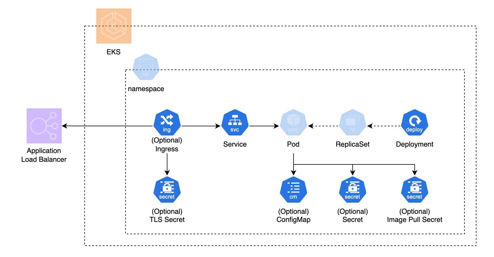

# EKS Public API Adapter
kubernetes 上にアプリケーションをデプロイして、外部に公開するための Adapter です。
以下の kubernetes リソースを作成します。

* Deployment
* Service
* Ingress
* ExternalSecret or Secret
* Config Map



ConfigMap 、Secret の内容を環境変数として読み込んだ Deployment を作成し、AWS Load Balancer Controller と連携した Ingress によってアプリケーションを公開します。
Deployment はコンテナを2つ利用するサイドカーパターンに対応しています。

## Module

Module: `qmonus.net/adapter/official`

Import path: `qmonus.net/adapter/official/adapters/aws/container/kubernetes/publicApi`

## Level

Sample: サンプル実装

## Platform

kubernetes, AWS

## Prerequisites / Constraints

### Prerequisites

* Ingress リソースを作成する場合、デプロイ先の EKS 環境で AWS Load Balancer Controller がインストールされていること。
* ExternalSecret リソースを作成する場合、デプロイ先の EKS 環境に External Secrets Operator がインストール済みであること。
* Ingress リソースを使用して HTTPS 接続を有効にする場合は、AWS Certificate Manager で管理される SSL/TLS 証明書が必要になります。
* External Secrets Operator を利用して AWS Secrets Manager に格納されている機密情報を利用するためには ClusterSecretStore の作成と、認証の設定が必要。
  * 設定方法は https://external-secrets.io/v0.9.0/provider/aws-secrets-manager/ を参照。

### Constraints

* Deployment
  * コンテナを 2 つ、init コンテナを 1 つまで設定可能。
    * コンテナ 2 つはサイドカーパターンにおけるメインコンテナとサイドカーコンテナとしての利用を想定。
  * コンテナポートはメインコンテナとサイドカーコンテナにそれぞれ 2 つまで設定可能。
  * ConfigMap と Secret はメインコンテナ、サイドカーコンテナ、init コンテナで環境変数として利用するケースのみをサポートする。
    * 環境変数名は key 名が自動的に設定される。
    * volume としての利用は不可。
* Ingress
  * AWS Load Balancer Controller での利用が前提となる。
* ConfigMap
    * コンテナの環境変数としてのみ利用される。
* Secret / ExternalSecret
    * 任意の機密情報を持つSecretは、コンテナの環境変数としてのみ利用される。

## Infrastructure Parameters

設定可能なパラメータを以下に示します。

### Common

| Parameter Name | Type   | Required | Default | Description                                    |
| -------------- | ------ | -------- | ------- | ---------------------------------------------- |
| appName        | string | yes      | -       | デプロイするアプリケーション名                 |
| k8sNamespace   | string | yes      | -       | アプリケーションをデプロイする対象の Namespace |

```yaml
designPatterns:
  - pattern: qmonus.net/adapter/official/adapters/aws/container/kubernetes/publicApi
    params:
      appName: api
      k8sNamespace: namespace
      …
```

### Deployment

| Parameter Name                        | Type                                                                      | Required | Default         | Description                                                             |
| ------------------------------------- | ------------------------------------------------------------------------- | -------- | --------------- | ----------------------------------------------------------------------- |
| podAnnotations                        | key value                                                                 | no       | -               | Deployment から生成される Podに付与する annotation                         |
| nodeSelector                          | key value                                                                 | no       | -               | Deployment の nodeSelector の設定                                          |
| strategyType                          | string                                                                    | no       | "RollingUpdate" | Deploymentの更新戦略                                                    |
| rollingUpdateMaxSurge                 | string                                                                    | no       | "25%"           | RollingUpdate の maxSurge の値<br>数字か%表記で記載すること<br>rollingUpdateMaxUnavailable を 0 とする場合、0 を指定不可 |
| rollingUpdateMaxUnavailable           | string                                                                    | no       | "25%"           | RollingUpdate の maxUnavailable の値<br>数字か%表記で記載すること<br>rollingUpdateMaxSurge を 0 とする場合、0 を指定不可 |
| replicas                              | string                                                                    | no       | "1"             | 作成する Pod のレプリカ数                                               |
| imagePullSecretName                   | string                                                                    | no       | -               | コンテナイメージの pull に利用する資格情報の Secret 名<br>資格情報を作成するパラメータ（b64EncodedImagePullSecret、imagePullSecret）との併用は不可 |
| imageName                             | string                                                                    | yes      | -               | デプロイするコンテナイメージ                                              |
| command                               | List\<string>                                                             | no       | -               | コンテナに渡すコマンド                                                  |
| args                                  | List\<string>                                                             | no       | -               | コンテナに渡す引数                                                      |
| port                                  | string                                                                    | yes      | -               | コンテナが利用するポート番号                                            |
| portName                              | string                                                                    | no       | -               | コンテナが利用するポート名                                              |
| portProtocol                          | string                                                                    | no       | "TCP"           | コンテナが利用するポートのプロトコル                                    |
| secondaryPort                         | string                                                                    | no       | -               | コンテナが利用するポート番号（2つ目）                                   |
| secondaryPortName                     | string                                                                    | no       | -               | コンテナが利用するポート名（2つ目）                                     |
| secondaryPortProtocol                 | string                                                                    | no       | "TCP"           | コンテナが利用するポートのプロトコル（2つ目）                           |
| env                                   | List\<{ name: string, value: string }> | no       | -               | コンテナに設定する環境変数                                              |
| cpuRequest                            | string                                                                    | no       | -               | コンテナが使用する cpu の要求値                                           |
| cpuLimit                              | string                                                                    | no       | -               | コンテナが使用する cpu の上限値                                             |
| memoryRequest                         | string                                                                    | no       | -               | コンテナが使用する memory の要求値                                        |
| memoryLimit                           | string                                                                    | no       | -               | コンテナが使用する memory の上限値                                         |
| livenessProbe                         | [probe](#probe)                                                           | no       | -               | livenessProbe の設定                                                     |
| readinessProbe                        | [probe](#probe)                                                           | no       | -               | readinessProbe の設定                                                    |
| startupProbe                          | [probe](#probe)                                                           | no       | -               | startupProbe の設定                                                      |
| volumeMountPath                       | string                                                                    | no       | -               | emptyDir ボリュームをマウントするパス                                     |
| sidecarContainerImageName             | string                                                                    | no       | -               | （サイドカーコンテナ）<br>デプロイするコンテナイメージ                    |
| sidecarContainerCommand               | List\<string>                                                             | no       | -               | （サイドカーコンテナ）<br>コンテナに渡すコマンド                        |
| sidecarContainerArgs                  | List\<string>                                                             | no       | -               | （サイドカーコンテナ）<br>コンテナに渡す引数                            |
| sidecarContainerPort                  | string                                                                    | no       | -               | （サイドカーコンテナ）<br>コンテナが利用するポート番号                  |
| sidecarContainerPortName              | string                                                                    | no       | -               | （サイドカーコンテナ）<br>コンテナが利用するポート名                    |
| sidecarContainerPortProtocol          | string                                                                    | no       | "TCP"           | （サイドカーコンテナ）<br>コンテナが利用するポートのプロトコル          |
| sidecarContainerSecondaryPort         | string                                                                    | no       | -               | （サイドカーコンテナ）<br>コンテナが利用するポート番号（2つ目）         |
| sidecarContainerSecondaryPortName     | string                                                                    | no       | -               | （サイドカーコンテナ）<br>コンテナが利用するポート名（2つ目）           |
| sidecarContainerSecondaryPortProtocol | string                                                                    | no       | "TCP"           | （サイドカーコンテナ）<br>コンテナが利用するポートのプロトコル（2つ目） |
| sidecarContainerEnv                   | List\<{ name: string, value: string }> | no       | -               | （サイドカーコンテナ）<br>コンテナに設定する環境変数                    |
| sidecarContainerCpuRequest            | string                                                                    | no       | -               | （サイドカーコンテナ）<br>コンテナが使用する cpu の要求値                 |
| sidecarContainerCpuLimit              | string                                                                    | no       | -               | （サイドカーコンテナ）<br>コンテナが使用する cpu の上限値                  |
| sidecarContainerMemoryRequest         | string                                                                    | no       | -               | （サイドカーコンテナ）<br>コンテナが使用する memory の要求値              |
| sidecarContainerMemoryLimit           | string                                                                    | no       | -               | （サイドカーコンテナ）<br>コンテナが使用する memory の上限値               |
| sidecarContainerLivenessProbe         | [probe](#probe)                                                           | no       | -               | （サイドカーコンテナ）<br>livenessProbe の設定                           |
| sidecarContainerReadinessProbe        | [probe](#probe)                                                           | no       | -               | （サイドカーコンテナ）<br>readinessProbe の設定                          |
| sidecarContainerStartupProbe          | [probe](#probe)                                                           | no       | -               | （サイドカーコンテナ）<br>startupProbe の設定                            |
| sidecarContainerVolumeMountPath       | string                                                                    | no       | -               | （サイドカーコンテナ）<br>emptyDir ボリュームをマウントするパス            |
| initContainerImageName                | string                                                                    | no       | -               | （init コンテナ）<br>デプロイするコンテナイメージ                          |
| initContainerCommand                  | List\<string>                                                             | no       | -               | （init コンテナ）<br>コンテナに渡すコマンド                              |
| initContainerArgs                     | List\<string>                                                             | no       | -               | （init コンテナ）<br>コンテナに渡す引数                                  |
| initContainerEnv                      | List\<{ name: string, value: string }> | no       | -               | （init コンテナ）<br>コンテナに設定する環境変数                          |
| initContainerCpuRequest               | string                                                                    | no       | -               | （init コンテナ）<br>コンテナが使用する cpu の要求値                       |
| initContainerCpuLimit                 | string                                                                    | no       | -               | （init コンテナ）<br>コンテナが使用する cpu の上限値                        |
| initContainerMemoryRequest            | string                                                                    | no       | -               | （init コンテナ）<br>コンテナが使用する memory の要求値                    |
| initContainerMemoryLimit              | string                                                                    | no       | -               | （init コンテナ）<br>コンテナが使用する memory の上限値                     |

```yaml
designPatterns:
  - pattern: qmonus.net/adapter/official/adapters/aws/container/kubernetes/publicApi
    params:
      …
      podAnnotations:
        example/annotation: deploy
      nodeSelector:
        "kubernetes.io/os": linux
      strategyType: RollingUpdate
      rollingUpdateMaxSurge: 25%
      rollingUpdateMaxUnavailable: 25%
      replicas: "1"
      imagePullSecretName: my-image-pull-sec
      imageName: busybox
      port: "8080"
      portName: container
      portProtocol: TCP
      secondaryPort: "8443"
      secondaryPortName: https
      secondaryPortProtocol: TCP
      cpuRequest: 64Mi
      cpuLimit: 128Mi
      memoryRequest: 250m
      memoryLimit: 500m
      command:
        - sh
        - -c
      args:
        - echo
        - "hello world"
      env:
        - name: ENV
          value: main
      livenessProbe: {...}
      readinessProbe: {...}
      startupProbe: {...}
      volumeMountPath: /mountpath1
      sidecarContainerImageName: busybox
      sidecarContainerPort: "8081"
      sidecarContainerPortName: sidecar-port-1
      sidecarContainerPortProtocol: TCP
      sidecarContainerSecondaryPort: "9081"
      sidecarContainerSecondaryPortName: sidecar-port-2
      sidecarContainerSecondaryPortProtocol: TCP
      sidecarContainerCpuRequest: 64Mi
      sidecarContainerCpuLimit: 128Mi
      sidecarContainerMemoryRequest: 250m
      sidecarContainerMemoryLimit: 500m
      sidecarContainerCommand:
        - sh
        - -c
      sidecarContainerArgs:
        - echo
        - "side car"
      sidecarContainerEnv:
        - name: ENV
          value: sidecar
      sidecarContainerLivenessProbe: {...}
      sidecarContainerReadinessProbe: {...}
      sidecarContainerStartupProbe: {...}
      sidecarContainerVolumeMountPath: /mountpath2
      # init container params
      initContainerImageName: busybox
      initContainerCpuRequest: 64Mi
      initContainerCpuLimit: 128Mi
      initContainerMemoryRequest: 250m
      initContainerMemoryLimit: 500m
      initContainerCommand:
        - sh
        - -c
      initContainerArgs:
        - echo
        - "side car"
      initContainerEnv:
        - name: ENV
          value: init
      …
```

#### probe

| Parameter Name      | Type                    | Required | Default | Description                                                                                                   |
| ------------------- | ----------------------- | -------- | ------- | ------------------------------------------------------------------------------------------------------------- |
| exec                | [exec](#exec)           | no       | -       | コマンド実行による probe の設定                                                                               |
| httpGet             | [httpGet](#httpget)     | no       | -       | HTTP GET リクエストを使用した probe の設定                                                                    |
| tcpSocket           | [tcpSocket](#tcpsocket) |          | -       | TCP ソケット接続を使用したprobeの設定                                                                         |
| failureThreshold    | string                  | no       | -       | probe が失敗と見なされるまでの連続失敗回数<br>livenessProbe, startupProbe の場合は "1" でなければならない        |
| initialDelaySeconds | string                  | no       | -       | コンテナが起動してから probe を実行するまでの待機時間                                                         |
| periodSeconds       | string                  | no       | -       | probe を実行する間隔                                                                                          |
| successThreshold    | string                  | no       | -       | probe が成功と見なされるために必要な連続成功回数                                                              |
| timeoutSeconds      | string                  | no       | -       | probe がタイムアウトと見なされるまでの時間                                                                    |

```yaml
designPatterns:
  - pattern: qmonus.net/adapter/official/adapters/aws/container/kubernetes/publicApi
    params:
      …
      livenessProbe:
        exec:
         …
        initialDelaySeconds: "3"
        periodSeconds: "3"
        failureThreshold: "1"
        successThreshold: "1"
        timeoutSeconds: "3"
      …
```

##### exec

| Parameter Name | Type          | Required | Default | Description                            |
| -------------- | ------------- | -------- | ------- | -------------------------------------- |
| command        | List\<string> | no       | -       | probe 時にコンテナ内で実行するコマンド |

```yaml
designPatterns:
  - pattern: qmonus.net/adapter/official/adapters/aws/container/kubernetes/publicApi
    params:
      …
      livenessProbe:
        exec:
         command:
          - cat
          - /tmp/healthy
      …
```

##### httpGet

| Parameter Name | Type                                   | Required | Default | Description                                               |
| -------------- | -------------------------------------- | -------- | ------- | --------------------------------------------------------- |
| host           | string                                 | no       | -       | HTTP GET リクエストを送信するホスト名                     |
| httpHeaders    | List\<{ name: string, value: string }> | no       | -       | HTTP GET リクエストに追加するカスタムHTTPヘッダー         |
| path           | string                                 | yes      | -       | HTTP GET リクエストのパス                                 |
| port           | string                                 | yes      | -       | HTTP GET リクエストを送信するポート番号、もしくはポート名 |
| scheme         | string                                 | no       | -       | HTTP GET リクエストに使用するスキーム                     |

```yaml
designPatterns:
  - pattern: qmonus.net/adapter/official/adapters/aws/container/kubernetes/publicApi
    params:
      …
      livenessProbe:
        httpGet:
          host: example.com
          path: /healthz
          port: "8080"
          scheme: HTTP
          httpHeaders:
            - name: Custom-Header
              value: Awesome
      …
```

##### tcpSocket

| Parameter Name | Type   | Required | Default | Description                                    |
| -------------- | ------ | -------- | ------- | ---------------------------------------------- |
| host           | string | no       | -       | TCP ソケット接続のホスト名                     |
| port           | string | yes      | -       | TCP ソケット接続のポート番号、もしくはポート名 |

```yaml
designPatterns:
  - pattern: qmonus.net/adapter/official/adapters/aws/container/kubernetes/publicApi
    params:
      …
      livenessProbe:
        tcpSocket:
          host: example.com
          port: "8080"
      …
```

### Service

| Parameter Name     | Type                                | Required | Default     | Description                   |
| ------------------ | ----------------------------------- | -------- | ----------- | ----------------------------- |
| serviceAnnotations | key value                           | no       | -           | Service に付与する annotation |
| serviceType        | string                              | no       | "NodePort"  | Service リソースのタイプ      |
| servicePorts       | List<[servicePorts](#servicePorts)> | yes      | -           | Service リソースのポート設定  |

```yaml
designPatterns:
  - pattern: qmonus.net/adapter/official/adapters/aws/container/kubernetes/publicApi
    params:
      …
      serviceAnnotations:
        example/annotation: svc
      serviceType: NodePort
      servicePorts: […]
      …
```


#### servicePorts

| Parameter Name | Type   | Required | Default | Description                |
| -------------- | ------ | -------- | ------- | -------------------------- |
| name           | string | no       | -       | port 名                    |
| protocol       | string | no       | "TCP"   | protocol を指定            |
| port           | string | yes      | -       | port 番号を指定            |
| targetPort     | string | yes      | -       | 対象のコンテナポートを指定 |

```yaml
designPatterns:
  - pattern: qmonus.net/adapter/official/adapters/aws/container/kubernetes/publicApi
    params:
      …
      servicePorts:
        - port: "80"
          targetPort: "8080"
          name: http
          protocol: TCP
        - port: "443"
          targetPort: "8443"
          name: https
          protocol: TCP
      …
```

### Ingress

| Parameter Name      | Type      | Required | Default  | Description                                                                        |
| ------------------- | --------- | -------- | -------- | ---------------------------------------------------------------------------------- |
| useIngress          | string    | no       | "false"  | true を設定すると、Ingress リソースを作成する                                      |
| ingressAnnotations  | key value | no       | -        | Ingress に付与する annotation<br>AWS Load Balancer Controller についての設定を付与する場合は、以下を参照<br>https://kubernetes-sigs.github.io/aws-load-balancer-controller/v2.13/guide/ingress/annotations/ |
| host                | string    | no※      | -        | 公開するアプリケーションのホスト名<br>※ useIngress がtrueの場合は必須                |
| paths               | List<[paths](#paths)>  | no※      | -        | Ingress のパスの設定<br>※ useIngress が true の場合は必須                               |

```yaml
designPatterns:
  - pattern: qmonus.net/adapter/official/adapters/aws/container/kubernetes/publicApi
    params:
      …
      useIngress: "true"
      ingressAnnotations:
        alb.ingress.kubernetes.io/scheme: internet-facing
        alb.ingress.kubernetes.io/target-type: ip
        alb.ingress.kubernetes.io/certificate-arn: arn:aws:acm:ap-northeast-1:123456789012:certificate/12345678-90ab-cdef-1234-567890abcdef
        alb.ingress.kubernetes.io/listen-ports: '[{"HTTPS":443}, {"HTTP":80}]'
        alb.ingress.kubernetes.io/ssl-redirect: '443'
      host: example.com
      paths: […]
      …
```

#### paths

| Parameter Name | Type   | Required | Default  | Description                                                            |
| -------------- | ------ | -------- | -------- | ---------------------------------------------------------------------- |
| pathType       | string | no       | "Prefix" | パスのタイプ<br>Prefix, Exact, ImplementationSpecific のいずれかを指定 |
| path           | string | yes      | -        | 公開するアプリケーションのパス                                         |
| serviceName    | string | yes      | -        | 公開するサービス名                                                     |
| servicePort    | string | yes      | -        | 公開するサービスのポート                                               |

```yaml
designPatterns:
  - pattern: qmonus.net/adapter/official/adapters/aws/container/kubernetes/publicApi
    params:
      …
      paths:
        - pathType: Prefix
          path: /
          serviceName: api
          servicePort: "80"
      …
```

### ConfigMap

| Parameter Name                | Type      | Required | Default | Description                                                                |
| ----------------------------- | --------- | -------- | ------- | -------------------------------------------------------------------------- |
| configMapData                 | key value | no       | -       | ConfigMap に設定するデータ<br>メインコンテナの環境変数として利用される     |
| sidecarContainerConfigMapData | key value | no       | -       | ConfigMap に設定するデータ<br>サイドカーコンテナの環境変数として利用される |
| initContainerConfigMapData    | key value | no       | -       | ConfigMap に設定するデータ<br>init コンテナの環境変数として利用される      |

```yaml
designPatterns:
  - pattern: qmonus.net/adapter/official/adapters/aws/container/kubernetes/publicApi
    params:
      …
      configMapData:
        CONTAINER: main
        ENVIRONMENT: dev
      sidecarContainerConfigMapData:
        CONTAINER: sidecar
        ENVIRONMENT: dev
      initContainerConfigMapData:
        CONTAINER: init
        ENVIRONMENT: dev
      …
```

### Secret

※ 直接機密情報をBase64形式で入力する形式のため、開発環境での利用に限定してください。

| Parameter Name                | Type      | Required | Default | Description                                                                                                                                                                                                   |
| ----------------------------- | --------- | -------- | ------- | ------------------------------------------------------------------------------------------------------------------------------------------------------------------------------------------------------------- |
| b64EncodedSecrets                 | key value | no       | -       | メインコンテナの環境変数として渡す機密情報<br>値にはbase64でエンコードされたものを設定する<br>ExternalSecret リソース向けのパラメータ (deploymentSecrets) との併用は不可                                                                           |
| b64EncodedSidecarContainerSecrets | key value | no       | -       | サイドカーコンテナの環境変数として渡す機密情報<br>値にはbase64でエンコードされたものを設定する<br>ExternalSecret リソース向けのパラメータ (sidecarContainerDeploymentSecrets) との併用は不可                                                        |
| b64EncodedInitContainerSecrets    | key value | no       | -       | init コンテナの環境変数として渡す機密情報<br>値にはbase64でエンコードされたものを設定する<br>ExternalSecret リソース向けのパラメータ (initContainerDeploymentSecrets) との併用は不可                                                               |
| b64EncodedImagePullSecret         | string    | no       | -       | docker 認証情報を base64 形式でエンコードしたもの<br>設定すると、docker の資格情報を含む Secret リソースが作成され、Deployment の image の pull のこの資格情報が利用される<br>ExternalSecret リソース向けのパラメータ (imagePullSecret) との併用は不可 |

```yaml
designPatterns:
  - pattern: qmonus.net/adapter/official/adapters/aws/container/kubernetes/publicApi
    params:
      …
      b64EncodedSecrets:
        CONTAINER: bWFpbgo=
        ADMIN: aGVsbG8K
      b64EncodedSidecarContainerSecrets:
        CONTAINER: c2lkZWNhcgo=
        ADMIN: aGVsbG8K
      b64EncodedInitContainerSecrets:
        CONTAINER: aW5pdAo=
        ADMIN: aGVsbG8K
      b64EncodedImagePullSecret: e2F1dGhzOntob2dlcmVnaXN0cnkuY29tOnt1c2Vy…
      …
```

### ExternalSecret

| Parameter Name                    | Type              | Required | Default | Description                                                                                                                                                                                     |
| --------------------------------- | ----------------- | -------- | ------- | ----------------------------------------------------------------------------------------------------------------------------------------------------------------------------------------------- |
| deploymentSecrets                 | key value         | no       | -       | コンテナの環境変数として渡す機密情報<br>Secret リソース向けのパラメータ (b64EncodedSecrets) との併用は不可                                                                                                                                   |
| sidecarContainerDeploymentSecrets | key value         | no       | -       | サイドカーコンテナの環境変数として渡す機密情報<br>Secret リソース向けのパラメータ (b64EncodedSidecarContainerSecrets) との併用は不可                                                                                                         |
| initContainerDeploymentSecrets    | key value         | no       | -       | init コンテナの環境変数として渡す機密情報<br>Secret リソース向けのパラメータ (b64EncodedInitContainerSecrets) との併用は不可                                                                                                                 |
| clusterSecretStoreName            | string            | no※      | -       | ExternalSecret リソースが参照する ClusterSecretStore 名<br>※ ExternalSecret を利用する場合は必須                                                                                               |
| refreshInterval                   | string            | no       | "1h"    | ExternalSecret リソースが外部プロバイダと同期して機密情報を更新する間隔<br>指定可能な時間の単位は、「ns」、「us」(または 「µs」)、「ms」、「s」、「m」、「h」                                   |
| imagePullSecret                   | deployment secret | no       | -       | 外部プロバイダで管理された docker 認証情報<br>設定すると、docker の資格情報を含む Secret リソースが作成され、Deployment の image の pull のこの資格情報が利用される<br>Secret リソース向けのパラメータ (b64EncodedImagePullSecret) との併用は不可 |

```yaml
params:
  - name: adminUser
    type: secret
  - name: adminPass
    type: secret
  - name: imagePullSecret
    type: secret
  - name: secretMain
    type: secret
  - name: secretSidecar
    type: secret
  - name: secretInit
    type: secret

…

designPatterns:
  - pattern: qmonus.net/adapter/official/adapters/aws/container/kubernetes/publicApi
    params:
      …
      clusterSecretStoreName: css
      refreshInterval: "24h"
      imagePullSecret: $(params.imagePullSecret)
      deploymentSecrets:
        CONTAINER: $(params.secretMain)
        ADMIN: $(params.adminUser)
        ADMIN_PASS: $(params.adminPass)
      sidecarContainerDeploymentSecrets:
        CONTAINER: $(params.secretSidecar)
        ADMIN: $(params.adminUser)
        ADMIN_PASS: $(params.adminPass)
      initContainerDeploymentSecrets:
        CONTAINER: $(params.secretInit)
        ADMIN: $(params.adminUser)
        ADMIN_PASS: $(params.adminPass)
      …
```

## Application Resources

Adapterによって作成されるKubernetesリソースを以下に示します。

| Resource ID                    | Provider   | API version                 | Kind           | Description                                                                                                                  |
| ------------------------------ | ---------- | --------------------------- | -------------- | ---------------------------------------------------------------------------------------------------------------------------- |
| deployment                     | kubernetes | apps/v1                     | Deployment     | デプロイする Pod リソース（アプリケーション）を定義します。                                                                  |
| ingress                        | kubernetes | networking.k8s.io/v1        | Ingress        | Service に対する外部からのアクセスを管理します。                                                                             |
| service                        | kubernetes | v1                          | Service        | 静的なポートで Service を公開します。                                                                                        |
| configMap                      | kubernetes | v1                          | configMap      | メインコンテナの環境変数として利用する情報を管理します。                                                                     |
| configMapForSidecar            | kubernetes | v1                          | configMap      | サイドカーコンテナの環境変数として利用する情報を管理します。                                                                 |
| configMapForInitContainer      | kubernetes | v1                          | configMap      | init コンテナの環境変数として利用する情報を管理します。                                                                      |
| externalSecret                 | kubernetes | external-secrets.io/v1beta1 | ExternalSecret | 外部プロバイダの機密情報を Secret リソースとして使用できるようにします。<br>メインコンテナの環境変数として利用されます。     |
| externalSecretForSidecar       | kubernetes | external-secrets.io/v1beta1 | ExternalSecret | 外部プロバイダの機密情報を Secret リソースとして使用できるようにします。<br>サイドカーコンテナの環境変数として利用されます。 |
| externalSecretForInitContainer | kubernetes | external-secrets.io/v1beta1 | ExternalSecret | 外部プロバイダの機密情報を Secret リソースとして使用できるようにします。<br>init の環境変数として利用されます。              |
| externalSecretIps              | kubernetes | external-secrets.io/v1beta1 | ExternalSecret | 外部プロバイダで管理されたコンテナイメージを pull するための資格情報を Secret リソースとして使用できるようにします。         |
| secret                         | kubernetes | v1                          | Secret         | メインコンテナの環境変数として利用する機密情報を管理します。                                                                 |
| secretForSidecar               | kubernetes | v1                          | Secret         | サイドカーコンテナの環境変数として利用する機密情報を管理します。                                                             |
| secretForInitContainer         | kubernetes | v1                          | Secret         | init コンテナの環境変数として利用する機密情報を管理します。                                                                  |
| secretIps                      | kubernetes | v1                          | Secret         | Secret リソースとしてコンテナイメージを pull するための資格情報を管理します。                                                |

## Usage

### 最小構成

```yaml
designPatterns:
  - pattern: qmonus.net/adapter/official/adapters/aws/container/kubernetes/publicApi
    params:
      appName: $(params.appName)
      k8sNamespace: $(params.k8sNamespace)
      imageName: $(params.imageName)
      port: $(params.port)
      servicePorts:
        - port: $(params.servicePort)
          targetPort: $(params.port)
```

### Ingress を使用して HTTPS 接続を有効にする

```yaml
designPatterns:
  - pattern: qmonus.net/adapter/official/adapters/aws/container/kubernetes/publicApi
    params:
      appName: $(params.appName)
      k8sNamespace: $(params.k8sNamespace)
      imageName: $(params.imageName)
      port: $(params.port)
      serviceType: $(params.serviceType)
      servicePorts:
        - port: $(params.servicePort)
          targetPort: $(params.port)
      useIngress: $(params.useIngress)
      host: $(params.host)
      paths:
        - path: $(params.path)
          serviceName: $(params.appName)
          servicePort: $(params.servicePort)
      ingressAnnotations:
        alb.ingress.kubernetes.io/scheme: internet-facing
        alb.ingress.kubernetes.io/target-type: $(params.ingressTargetType)
        alb.ingress.kubernetes.io/certificate-arn: $(params.ingressCertificateArn)
        alb.ingress.kubernetes.io/listen-ports: '[{"HTTPS":443}, {"HTTP":80}]'
        alb.ingress.kubernetes.io/ssl-redirect: "443"
```

### フルオプション

```yaml
designPatterns:
  - pattern: qmonus.net/adapter/official/adapters/aws/container/kubernetes/publicApi
    params:
      appName: $(params.appName)
      k8sNamespace: $(params.k8sNamespace)
      nodeSelector:
        "kubernetes.io/os": $(params.nodeLabel)
      strategyType: $(params.strategyType)
      rollingUpdateMaxSurge: $(params.rollingUpdateMaxSurge)
      rollingUpdateMaxUnavailable: $(params.rollingUpdateMaxUnavailable)
      replicas: $(params.replicas)
      imagePullSecret: $(params.imagePullSecret)
      imageName: $(params.imageName)
      port: $(params.port)
      portName: $(params.portName)
      portProtocol: $(params.portProtocol)
      secondaryPort: $(params.secondaryPort)
      secondaryPortName: $(params.secondaryPortName)
      secondaryPortProtocol: $(params.secondaryPortProtocol)
      cpuRequest: $(params.cpuRequest)
      cpuLimit: $(params.cpuLimit)
      memoryRequest: $(params.memoryRequest)
      memoryLimit: $(params.memoryLimit)
      command: ["$(params.command[*])"]
      args: ["$(params.args[*])"]
      env:
        - name: CONTAINER
          value: $(params.envContainer)
        - name: GREETING
          value: $(params.envGreeting)
        - name: ENV
          value: $(params.envEnv)
      livenessProbe:
        httpGet:
          host: $(params.probeHost)
          path: $(params.probeHttpGetPath)
          port: $(params.probePort)
          scheme: $(params.probeHttpGetScheme)
          httpHeaders:
            - name: Accept
              value: $(params.probeHttpHeaderAccept)
        initialDelaySeconds: $(params.initialDelaySeconds)
        periodSeconds: $(params.periodSeconds)
        failureThreshold: $(params.failureThreshold)
        successThreshold: $(params.successThreshold)
        timeoutSeconds: $(params.timeoutSeconds)
      readinessProbe:
        tcpSocket:
          host: $(params.probeHost)
          port: $(params.probePort)
        initialDelaySeconds: $(params.initialDelaySeconds)
        periodSeconds: $(params.periodSeconds)
        failureThreshold: $(params.failureThreshold)
        successThreshold: $(params.successThreshold)
        timeoutSeconds: $(params.timeoutSeconds)
      startupProbe:
        exec:
          command: ["$(params.probeCommand[*])"]
        initialDelaySeconds: $(params.initialDelaySeconds)
        periodSeconds: $(params.periodSeconds)
        failureThreshold: $(params.failureThreshold)
        successThreshold: $(params.successThreshold)
        timeoutSeconds: $(params.timeoutSeconds)
      volumeMountPath: $(params.volumeMountPath)
      sidecarContainerImageName: $(params.sidecarContainerImageName)
      sidecarContainerPort: $(params.sidecarContainerPort)
      sidecarContainerPortName: $(params.sidecarContainerPortName)
      sidecarContainerPortProtocol: $(params.sidecarContainerPortProtocol)
      sidecarContainerSecondaryPort: $(params.sidecarContainerSecondaryPort)
      sidecarContainerSecondaryPortName: $(params.sidecarContainerSecondaryPortName)
      sidecarContainerSecondaryPortProtocol: $(params.sidecarContainerSecondaryPortProtocol)
      sidecarContainerCpuRequest: $(params.sidecarContainerCpuRequest)
      sidecarContainerCpuLimit: $(params.sidecarContainerCpuLimit)
      sidecarContainerMemoryRequest: $(params.sidecarContainerMemoryRequest)
      sidecarContainerMemoryLimit: $(params.sidecarContainerMemoryLimit)
      sidecarContainerCommand: ["$(params.sidecarContainerCommand[*])"]
      sidecarContainerArgs: ["$(params.sidecarContainerArgs[*])"]
      sidecarContainerEnv:
        - name: CONTAINER
          value: $(params.sidecarContainerEnvContainer)
        - name: GREETING
          value: $(params.envGreeting)
        - name: ENV
          value: $(params.envEnv)
      sidecarContainerLivenessProbe:
        tcpSocket:
          host: $(params.probeHost)
          port: $(params.probePort)
        initialDelaySeconds: $(params.initialDelaySeconds)
        periodSeconds: $(params.periodSeconds)
        failureThreshold: $(params.failureThreshold)
        successThreshold: $(params.successThreshold)
        timeoutSeconds: $(params.timeoutSeconds)
      sidecarContainerReadinessProbe:
        exec:
          command: ["$(params.probeCommand[*])"]
        initialDelaySeconds: $(params.initialDelaySeconds)
        periodSeconds: $(params.periodSeconds)
        failureThreshold: $(params.failureThreshold)
        successThreshold: $(params.successThreshold)
        timeoutSeconds: $(params.timeoutSeconds)
      sidecarContainerStartupProbe:
        httpGet:
          host: $(params.probeHost)
          path: $(params.probeHttpGetPath)
          port: $(params.probePort)
          scheme: $(params.probeHttpGetScheme)
          httpHeaders:
            - name: Accept
              value: $(params.probeHttpHeaderAccept)
        initialDelaySeconds: $(params.initialDelaySeconds)
        periodSeconds: $(params.periodSeconds)
        failureThreshold: $(params.failureThreshold)
        successThreshold: $(params.successThreshold)
        timeoutSeconds: $(params.timeoutSeconds)
      sidecarContainerVolumeMountPath: $(params.sidecarContainerVolumeMountPath)
      initContainerImageName: $(params.initContainerImageName)
      initContainerCpuRequest: $(params.initContainerCpuRequest)
      initContainerCpuLimit: $(params.initContainerCpuLimit)
      initContainerMemoryRequest: $(params.initContainerMemoryRequest)
      initContainerMemoryLimit: $(params.initContainerMemoryLimit)
      initContainerCommand: ["$(params.initContainerCommand[*])"]
      initContainerArgs: ["$(params.initContainerArgs[*])"]
      initContainerEnv:
        - name: CONTAINER
          value: $(params.initContainerEnvContainer)
        - name: GREETING
          value: $(params.envGreeting)
        - name: ENV
          value: $(params.envEnv)
      serviceType: $(params.serviceType)
      servicePorts:
        - port: $(params.servicePort)
          targetPort: $(params.port)
          name: $(params.servicePortName)
          protocol: $(params.servicePortProtocol)
        - port: $(params.secondaryServicePort)
          targetPort: $(params.secondaryPort)
          name: $(params.secondaryServicePortName)
          protocol: $(params.secondaryServicePortProtocol)
      useIngress: $(params.useIngress)
      host: $(params.host)
      paths:
        - path: $(params.path)
          serviceName: $(params.appName)
          servicePort: $(params.servicePort)
      configMapData:
        MAIN_CONTAINER: $(params.main)
        GREETING: $(params.greeting)
        ENVIRONMENT: $(params.environment)
      sidecarContainerConfigMapData:
        SIDECAR_CONTAINER: $(params.sidecar)
        GREETING: $(params.greeting)
        ENVIRONMENT: $(params.environment)
      initContainerConfigMapData:
        INIT_CONTAINER: $(params.init)
        GREETING: $(params.greeting)
        ENVIRONMENT: $(params.environment)
      clusterSecretStoreName: $(params.clusterSecretStoreName)
      refreshInterval: $(params.refreshInterval)
      deploymentSecrets:
        MAIN_CONTAINER_SEC: $(params.secretMain)
        ADMIN: $(params.adminUser)
        ADMIN_PASS: $(params.adminPass)
      sidecarContainerDeploymentSecrets:
        MAIN_CONTAINER_SEC: $(params.secretMain)
        ADMIN: $(params.adminUser)
        ADMIN_PASS: $(params.adminPass)
      initContainerDeploymentSecrets:
        INIT_CONTAINER_SEC: $(params.secretInit)
        ADMIN: $(params.adminUser)
        ADMIN_PASS: $(params.adminPass)
      podAnnotations:
        test/annotation: $(params.podAnnotation)
      serviceAnnotations:
        test/annotation: $(params.svcAnnotation)
      ingressAnnotations:
        alb.ingress.kubernetes.io/scheme: $(params.ingressScheme)
        alb.ingress.kubernetes.io/target-type: $(params.ingressTargetType)
        alb.ingress.kubernetes.io/certificate-arn: $(params.ingressCertificateArn)
        alb.ingress.kubernetes.io/listen-ports: $(params.ingressListenPorts)
        alb.ingress.kubernetes.io/ssl-redirect: $(params.ingressSslRedirect)
```

## Code

[publicApi](main.cue)
