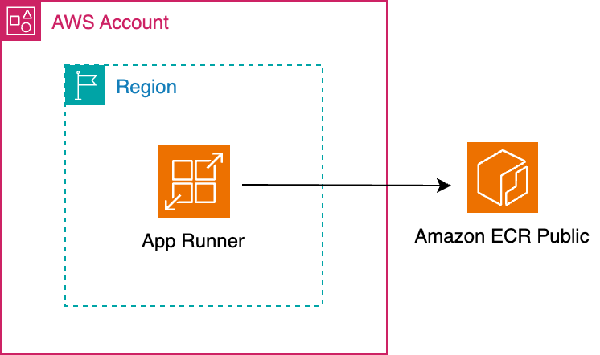

# Sample App Runner Adapter

HTTPSで外部公開できるアプリケーションをAWS環境にデプロイするCloud Native Adapterです。

以下のリソースを作成します。

* AWS App Runner
    * サービス



## Platform

AWS

## Module

* Module: `qmonus.net/adapter/official`
* Import path: `qmonus.net/adapter/official/adapters/aws/sample/appRunner`

## Level

Sample: サンプル実装

## Prerequisites / Constraints

### Prerequisites

* 事前にIAMユーザーを作成し、Qmonus Value Streamへ認証情報を登録する必要があります。以下のポリシーをIAMユーザーに付与してください。
    * `AWSAppRunnerFullAccess`

### Constraints

* 利用可能なコンテナイメージは、[Amazon ECR Public Gallery](https://gallery.ecr.aws/) で公開されているイメージのみとなります。

* パラメータ `serviceName` には、4文字以上40文字以内かつ、半角英数字、ハイフン、アンダースコアのみを使用した文字列を設定してください。

## Infrastructure Parameters

| Parameter Name | Type | Required | Default | Description | Example | Auto Binding |
| --- | --- | --- | --- | --- | --- | --- |
| serviceName | string | yes | - | 作成するApp Runnerのサービス名。4文字以上40文字以内かつ、半角英数字、ハイフン、アンダースコアのみを使用してください。 | nginx | no |
| imageUri | string | yes | - | App RunnerにデプロイするコンテナイメージのURI。Amazon ECR Public Galleryで公開されているイメージのみ指定できます。 | public.ecr.aws/nginx/nginx:latest | no |
| port | string | yes | - | App Runnerサービスで利用されるポート番号 | "80" | no |
| awsRegion | string | yes | - | App Runnerサービスを作成するリージョン | ap-northeast-1 | yes |

## CI/CD Parameters

### Adapter Options

| Parameter Name | Type | Required | Default | Description | Example |
| --- | --- | --- | --- | --- | --- |
| repositoryKind | string | no | "" | ソースコードの管理に使用しているGitリポジトリの種類を指定してください。サポートしているのは、github, gitlab, bitbucket, backlog で、何も指定されない場合はgithub用の設定になります。 | gitlab |
| useSshKey | bool | no | false | trueを指定するとリポジトリをクローンするための認証にSSH Keyを使用するように設定できます。 | true |

### Parameters

| Parameter Name | Type | Required | Default | Description | Example | Auto Binding |
| --- | --- | --- | --- | --- | --- | --- |
| gitCloneUrl | string | yes | - | GitリポジトリサービスのURL | https://github.com/${organization}/<br>${repository} | yes |
| gitRevision | string | yes | - | Gitのリビジョン | commit-hash, branch-name or tag-name | no |
| gitRepositoryDeleteExisting | bool   | no | true | trueの場合、Git Checkoutする時に指定先のディレクトリが存在している場合に削除する |true | no |
| gitCheckoutSubDirectory | string | no | "" | GitのCheckout作業をするパス名 | "" | no |
| gitTokenSecretName | string | yes | - | Gitのアクセストークンを保管しているk8s Secret名 | gitsecret-xxxxxxxxxxxxxxxxxxxx | yes |
| pathToSource | string | no | "" | ソースディレクトリからの相対パス | "" | no |
| qvsConfigPath | string | yes | - | QVS Config(旧称：Application Config)のパス | .valuestream/qvs.yaml | yes |
| appName | string | yes | - | QVSにおけるApplication名 | nginx | yes |
| qvsDeploymentName | string | yes | - | QVSにおけるDeployment名 | staging | yes |
| deployStateName | string | no | app | pulumi-stack名のSuffixとして使用される | app | no |
| awsCredentialName | string | yes | - | AWSのIAMユーザーの認証情報を保管しているSecret名 | aws-default-xxxxxxxxxxxxxxxxxxxx | yes |

### Results Parameters

| Parameter Name | Type | Pipeline | Description | Example |
| --- | --- | --- | --- | --- |
| serviceUrl | string | get-url | デプロイしたApp Runnerサービスの接続用URL | `https://{.....}.ap-northeast-1.awsapprunner.com` |

## Application Resources

| Resource ID | Provider | Resource Name | Description |
| --- | --- | --- | --- |
| appRunnerService | aws | AWS App Runnerサービス | コンテナアプリケーションをデプロイするためのApp Runnerサービスを作成します。 |

## Pipeline Resources

以下のTekton Pipeline/Taskリソースを含むマニフェストが作成されます。

### Pipeline

| Resource ID | Description |
| --- | --- |
| deploy | git-checkout(-ssh), compile-adapter-into-pulumi-yaml(-ssh), deploy-by-pulumi-yaml のTaskを順番に実行し、アプリケーションを指定の環境にデプロイします。 |
| get-url | get-url-aws-app-runner のTaskを実行し、デプロイしたApp Runnerサービスの接続用URLをResultsに出力します。 |

### Task

| Resource ID | Pipeline | runAfter | Description |
| --- | --- | --- | --- |
| git-checkout | deploy | - | 指定のGitリポジトリをクローンし、対象のリビジョン・ブランチにチェックアウトします。クローンする際の認証にはGit Tokenを使用します。AdapterOptionsのuseSshKeyがFalseかつrepositoryKindがgithub, gitlabの場合に作成されます。 |
| git-checkout-ssh | deploy | - | 指定のGitリポジトリをクローンし、対象のリビジョン・ブランチにチェックアウトします。クローンする際の認証にはSSH Keyを使用します。AdapterOptionsのuseSshKeyがTrueまたはrepositoryKindがbitbucket, backlogの場合に作成されます。 |
| compile-adapter-into-pulumi-yaml | deploy | git-checkout | リポジトリ内の QVS Config に記載されている Cloud Native Adapter をコンパイルし、PulumiYamlのプロジェクトファイルを生成します。AdapterOptionsのuseSshKeyがFalseかつrepositoryKindがgithub, gitlabの場合に作成されます。 |
| compile-adapter-into-pulumi-yaml-ssh | deploy | git-checkout-ssh | リポジトリ内の QVS Config に記載されている Cloud Native Adapter をコンパイルし、PulumiYamlのプロジェクトファイルを生成します。AdapterOptionsのuseSshKeyがTrueまたはrepositoryKindがbitbucket, backlogの場合に作成されます。 |
| deploy-by-pulumi-yaml | deploy | compile-adapter-into-pulumi-yaml or compile-adapter-into-pulumi-yaml-ssh | コンパイルされたPulumiYamlのプロジェクトファイルを指定の環境にデプロイします。 |
| get-url-aws-app-runner | get-url | - | デプロイしたApp Runnerサービスの接続用URLをResultsに出力します。 |

## Usage

```yaml
designPatterns:
  - pattern: qmonus.net/adapter/official/adapters/aws/sample/appRunner
    params:
      serviceName: $(params.serviceName)
      imageUri: $(params.imageUri)
      port: $(params.port)
      awsRegion: $(params.awsRegion)
```

## Code

[appRunner](./main.cue)
