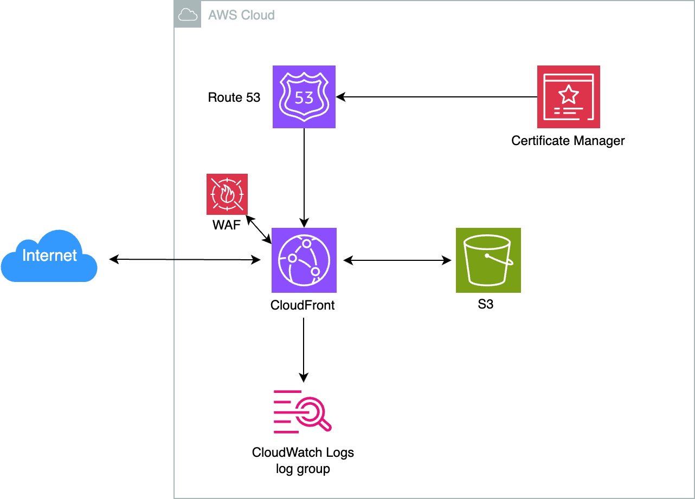

# Frontend Adapter

静的Webアプリケーションをビルドし、AWS環境にデプロイするCloud Native Adapterです。

以下のリソースを作成します。

* Amazon S3
  * 静的Webアプリケーションをホストするバケット
* Amazon CloudFront
  * ディストリビューション
* AWS Certificate Manager
  * CloudFrontディストリビューションにカスタムドメインを設定するために以下のリソースを作成します。
    * パブリック証明書
* Amazon Route 53
  * CloudFrontディストリビューションにカスタムドメインを設定するために以下のリソースを作成します。
    * ALIASレコード
* AWS WAF
  * Web ACL
    * Web ACLを使用する場合のみ、作成します。
* Amazon CloudWatch Logs
  * CloudFrontディストリビューションのアクセスログを記録するためのロググループ
    * CloudFrontディストリビューションのアクセスログを有効化する場合のみ、作成します。



## Platform

AWS

## Module

* Module: `qmonus.net/adapter/official`
* Import path: `qmonus.net/adapter/official/adapters/aws/serverless/staticSite/frontend`

## Level

Sample: サンプル実装

## Prerequisites / Constraints

### Prerequisites

* 事前にIAMユーザーを作成し、Qmonus Value Streamへ認証情報を登録する必要があります。以下のポリシーをIAMユーザーに付与してください。
  * AmazonRoute53FullAccess
  * AmazonS3FullAccess
  * AWSCertificateManagerFullAccess
  * AWSWAFFullAccess
  * CloudFrontFullAccess

* 事前にDNSゾーンを作成する必要があります。AWSにRoute 53ホストゾーンを作成し、各委譲元のDNSプロバイダで委譲設定を行ってください。

### Constraints

* デプロイするファイルはnpmでパッケージ管理されている必要があります。
* デプロイ対象のフロントエンドプロジェクトがルートディレクトリに存在しない場合は、buildTargetDir　及び、deployTargetDirのパラメータで適切なパスを指定してください。
* 環境変数を追加する場合はQVS ConfigにenvironmentVariablesパラメータを設定してください。
* 以下のリソースでは、リソース名にサフィックスとしてランダムな3文字を付与します。
  * Web ACL
* S3
  * バケット
    * 本Adapterによって作成されるCloudFrontディストリビューションからのアクセスのみを許可するバケットポリシーを設定します。
* Amazon CloudFront
  * ディストリビューション
    * オリジンアクセスコントロール（OAC）を使用して、S3バケットへのアクセスを制限します。
    * 本Adapterのパラメータ `indexDocumentName` で設定したファイルが、デフォルトルートオブジェクトになります。
* AWS WAF
  * Web ACL
    * 以下のAWSマネージドルールグループを追加します。
      * `AWSManagedRulesAmazonIpReputationList`
      * `AWSManagedRulesCommonRuleSet`
      * `AWSManagedRulesKnownBadInputsRuleSet`
* Amazon CloudWatch Logs
  * CloudFrontディストリビューションのアクセスログを記録するためのロググループ
    * CloudFrontディストリビューションからのログ送信を有効化するためにリソースポリシーが設定されます。
      * 設定されたリソースポリシーは `aws logs describe-resource-policies` コマンドで確認できます。

## Infrastructure Parameters

| Parameter Name | Type | Required | Default | Description | Example | Auto Binding |
| --- | --- | --- | --- | --- | --- | --- |
| appName | string | yes | - | QVSにおけるApplication名 | sample | yes |
| awsRegion | string | yes | - | AWSリソースの作成に使用するリージョン | ap-northeast-1 | yes |
| awsAccountId | string | yes | - | AWSリソースの作成に使用するアカウントID | "012345678912" | yes |
| customDomainName | string | yes | - | CloudFrontディストリビューションに設定するカスタムドメイン | <www.example.com> | no |
| dnsZoneId | string | yes | - | 事前に用意したRoute 53ホストゾーンのホストゾーンID | Z0123456789ABCDEFGHIJ | no |
| bucketName | string | yes | - | 新たに作成するS3のバケット名 | content-bucket-20250101 | no |
| indexDocumentName | string | yes | - | トップページとなるファイル名 | index.html | no |
| environmentVariables | object | no | - | ビルド時にアプリケーションに渡される環境変数名と値のペア | ENV: prod | no |
| enableWaf | string | no | "true" | CloudFrontディストリビューションにWeb ACLを設定するか否か。`"true"`, `"false"` のいずれかを設定できます。 | "true" | no |
| enableAccessLogging | string | no | "true" | CloudFrontディストリビューションのアクセスログを有効化するか否か。`"true"`, `"false"` のいずれかを設定できます。 | "true" | no |
| accessLogRetentionInDays | string | no | "365" | CloudFrontディストリビューションのアクセスログを記録するためのロググループにおいてログが保持される日数。1, 3, 5, 7, 14, 30, 60, 90, 120, 150, 180, 365, 400, 545, 731, 1096, 1827, 2192, 2557, 2922, 3288, 3653, 0のいずれかの数値を設定してください。0を設定した場合は、無制限で保持されます。 | "365" | no |

## CI/CD Parameters

### Adapter Options

| Parameter Name | Type | Required | Default | Description | Example |
| --- | --- | --- | --- | --- | --- |
| repositoryKind | string | no | "" | ソースコードの管理に使用しているGitリポジトリの種類を指定してください。サポートしているのは、github, gitlab, bitbucket, backlog で、何も指定されない場合はgithub用の設定になります。 | gitlab |
| useSshKey | bool | no | false | trueを指定するとリポジトリをクローンするための認証にSSH Keyを使用するように設定できます。 | true |

### Parameters

| Parameter Name | Type | Required | Default | Description | Example | Auto Binding |
| --- | --- | --- | --- | --- | --- | --- |
| gitCloneUrl | string | yes | - | GitリポジトリサービスのURL | <https://github.com/${organization}/><br>${repository} | yes |
| gitRevision | string | yes | - | Gitのリビジョン | commit-hash, branch-name or tag-name | no |
| gitRepositoryDeleteExisting | bool | no | true | trueの場合、Git Checkoutする時に指定先のディレクトリが存在している場合に削除する | true | no |
| gitCheckoutSubDirectory | string | no | "" | GitのCheckout作業をするパス名 | "" | no |
| gitTokenSecretName | string | yes | - | Gitのアクセストークンを保管しているk8s Secret名 | gitsecret-xxxxxxxxxxxxxxxxxxxx | yes |
| pathToSource | string | no | "" | ソースディレクトリからの相対パス | "" | no |
| qvsConfigPath | string | yes | - | QVS Config(旧称：Application Config)のパス | .valuestream/qvs.yaml | yes |
| appName | string | yes | - | QVSにおけるApplication名 | nginx | yes |
| qvsDeploymentName | string | yes | - | QVSにおけるDeployment名 | staging | yes |
| deployStateName | string | no | app | pulumi-stack名のSuffixとして使用される | app | no |
| awsCredentialName | string | yes | - | AWSのIAMユーザーの認証情報を保管しているSecret名 | aws-default-xxxxxxxxxxxxxxxxxxxx | yes |
| buildTargetDir | string | no | . | ビルド対象のフロントエンドアプリケーションディレクトリへのパス | apps/frontend | no |
| deployTargetDir | string | no | dist | ビルド結果のフロントエンドファイルが格納されているディレクトリへのパス | apps/frontend/dist | no |
| buildOptions | string | no | - | yarnでbuildを行う時に指定するオプション | -- --mode production | no |
| packageManagerName | string | no | yarn | install,buildを行うパッケージマネージャー名（yarn,npmから選択）| npm | no |

### Results Parameters

| Parameter Name | Type | Description | Example |
| --- | --- | --- | --- |
| publicUrl | string | デプロイしたCloudFrontディストリビューションのドメイン名 | `https://xxxxxxxxxxxxxx.cloudfront.net` |
| uploadedBucketUrl  | string | 作成されたS3バケットのURL | `https://ap-northeast-1.console.aws.amazon.com/s3/buckets/bucketname` |

## Application Resources

| Resource ID | Provider | Resource Name | Description |
| --- | --- | --- | --- |
| resourceSuffix | random | RandomString | 一部のリソース名の末尾に追加するランダム文字列（3文字）を生成します。 |
| contentBucket | aws | Amazon S3バケット | 静的Webアプリケーションをホストするためのバケットを作成します。 |
| contentBucketPolicy | aws | Amazon S3バケットポリシー | バケットポリシーを作成します。 |
| cloudFrontDistribution | aws | Amazon CloudFrontディストリビューション | 静的Webアプリケーションの配信を高速化するためのディストリビューションを作成します。 |
| cloudFrontOAC | aws | Amazon CloudFrontディストリビューション | ディストリビューションに設定するOACを作成します。 |
| awsCertificate | aws | AWS Certificate Managerパブリック証明書 | カスタムドメイン用のSSL証明書を作成します。 |
| awsCertificateValidationRecord | aws | Amazon Route 53レコード | パブリック証明書で使用されるカスタムドメインの所有権を検証するためのDNSレコードを作成します。 |
| dnsRecord | aws | Amazon Route 53レコード | ALIASレコードを作成します。 |
| awsWaf | aws | AWS WAF Web ACL | Web ACLを作成します。 |
| awsCloudWatchLogGroup | aws | Amazon CloudWatch Logsロググループ | CloudFrontディストリビューションのアクセスログを記録するためのロググループを作成します。 |
| logResourcePolicyForCloudFrontDistribution | aws | Amazon CloudWatch Logsリソースポリシー | CloudFrontディストリビューションからロググループへのログ送信を有効化するためのリソースポリシーを作成します。 |
| awsCloudWatchLogDeliverySource | aws | Amazon CloudWatch Logs | CloudFrontディストリビューションのアクセスログの配信元を作成します。 |
| awsCloudWatchLogDeliveryDestination | aws | Amazon CloudWatch Logs | CloudFrontディストリビューションのアクセスログの配信先を作成します。 |
| awsCloudWatchLogDelivery | aws | Amazon CloudWatch Logs | CloudFrontディストリビューションのアクセスログの配信元を配信先に関連づけます。 |

## Pipeline Resources

以下の Tekton Pipeline/Task リソースを含むマニフェストが作成されます。

### Pipeline

| Resource ID | Description |
| --- | --- |
| deploy | git-checkout(-ssh), compile-adapter-into-pulumi-yaml(-ssh), deploy-by-pulumi-yaml のTaskを順番に実行し、アプリケーションを指定の環境にデプロイします。 |
| publish-site | git-checkout(-ssh), generate-environment-variables-file, build-aws-static-website, deploy-aws-static-website, get-url-cloudfront-distribution のTaskを順番に実行し、静的ファイルをデプロイします。 |

### Task

| Resource ID | Pipeline | runAfter | Description |
| --- | --- | --- | --- |
| git-checkout | deploy, publish-site | - | 指定のGitリポジトリをクローンし、対象のリビジョン・ブランチにチェックアウトします。クローンする際の認証にはGit Tokenを使用します。AdapterOptionsのuseSshKeyがFalseかつrepositoryKindがgithub, gitlabの場合に作成されます。 |
| git-checkout-ssh | deploy, publish-site | - | 指定のGitリポジトリをクローンし、対象のリビジョン・ブランチにチェックアウトします。クローンする際の認証にはSSH Keyを使用します。AdapterOptionsのuseSshKeyがTrueまたはrepositoryKindがbitbucket, backlogの場合に作成されます。 |
| compile-adapter-into-pulumi-yaml | deploy | git-checkout | リポジトリ内の QVS Config に記載されている Cloud Native Adapter をコンパイルし、PulumiYamlのプロジェクトファイルを生成します。AdapterOptionsのuseSshKeyがFalseかつrepositoryKindがgithub, gitlabの場合に作成されます。 |
| compile-adapter-into-pulumi-yaml-ssh | deploy | git-checkout-ssh | リポジトリ内の QVS Config に記載されている Cloud Native Adapter をコンパイルし、PulumiYamlのプロジェクトファイルを生成します。AdapterOptionsのuseSshKeyがTrueまたはrepositoryKindがbitbucket, backlogの場合に作成されます。 |
| deploy-by-pulumi-yaml | deploy | compile-adapter-into-pulumi-yaml or compile-adapter-into-pulumi-yaml-ssh | コンパイルされたPulumiYamlのプロジェクトファイルを指定の環境にデプロイします。 |
| generate-environment-variables-file | publish-site | git-checkout or git-checkout-ssh | 環境変数をexportするスクリプトを作成します。 |
| build-aws-static-website | publish-site | generate-environment-variables-file | リポジトリ内のnpmプロジェクトをビルドし、静的ファイルを生成します。 |
| deploy-aws-static-website | publish-site | build-aws-static-website | ビルドされた静的ファイルをデプロイします。 |
| get-url-cloudfront-distribution | publish-site | deploy-aws-static-website | デプロイされたアプリケーションの公開URLを取得します。 |

## Usage

```yaml
designPatterns:
  - pattern: qmonus.net/adapter/official/adapters/aws/serverless/staticSite/frontend
    params:
      appName: $(params.appName)
      awsRegion: $(params.awsRegion)
      customDomainName: $(params.customDomainName)
      dnsZoneId : $(params.dnsZoneId)
      bucketName: $(params.bucketName)
      indexDocumentName: $(params.indexDocumentName)
      environmentVariables:
        ENV1: $(params.env1)
        ENV2: $(params.env2)
```

## Code

[frontend](main.cue)

## Appendix

* `package.json` の `scripts` フィールドに記載している `build` に、具体的なビルド時のオプションを指定できます。

* AssemblyLineで以下のようにResultsを指定することで、GUI上でアプリケーションの公開用URLをAssemblyLine Resultsとして確認することができます。

    ```yaml
    apiVersion: vs.axis-dev.io/v1
    kind: AssemblyLine
    metadata:
    name: sample
    spec:
    …
    results:
        - name: publicUrl
            value: $(stages.publish-site.results.publicUrl)
    ```
