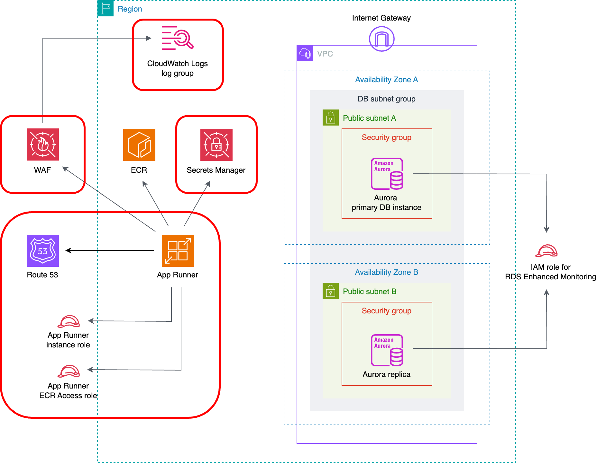

# API Backend Adapter

HTTPSで外部公開できるコンテナアプリケーションをビルドし、AWS環境にデプロイするCloud Native Adapterです。

以下のリソースを作成します。

* AWS App Runner
    * サービス
* IAMロール
    * App RunnerサービスのECRアクセスロール用のロール
    * App Runnerサービスのインスタンスロール用のロール
* Amazon Route 53
    * App Runnerサービスにカスタムドメインをリンクするために以下のレコードを作成します。
        * ALIASレコード
        * CNAMEレコード（2つ）
* AWS WAF
    * IPセット
        * アプリケーションにアクセスできるソースIPアドレスを制限する場合のみ、作成します。
    * Web ACL
* Amazon CloudWatch Logs
    * Web ACLトラフィックのログを記録するためのロググループ
* Amazon RDS（Amazon Aurora MySQL）
    * データベース
    * 作成したデータベースへのGRANT ALL権限をもつユーザアカウント
* AWS Secrets Managerシークレット
    * MySQLのユーザ用パスワードを格納したシークレット



## Platform

AWS

## Module

* Module: `qmonus.net/adapter/official`
* Import path: `qmonus.net/adapter/official/adapters/aws/serverless/webApp/apiBackend`

## Level

Sample: サンプル実装

## Prerequisites / Constraints

### Prerequisites

* 事前に [Shared Infrastructure Adapter](./sharedInfrastructure/README.md) を用いて各種クラウドリソースを作成してください。

* 事前にIAMユーザーを作成し、Qmonus Value Streamへ認証情報を登録する必要があります。以下のポリシーをIAMユーザーに付与してください。
    * `AmazonEC2ContainerRegistryFullAccess`
    * `AmazonRoute53FullAccess`
    * `AWSAppRunnerFullAccess`
    * `AWSWAFFullAccess`
    * `CloudWatchLogsFullAccess`
    * `IAMFullAccess`
    * `SecretsManagerReadWrite`

* 事前にDNSゾーンを作成する必要があります。AWSにRoute 53ホストゾーンを作成し、各委譲元のDNSプロバイダで委譲設定を行ってください。

### Constraints

* 以下のリソースでは、リソース名にサフィックスとしてランダムな3文字を付与します。
    * App Runnerサービス
    * IAMロール
    * IPセット
    * Web ACL
    * ロググループ
        * リソース名のプレフィックスにサフィックスが付与されます。
    * Secret Managerシークレット
        * リソース名のプレフィックスにサフィックスが付与されます。
* AWS App Runner
    * サービス
        * デプロイ方法には手動デプロイを使用します。
        * ヘルスチェックのプロトコルにはTCPを使用します。
        * 受信ネットワークトラフィックにはパブリックエンドポイントを使用します。
        * 送信ネットワークトラフィックにはパブリックアクセスを使用します。
        * 以下の値を環境変数としてアプリケーションに渡します。
            * Amazon Aurora MySQL DBクラスターのライターエンドポイント
            * 作成したMySQLのデータベース名
            * 作成したMySQLのユーザ名
            * パラメータ `environmentVariables` を設定することで、任意の環境変数も追加できます。
                * なお、App Runnerでは `PORT` という環境変数名は予約されているため、使用しないでください。
        * 以下のSecrets Managerシークレットを環境変数としてアプリケーションに渡します。
            * 作成したMySQLのユーザ用パスワード
            * パラメータ `secretsArn` を設定することで、任意のSecrets Managerシークレットも追加できます。
* IAMロール
    * App RunnerサービスのECRアクセスロール用のロール
        * 以下のAWS管理ポリシーを付与します。
            * `AWSAppRunnerServicePolicyForECRAccess`
    * App Runnerサービスのインスタンスロール用のロール
        * Secrets Managerシークレットを参照するアクセス許可を有効化するためのインラインポリシーを付与します。
* AWS WAF
    * Web ACL
        * アプリケーションにアクセスできるソースIPアドレスを本Adapterのパラメータ `wafAllowedSourceIps` で設定する場合:
            * デフォルトアクションは `Block` になります。
            * 設定したソースIPアドレスからのアクセスのみを許可します。
        * アプリケーションにアクセスできるソースIPアドレスを本Adapterのパラメータ `wafAllowedSourceIps` で設定しない場合:
            * デフォルトアクションは `Allow` になります。
* Amazon CloudWatch Logs
    * Web ACLトラフィックのログを記録するためのロググループ
        * ロググループ名には `aws-waf-logs-qvs-${appName}-<SUFFIX>-` というプレフィックスが付与されます。
        * AWS WAFからのログ送信を有効化するためにリソースポリシーが設定されます。
            * 設定されたリソースポリシーは `aws logs describe-resource-policies` コマンドで確認できます。
* Amazon RDS（Amazon Aurora MySQL）
    * データベース
        * 文字セットには `utf8mb4` を使用します。
        * 照合順序には `utf8mb4_0900_ai_ci` を使用します。
    * 作成したデータベースへのGRANT ALL権限をもつユーザアカウント
        * `${mysqlUserName}'@'%` として作成します。
        * パスワードは、1文字以上の大小英数字記号を含む16文字でランダムで生成されます。
* AWS Secrets Managerシークレット
    * MySQLのユーザ用パスワードを格納したシークレット
        * シークレット名には `qvs-${appName}-db-user-password-<SUFFIX>-` というプレフィックスが付与されます。

## Infrastructure Parameters

| Parameter Name | Type | Required | Default | Description | Example | Auto Binding |
| --- | --- | --- | --- | --- | --- | --- |
| appName | string | yes | - | QVSにおけるApplication名 | sample | yes |
| awsAccountId | string | yes | - | AWSリソースの作成に使用するアカウントID | "012345678912" | yes |
| awsRegion | string | yes | - | AWSリソースの作成に使用するリージョン | ap-northeast-1 | yes |
| dnsZoneId | string | yes | - | 事前に用意したRoute 53ホストゾーンのホストゾーンID | Z0123456789ABCDEFGHIJ | no |
| appRunnerServiceCpu | string | no | "1024" | App Runnerサービスで使用する仮想CPUの数。256（0.25 vCPU）, 512（0.5 vCPU）, 1024（1 vCPU）, 2048（2 vCPU）, 4096（4 vCPU）のいずれかの数値を設定してください。 | "1024" | no |
| appRunnerServiceCpu | string | no | "2048" | App Runnerサービスで使用するメモリの容量。512（0.5GB）, 1024（1GB）, 2048（2GB）, 3072（3GB）, 4096（4GB）, 6144（6GB）, 8192（8GB）, 10240（10GB）, 12288（12GB）のいずれかの数値を設定してください。 | "2048" | no |
| appRunnerServicePort | string | yes | - | アプリケーションが利用するポート番号 | "80" | no |
| appRunnerServiceCustomDomain | string | yes | - | App Runnerサービスにリンクするカスタムドメイン | www.example.com | no |
| appRunnerServiceImageUri | string | yes | - | App Runnerサービスで使用する、ECRにおけるコンテナイメージのURI | 012345678912.dkr.ecr.ap-northeast-1.amazonaws.com/nginx:latest | no |
| wafAllowedSourceIps | array | no | [] | App Runnerサービスへのアクセスを許可するソースIPアドレスのリスト <br> アプリケーションへのアクセスを許可したいIPアドレスをCIDR表記で指定してください。複数のIPアドレスを指定する場合はカンマ区切りの文字列で指定します。指定を省略した場合は、インターネットの全てのIPアドレスからのアクセスが許可されます。 | "192.168.0.1/32","172.16.0.0/12" | no |
| wafLogGroupRetentionInDays | string | no | "365" | Web ACLトラフィックのログを記録するためのロググループにおいてログが保持される日数。1, 3, 5, 7, 14, 30, 60, 90, 120, 150, 180, 365, 400, 545, 731, 1096, 1827, 2192, 2557, 2922, 3288, 3653, 0のいずれかの数値を設定してください。0を設定した場合は、無制限で保持されます。 | "365" | no |
| rdsEndpoint | string | yes | - | Amazon Aurora MySQL DBクラスターのライターエンドポイント | example.0123456789.ap-northeast-1.rds.amazonaws.com | no |
| rdsEndpointEnvironmentVariableName | string | no | DB_HOST | Amazon Aurora MySQL DBクラスターのライターエンドポイントとしてApp Runnerサービスに設定される環境変数名 | DB_HOST | no |
| rdsMasterPasswordSecretArn | string | yes | - | Amazon Aurora MySQL DBインスタンスのマスターパスワードが格納されたSecrets ManagerシークレットのARN | arn:aws:secretsmanager:ap-northeast-1:012345678912:secret:db-master-password-xxxxxx | no |
| mysqlDatabaseName | string | yes | - | 新たに作成するMySQLのデータベース名 | database | no |
| mysqlDatabaseNameEnvironmentVariableName | string | no | DB_NAME | 作成したMySQLのデータベース名としてApp Runnerサービスに設定される環境変数名 | DB_NAME | no |
| mysqlUserName | string | yes | - | 新たに作成するMySQLのユーザ名 | dbuser | no |
| mysqlUserNameEnvironmentVariableName | string | no | DB_USER | 作成したMySQLのユーザ名としてApp Runnerサービスに設定される環境変数名 | DB_USER | no |
| mysqlUserPasswordEnvironmentVariableName | string | no | DB_PASS | 作成したMySQLのユーザ用パスワードとしてApp Runnerサービスに設定される環境変数名 | DB_PASS | no |
| secretsArn | object | no | - | App Runnerサービスに設定される環境変数名とSecrets ManagerシークレットのARNのペア | PASSWORD: arn:aws:secretsmanager:ap-northeast-1:012345678912:secret:secret-xxxxxx | no |
| environmentVariables | object | no | - | App Runnerサービスに設定される環境変数名と値のペア | ENV: prod | no |

## CI/CD Parameters

### Adapter Options

| Parameter Name | Type | Required | Default | Description | Example |
| --- | --- | --- | --- | --- | --- |
| repositoryKind | string | no | "" | ソースコードの管理に使用しているGitリポジトリの種類を指定してください。サポートしているのは、github, gitlab, bitbucket, backlog で、何も指定されない場合はgithub用の設定になります。 | gitlab |
| useSshKey | bool | no | false | trueを指定するとリポジトリをクローンするための認証にSSH Keyを使用するように設定できます。 | true |

### Parameters

| Parameter Name | Type | Required | Default | Description | Example | Auto Binding |
| --- | --- | --- | --- | --- | --- | --- |
| gitCloneUrl | string | yes | - | GitリポジトリサービスのURL | https://github.com/${organization}/<br>${repository} | yes |
| gitRevision | string | yes | - | Gitのリビジョン | commit-hash, branch-name or tag-name | no |
| gitRepositoryDeleteExisting | bool   | no | true | trueの場合、Git Checkoutする時に指定先のディレクトリが存在している場合に削除する |true | no |
| gitCheckoutSubDirectory | string | no | "" | GitのCheckout作業をするパス名 | "" | no |
| gitTokenSecretName | string | yes | - | Gitのアクセストークンを保管しているk8s Secret名 | gitsecret-xxxxxxxxxxxxxxxxxxxx | yes |
| gitSshKeySecretName | string | yes | - | GitのSSH Keyを保管しているk8s Secret名 | | yes |
| pathToSource | string | no | "" | ソースディレクトリからの相対パス | "" | no |
| qvsConfigPath | string | yes | - | QVS Config(旧称：Application Config)のパス | .valuestream/qvs.yaml | yes |
| appName | string | yes | - | QVSにおけるApplication名 | nginx | yes |
| qvsDeploymentName | string | yes | - | QVSにおけるDeployment名 | staging | yes |
| deployStateName | string | no | app | pulumi-stack名のSuffixとして使用される | app | no |
| awsCredentialName | string | yes | - | AWSのIAMユーザーの認証情報を保管しているSecret名 | aws-default-xxxxxxxxxxxxxxxxxxxx | yes |
| awsProfile | string | no | default | ECRのログインに使用するプロファイル名 | | no |
| awsRegion | string | yes | - | AWSリソースの作成に使用するリージョン | ap-northeast-1 | yes |
| containerRegistry | string | yes | "" | コンテナレジストリのエンドポイント | xxxxxxxxxxxx.dkr.ecr.ap-northeast-1.amazonaws.com | no |
| dockerfile | string | yes | Dockerfile | ビルドするDockerfileのファイル名 | | no |
| imageRegistryPath | string | yes | - | ビルドしたイメージをプッシュするコンテナレジストリのイメージ名を含まないパス | xxxxxxxxxxxx.dkr.ecr.ap-northeast-1.amazonaws.com | no |
| imageShortName | string | yes | - | ビルドするコンテナイメージの省略名。ECRのリポジトリ名を指定する。 | nginx | no |
| imageTag | string | yes | - | コンテナイメージのタグ名 | v1.0.0 | no |
| pathToContext | string | yes | . | ソースディレクトリからの相対パス | | no |
| extraArgs | string | yes | "" | Buildkitでイメージをビルドする際に追加で設定するオプション | --opt build-arg:foo=var | no |

## Application Resources

| Resource ID | Provider | Resource Name | Description |
| --- | --- | --- | --- |
| resourceSuffix | random | RandomString | 一部のリソース名の末尾に追加するランダム文字列（3文字）を生成します。 |
| appRunnerService | aws | AWS App Runnerサービス | コンテナアプリケーションをデプロイするためのApp Runnerサービスを作成します。 |
| appRunnerServiceEcrAccessRole | aws | IAMロール | App RunnerサービスのECRアクセスロール用のロールを作成します。 |
| appRunnerServiceInstanceRole | aws | IAMロール | App Runnerサービスのインスタンスロール用のロールを作成します。 |
| appRunnerServiceInstanceRolePolicy | aws | IAMインラインポリシー | App Runnerサービスのインスタンスロール用のロールに付与するインラインポリシーを作成します。 |
| appRunnerCustomDomainAssociation | aws | AWS App Runnerサービス | App Runnerサービスにカスタムドメインをリンクします。 |
| aliasRecord | aws | Amazon Route 53レコード | ALIASレコードを作成します。 |
| cnameRecord1 | aws | Amazon Route 53レコード | 1つめのCNAMEレコードを作成します。 |
| cnameRecord2 | aws | Amazon Route 53レコード | 2つめのCNAMEレコードを作成します。 |
| ipSet | aws | AWS WAF IPセット | IPセットを作成します。 |
| webAcl | aws | AWS WAF Web ACL | Web ACLを作成します。 |
| webAclAssociation | aws | AWS WAF Web ACL | Web ACLをApp Runnerサービスに関連づけます。 |
| webAclLoggingConfiguration | aws | AWS WAF Web ACL | Web ACLをロググループに関連づけます。 |
| webAclLogGroup | aws | Amazon CloudWatch Logsロググループ | Web ACLトラフィックのログを記録するためのロググループを作成します。 |
| logResourcePolicyForWafLogging | aws | Amazon CloudWatch Logsリソースポリシー | AWS WAFからロググループへのログ送信を有効化するためのリソースポリシーを作成します。 |
| database | mysql | Database | MySQLのデータベースを作成します。 |
| user | mysql | User | MySQLのユーザを作成します。 |
| grant | mysql | Grant | 作成したデータベースへの権限をユーザに付与します。 |
| userPassword | random | RandomPassword | MySQLのユーザ用パスワードを、1文字以上の大小英数字記号を含む16文字で生成します。 |
| userPasswordSecret | aws | AWS Secrets Managerシークレット | MySQLのユーザ用パスワード用のシークレットを作成します。シークレットの値自体は、シークレットではなくシークレットバージョンとして作成されます。 |
| userPasswordSecretVersion | aws | AWS Secrets Managerシークレットバージョン | MySQLのユーザ用パスワードが格納されたシークレットバージョンを作成します。 |

## Pipeline Resources

以下のTekton Pipeline/Taskリソースを含むマニフェストが作成されます。

### Pipeline

| Resource ID | Description |
| --- | --- |
| build | git-checkout(-ssh), docker-login-aws, buildkit のTaskを順番に実行し、Dockerfileからイメージのビルドとプッシュを行います。 |
| deploy | git-checkout(-ssh), compile-adapter-into-pulumi-yaml(-ssh), deploy-by-pulumi-yaml のTaskを順番に実行し、アプリケーションを指定の環境にデプロイします。 |

### Task

| Resource ID | Pipeline | runAfter | Description |
| --- | --- | --- | --- |
| git-checkout | build, deploy | - | 指定のGitリポジトリをクローンし、対象のリビジョン・ブランチにチェックアウトします。クローンする際の認証にはGit Tokenを使用します。AdapterOptionsのuseSshKeyがFalseかつrepositoryKindがgithub, gitlabの場合に作成されます。 |
| git-checkout-ssh | build, deploy | - | 指定のGitリポジトリをクローンし、対象のリビジョン・ブランチにチェックアウトします。クローンする際の認証にはSSH Keyを使用します。AdapterOptionsのuseSshKeyがTrueまたはrepositoryKindがbitbucket, backlogの場合に作成されます。 |
| docker-login-aws | build | git-checkout or git-checkout-ssh | 指定したElastic Container Registryへの認証を行います。|
| buildkit | build | docker-login-aws | Dockerfileからイメージをビルドし、コンテナレジストリへプッシュします。|
| compile-adapter-into-pulumi-yaml | deploy | git-checkout | リポジトリ内の QVS Config に記載されている Cloud Native Adapter をコンパイルし、PulumiYamlのプロジェクトファイルを生成します。AdapterOptionsのuseSshKeyがFalseかつrepositoryKindがgithub, gitlabの場合に作成されます。 |
| compile-adapter-into-pulumi-yaml-ssh | deploy | git-checkout-ssh | リポジトリ内の QVS Config に記載されている Cloud Native Adapter をコンパイルし、PulumiYamlのプロジェクトファイルを生成します。AdapterOptionsのuseSshKeyがTrueまたはrepositoryKindがbitbucket, backlogの場合に作成されます。 |
| deploy-by-pulumi-yaml | deploy | compile-adapter-into-pulumi-yaml or compile-adapter-into-pulumi-yaml-ssh | コンパイルされたPulumiYamlのプロジェクトファイルを指定の環境にデプロイします。 |

## Usage

```yaml
designPatterns:
  - pattern: qmonus.net/adapter/official/adapters/aws/serverless/webApp/apiBackend
    params:
      appName: $(params.appName)
      awsAccountId: $(params.awsAccountId)
      awsRegion: $(params.awsRegion)
      dnsZoneId: $(params.dnsZoneId)
      appRunnerServicePort: $(params.appRunnerServicePort)
      appRunnerServiceCustomDomain: $(params.appRunnerServiceCustomDomain)
      appRunnerServiceImageUri: $(params.appRunnerServiceImageUri)
      rdsEndpoint: $(params.rdsEndpoint)
      rdsMasterPasswordSecretArn: $(params.rdsMasterPasswordSecretArn)
      mysqlDatabaseName: $(params.mysqlDatabaseName)
      mysqlUserName: $(params.mysqlUserName)
```

## Code

[apiBackend](main.cue)
