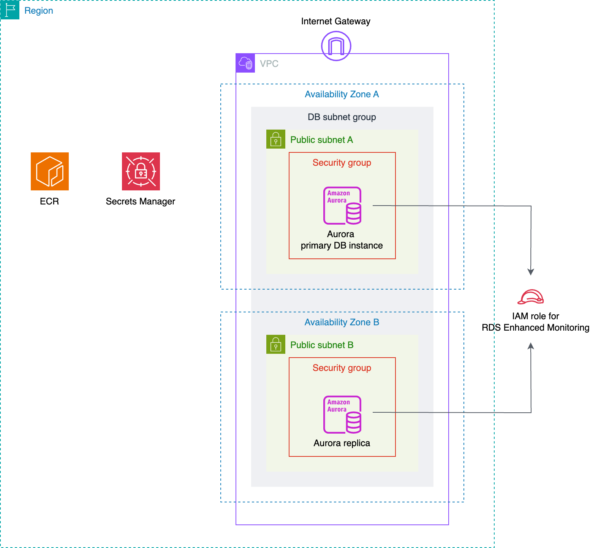

# Shared Infrastructure Adapter

HTTPSで外部公開できるアプリケーションをAWS上にデプロイするために必要なAWSリソース群をデプロイするCloud Native Adapterです。

以下のリソースを作成します。

* Amazon VPC
* サブネット（2つ）
* インターネットゲートウェイ
* ルートテーブル
* セキュリティグループ
* Amazon RDS（Amazon Aurora MySQL）
    * DBクラスター
    * DBインスタンス（2つ）
    * サブネットグループ
    * DBクラスターパラメータグループ
* IAMロール
    * Amazon RDS拡張モニタリング用のロール
* AWS Secrets Managerシークレット
    * DBインスタンスのマスターパスワード
* Amazon ECRリポジトリ



## Platform

AWS

## Module

* Module: `qmonus.net/adapter/official`
* Import path: `qmonus.net/adapter/official/adapters/aws/serverless/webApp/apiBackend/sharedInfrastructure`

## Level

Sample: サンプル実装

## Prerequisites / Constraints

### Prerequisites

* 事前にIAMユーザーを作成し、Qmonus Value Streamへ認証情報を登録する必要があります。以下のポリシーをIAMユーザーに付与してください。
    * `AmazonVPCFullAccess`
    * `AmazonRDSFullAccess`
    * `IAMFullAccess`
    * `SecretsManagerReadWrite`
    * `AmazonEC2ContainerRegistryFullAccess`

### Constraints

* VPC
    * 以下のIPv4 CIDRブロックが設定されます。
        * 10.0.0.0/16
* サブネット
    * 2つのサブネットを作成します。
    * 各サブネットを所属させたいアベイラビリティゾーン名を、本Adapterのパラメータ `subnet1AvailabilityZone` および `subnet2AvailabilityZone` に設定してください。
        * `subnet1AvailabilityZone` と `subnet2AvailabilityZone` には、それぞれ異なるアベイラビリティゾーン名を設定する必要があります。
    * 各サブネットには、それぞれ以下のIPv4 VPC CIDRブロックが設定されます。
        * サブネット1
            * 10.0.4.0/22
        * サブネット2
            * 10.0.8.0/22
* ルートテーブル
    * 以下のルートを追加します。
        * localルート
        * インターネットゲートウェイへのルート
    * 2つのサブネット両方と関連づけます。
* セキュリティグループ
    * DBクラスターに設定します。
    * 以下のインバウンドルールおよびアウトバウンドルールを設定します。
        * インバウンドルール
            * すべてのIPアドレスからのMySQLトラフィックを許可します。
        * アウトバウンドルール
            * すべてのトラフィックを許可します。
* Amazon RDS（Amazon Aurora MySQL）
    * DBクラスター
        * エンジンはAurora MySQLになります。
        * エンジンバージョンにはMySQL 8.0互換のエンジンバージョンを設定できます。
        * クラスターストレージ設定にはAurora スタンダードを使用します。
        * Aurora Serverless v2を使用します。
        * DBクラスター識別子には `qvs-db-cluster-` というプレフィックスが付与されます。
        * マスターユーザー名は `root` になります。
        * マスターパスワードは、1文字以上の大小英数字記号を含む16文字でランダムで生成されます。
        * 以下のログがCloudWatch Logsにエクスポートされます。
            * 本Adapterのパラメータ `rdsCloudWatchLogsExportsType` に `standard` を設定した場合:
                * 監査ログ
                * エラーログ
                * スロークエリログ
            * `rdsCloudWatchLogsExportsType` に `all` を設定した場合:
                * `standard` を設定した場合にエクスポートされるログ
                * 全般ログ
        * クラスターの削除後に自動バックアップを保持します。自動バックアップの保持期間は本Adapterのパラメータ `rdsBackupRetentionPeriod` で設定できます。
    * DBインスタンス
        * 2つのインスタンスを作成します。
        * DB識別子には `qvs-db-instance-` というプレフィックスが付与されます。
        * パブリックアクセス可能にします。
        * Performance Insightsが有効化されます。
        * 拡張モニタリングが有効化されます。
        * マイナーバージョン自動アップグレードは無効化されます。
    * サブネットグループ
        * 2つのサブネット両方が追加されます。
    * DBクラスターパラメータグループ
        * CloudWatch Logsへのログエクスポートのために、以下のパラメータを設定します。
            * 本Adapterのパラメータ `rdsCloudWatchLogsExportsType` に `standard` を設定した場合:
                * `server_audit_logging = 1`
                * `server_audit_events = CONNECT,QUERY,TABLE`
                * `slow_query_log = 1`
            * `rdsCloudWatchLogsExportsType` に `all` を設定した場合:
                * `standard` を設定した場合に設定されるパラメータ
                * `general_log = 1`
* IAMロール
    * Amazon RDS拡張モニタリング用のロール
        * 以下のAWS管理ポリシーを付与します。
            * `AmazonRDSEnhancedMonitoringRole`
* AWS Secrets Managerシークレット
    * DBインスタンスのマスターパスワード
        * シークレット名には `qvs-${appName}-db-master-password-` というプレフィックスが付与されます。

## Infrastructure Parameters

| Parameter Name | Type | Required | Default | Description | Example | Auto Binding |
| --- | --- | --- | --- | --- | --- | --- |
| appName | string | yes | - | QVSにおけるApplication名 | sample | yes |
| awsRegion | string | yes | - | AWSリソースの作成に使用するリージョン | ap-northeast-1 | yes |
| subnet1AvailabilityZone | string | yes | - | 1つめのサブネットを所属させるアベイラビリティゾーン名 | ap-northeast-1a | no |
| subnet2AvailabilityZone | string | yes | - | 2つめのサブネットを所属させるアベイラビリティゾーン名。`subnet1AvailabilityZone` とは異なるアベイラビリティゾーン名を指定してください。 | ap-northeast-1c | no |
| rdsEngineVersion | string | yes | - | Amazon Aurora MySQLのエンジンバージョン番号。MySQL 8.0互換のエンジンバージョンのみ指定できます。利用可能なバージョンは `aws rds describe-db-engine-versions` コマンドで確認できます。 | 8.0.mysql_aurora.3.05.2 | no |
| rdsBackupRetentionPeriod | string | no | "1" | DBインスタンスの自動バックアップが保持される日数。1〜35の数値を設定してください。 | "1" | no |
| rdsPerformanceInsightsRetentionPeriod | string | no | "7" | Performance Insightsが保存するDBインスタンスのデータベースパフォーマンスデータの保持日数。7または {month * 31}（monthは1～23の数値）または731を設定してください。 | "62" | no |
| rdsCloudWatchLogsExportsType | string | no | standard | DBインスタンスがCloudWatch Logsにエクスポートするログの種類。`standard`, `all` のいずれかを設定できます。`standard` の場合は、監査ログ, エラーログ, スロークエリログがエクスポートされます。`all` の場合は、`standard` のログに加えて全般ログもエクスポートされます。 | standard | no |
| rdsApplyImmediately | string | no | "false" | DBインスタンスのダウンタイムを要する変更が発生する場合に、変更をすぐに適用するかどうかを指定します。`"true"`, `"false"` のいずれかを設定できます。`"false"` の場合は、次のメンテナンスウィンドウに変更が適用されます。 | "false" | no |
| rdsBackupWindow | string | no | 18:00-18:30 | DBクラスターのバックアップウィンドウ。`hh:mm-hh:mm` の形式で、30分間以上の期間を指定してください。時刻はUTC表記で指定してください。 | 16:00-17:00 | no |
| rdsMaintenanceWindow | string | no | tue:19:00-tue:19:30 | DBクラスターおよびインスタンスのメンテナンスウィンドウ。`ddd:hh:mm-ddd:hh:mm` の形式で、30分間以上かつ、`rdsBackupWindow` で指定するバックアップウィンドウと重ならない期間を設定してください。時刻はUTC表記で指定してください。 | wed:17:00-wed:19:00 | no |
| auroraServerlessv2MaxAcu | string | no | "16" | Aurora Serverless v2のスケーリングの最大容量（ACU）。1〜128の範囲かつ、0.5の増分となる数値を設定してください。 | "64" | no |
| auroraServerlessv2MinAcu | string | no | "2" | Aurora Serverless v2のスケーリングの最小容量（ACU）。0.5〜128の範囲かつ、0.5の増分となる数値を設定してください。 | "0.5" | no |

## CI/CD Parameters

### Adapter Options

| Parameter Name | Type | Required | Default | Description | Example |
| --- | --- | --- | --- | --- | --- |
| repositoryKind | string | no | "" | ソースコードの管理に使用しているGitリポジトリの種類を指定してください。サポートしているのは、github, gitlab, bitbucket, backlog で、何も指定されない場合はgithub用の設定になります。 | gitlab |
| useSshKey | bool | no | false | trueを指定するとリポジトリをクローンするための認証にSSH Keyを使用するように設定できます。 | true |

### Parameters

| Parameter Name | Type | Required | Default | Description | Example | Auto Binding |
| --- | --- | --- | --- | --- | --- | --- |
| gitCloneUrl | string | yes | - | GitリポジトリサービスのURL | https://github.com/${organization}/<br>${repository} | yes |
| gitRevision | string | yes | - | Gitのリビジョン | commit-hash, branch-name or tag-name | no |
| gitRepositoryDeleteExisting | bool   | no | true | trueの場合、Git Checkoutする時に指定先のディレクトリが存在している場合に削除する |true | no |
| gitCheckoutSubDirectory | string | no | "" | GitのCheckout作業をするパス名 | "" | no |
| gitTokenSecretName | string | yes | - | Gitのアクセストークンを保管しているk8s Secret名 | gitsecret-xxxxxxxxxxxxxxxxxxxx | yes |
| pathToSource | string | no | "" | ソースディレクトリからの相対パス | "" | no |
| qvsConfigPath | string | yes | - | QVS Config(旧称：Application Config)のパス | .valuestream/qvs.yaml | yes |
| appName | string | yes | - | QVSにおけるApplication名 | nginx | yes |
| qvsDeploymentName | string | yes | - | QVSにおけるDeployment名 | staging | yes |
| deployStateName | string | no | app | pulumi-stack名のSuffixとして使用される | app | no |
| awsCredentialName | string | yes | - | AWSのIAMユーザーの認証情報を保管しているSecret名 | aws-default-xxxxxxxxxxxxxxxxxxxx | yes |

## Application Resources

| Resource ID | Provider | Resource Name | Description |
| --- | --- | --- | --- |
| vpc | aws | Amazon VPC | VPCを作成します。 |
| subnet1 | aws | サブネット | 1つめのサブネットを作成します。 |
| subnet2 | aws | サブネット | 2つめのサブネットを作成します。 |
| internetGateway | aws | インターネットゲートウェイ | インターネットゲートウェイを作成します。 |
| routeTable | aws | ルートテーブル | ルートテーブルを作成します。 |
| routeTableAssociationWithSubnet1 | aws | ルートテーブル | ルートテーブルに1つめのサブネットを関連づけます。 |
| routeTableAssociationWithSubnet2 | aws | ルートテーブル | ルートテーブルに2つめのサブネットを関連づけます。 |
| securityGroup | aws | セキュリティグループ | セキュリティグループを作成します。 |
| securityGroupIngressRuleAllowMySQL | aws | セキュリティグループ インバウンドルール | MySQLトラフィックを許可するインバウンドルールを作成します。 |
| securityGroupEgressRuleAllowAll | aws | セキュリティグループ アウトバウンドルール | すべてのトラフィックを許可するアウトバウンドルールを作成します。 |
| dbSubnetGroup | aws | Amazon RDSサブネットグループ | サブネットグループを作成します。 |
| dbClusterParameterGroup | aws | Amazon RDS DBクラスターパラメータグループ | DBクラスターパラメータグループを作成します。 |
| dbMasterPassword | random | RandomPassword | DBインスタンスのマスターパスワードを、1文字以上の大小英数字記号を含む16文字で生成します。 |
| dbMasterPasswordSecret | aws | AWS Secrets Managerシークレット | DBインスタンスのマスターパスワード用のシークレットを作成します。シークレットの値自体は、シークレットではなくシークレットバージョンとして作成されます。 |
| dbMasterPasswordSecretVersion | aws | AWS Secrets Managerシークレットバージョン | DBインスタンスのマスターパスワードが格納されたシークレットバージョンを作成します。 |
| rdsEnhancedMonitoringRole | aws | IAMロール | Amazon RDS拡張モニタリング用のロールを作成します。 |
| dbCluster | aws | Amazon RDS DBクラスター | DBクラスターを作成します。 |
| dbClusterInstance1 | aws | Amazon RDS DBインスタンス | 1つめのDBインスタンスを作成します。 |
| dbClusterInstance2 | aws | Amazon RDS DBインスタンス | 2つめのDBインスタンスを作成します。 |
| ecrRepository | aws | Amazon ECRリポジトリ | ECRリポジトリを作成します。 |

## Pipeline Resources

以下のTekton Pipeline/Taskリソースを含むマニフェストが作成されます。

### Pipeline

| Resource ID | Description |
| --- | --- |
| deploy | git-checkout(-ssh), compile-adapter-into-pulumi-yaml(-ssh), deploy-by-pulumi-yaml のTaskを順番に実行し、アプリケーションを指定の環境にデプロイします。 |

### Task

| Resource ID | Pipeline | runAfter | Description |
| --- | --- | --- | --- |
| git-checkout | deploy | - | 指定のGitリポジトリをクローンし、対象のリビジョン・ブランチにチェックアウトします。クローンする際の認証にはGit Tokenを使用します。AdapterOptionsのuseSshKeyがFalseかつrepositoryKindがgithub, gitlabの場合に作成されます。 |
| git-checkout-ssh | deploy | - | 指定のGitリポジトリをクローンし、対象のリビジョン・ブランチにチェックアウトします。クローンする際の認証にはSSH Keyを使用します。AdapterOptionsのuseSshKeyがTrueまたはrepositoryKindがbitbucket, backlogの場合に作成されます。 |
| compile-adapter-into-pulumi-yaml | deploy | git-checkout | リポジトリ内の QVS Config に記載されている Cloud Native Adapter をコンパイルし、PulumiYamlのプロジェクトファイルを生成します。AdapterOptionsのuseSshKeyがFalseかつrepositoryKindがgithub, gitlabの場合に作成されます。 |
| compile-adapter-into-pulumi-yaml-ssh | deploy | git-checkout-ssh | リポジトリ内の QVS Config に記載されている Cloud Native Adapter をコンパイルし、PulumiYamlのプロジェクトファイルを生成します。AdapterOptionsのuseSshKeyがTrueまたはrepositoryKindがbitbucket, backlogの場合に作成されます。 |
| deploy-by-pulumi-yaml | deploy | compile-adapter-into-pulumi-yaml or compile-adapter-into-pulumi-yaml-ssh | コンパイルされたPulumiYamlのプロジェクトファイルを指定の環境にデプロイします。 |

## Usage

```yaml
designPatterns:
  - pattern: qmonus.net/adapter/official/adapters/aws/serverless/webApp/apiBackend/sharedInfrastructure
    params:
      appName: $(params.appName)
      awsRegion: $(params.awsRegion)
      subnet1AvailabilityZone: $(params.subnet1AvailabilityZone)
      subnet2AvailabilityZone: $(params.subnet2AvailabilityZone)
      rdsEngineVersion: $(params.rdsEngineVersion)
```

## Code

[sharedInfrastructure](main.cue)
