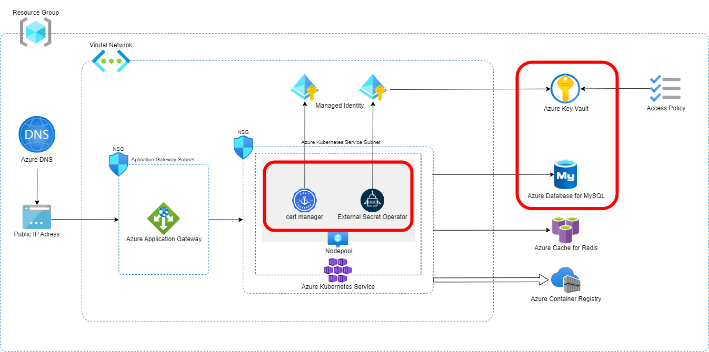

# API Backend Adapter

HTTPSで外部公開できるコンテナアプリケーションをビルドし、Azure環境にデプロイするCloud Native Adapterです。
以下のリソースを作成します。

* Azure DNS
  * レコードセット (Aレコード)
* Azure Database for MySQL
  * データベース
  * 作成したデータベースへのGRANT ALL権限をもつユーザーアカウント
* Azure Key Valut
  * MySQLのユーザー名、パスワードを格納したシークレット
* Kubernetes
  * Certificate
    * Aレコードとして払い出したドメインを指定し、HTTPS接続を可能にするための証明書を発行します。
  * Ingress
    * Certificateリソースと払い出したドメインを指定し、HTTPSアクセスを公開します。
  * Service
    * IngressへのアクセスをDeploymentに振り向けます。
  * ExternalSecret
    * Key Vaultにアクセスし、アプリケーションがDB接続を行うのに必要なユーザ名とパスワード、およびRedisのパスワードを取得します。
  * Deployment
    * パラメータから、DBとRedisのホスト名とポート番号を環境変数としてアプリケーションに渡します。
    * External Secretで生成されたSecretをマウントして、DBユーザ名とそのパスワード、およびRedisのパスワードを環境変数としてアプリケーションに渡します。



## Platform

Microsoft Azure, Kubernetes

## Module

* Module: `qmonus.net/adapter/official`
* Import path: `qmonus.net/adapter/official/adapters/azure/container/kubernetes/apiBackend`

## Level

Sample: サンプル実装

## Prerequisites / Constraints

### Prerequisites

* 事前に [Shared Infrastructure Adapter](./sharedInfrastructure/README.md) を用いて各種クラウドリソースを作成してください。

* AKSクラスタにアプリケーションをデプロイするために利用するkubeconfigは[Shared Infrastructure Adapter](./sharedInfrastructure/README.md) を用いて作成されます。kubeconfigの取得方法は [ドキュメント](./sharedInfrastructure/README.md#appendix) を参照してください。

### Constraints

* 作成するMySQLのユーザアカウントのパスワードは、それぞれ1文字以上の大小英数字を含む、16文字でランダムで生成されます。
* このAdapterでアプリケーションに渡す環境変数は以下のみとなります。
  * アプリケーションが利用するポート番号
  * 接続するデータベースのホスト名
  * データベースに接続するユーザ名
  * データベースに接続するユーザーパスワード
  * Redisのホスト名
  * Redisのポート番号
  * Redisの接続に使用するパスワード
* 環境変数を追加する場合はQVS ConfigにenvironmentVariablesパラメータを設定してください。
* 環境変数に機密情報を含む値を設定する場合はQVS Configにsecretsパラメータを設定し、Deployment Secretと併用して利用ください。
* アプリケーションに引数を渡す場合はQVS Configにargsパラメータを設定し、Deployment Configでカンマ区切りの文字列で指定してください。

## Infrastructure Parameters

| Parameter Name                         | Type   | Required | Default                | Description                                                    | Example                              | Auto Binding |
|----------------------------------------|--------|----------|------------------------|----------------------------------------------------------------|--------------------------------------|--------------|
| appName                                | string | yes      | -                      | QVSにおけるApplication名                                            | nginx                                | yes          |
| azureSubscriptionId                    | string | yes      | -                      | 事前に用意したAzureのリソースが含まれるサブスクリプション名                               | xxxxxxxx-xxxx-xxxx-xxxx-xxxxxxxxxxxx | yes          |
| azureResourceGroupName                 | string | yes      | -                      | 事前に用意したAzureのリソースが含まれるリソースグループ名                                | sample-resourcegroup                 | yes          |
| azureDnsZoneName                       | string | yes      | -                      | 事前に用意したDNSゾーン名                                                 | foo.example.com                      | no           |
| azureDnsZoneResourceGroupName          | string | yes      | -                      | 事前に用意したDNSゾーンが所属するリソースグループ名                                    | sample-dnszone-resourcegroup         | no           |
| azureDnsARecordName                    | string | yes      | -                      | 新たに作成するAレコード名                                                  | www                                  | no           |
| azureStaticIpAddress                   | string | yes      | -                      | 新たに作成するAレコードで指定するIPアドレス                                        | 192.168.x.x                          | no           |
| azureARecordTtl                        | string | no       | "3600"                 | 新たに作成するAレコードに設定するTTLの値                                         | "3600"                               | no           |
| mysqlCreateUserName                    | string | no       | dbuser                 | 新たに作成するMySQLのユーザー名                                             | dbuser                               | no           |
| mysqlCreateDbName                      | string | yes      | -                      | 新たに作成するMySQLのデータベース名                                           | sample-db                            | no           |
| mysqlCreateDbCharacterSet              | string | no       | utf8mb3                | 新たに作成するMySQLのデータベースに設定するキャラクタセット                               | utf8mb3                              | no           |
| mysqlEndpoint                          | string | no       | `dbHost` の値            | 接続するMySQLのエンドポイント（hostname / Unix domain socket）               | example.mysql.database.azure.com     | no           |
| azureKeyVaultKeyContainerName          | string | yes      | -                      | 事前に用意したキーコンテナ名                                                 | sample-keyvault                      | no           |
| azureKeyVaultDbAdminSecretName         | string | no       | dbadminuser            | 事前に用意した、MySQLのAdminユーザー名が格納されているシークレット名                        | dbadminuser                          | no           |
| azureKeyVaultDbAdminPasswordSecretName | string | no       | dbadminpassword        | 事前に用意した、MySQLのAdminパスワードが格納されているシークレット名                        | dbadminpassword                      | no           |
| azureKeyVaultDbUserSecretName          | string | no       | dbuser                 | MySQLのユーザー名を格納するシークレット名                                        | dbuser                               | no           |
| azureKeyVaultDbPasswordSecretName      | string | no       | dbpassword             | MySQLのユーザーパスワードを格納するシークレット名                                    | dbpassword                           | no           |
| clusterIssuerName                      | string | yes      | -                      | 使用するClusterIssuerリソース名                                         | letsencrypt                          | no           |
| k8sNamespace                           | string | yes      | -                      | アプリケーションをデプロイする対象のNamespace                                    | qvs-sample                           | yes          |
| imageName                              | string | yes      | -                      | デプロイするDocker Image                                             | nginx:latest                         | no           |
| replicas                               | string | no       | "1"                    | 作成するPodのレプリカ数                                                  | "1"                                  | no           |
| portEnvironmentVariableName            | string | no       | PORT                   | アプリケーションが利用するポート番号としてアプリケーションPodに渡される環境変数名                     | PORT                                 | no           |
| port                                   | string | yes      | -                      | アプリケーションが利用するポート番号                                             | "3000"                               | no           |
| dbHostEnvironmentVariableName          | string | no       | DB_HOST                | Azure Database for MySQLのホスト名としてアプリケーションPodに渡される環境変数名          | DB_HOST                              | no           |
| dbHost                                 | string | yes      | -                      | Azure Database for MySQLのホスト名                                  | example.mysql.database.azure.com     | no           |
| dbUserEnvironmentVariableName          | string | no       | DB_USER                | Azure Database for MySQLに接続するユーザ名としてアプリケーションPodに渡される環境変数名      | DB_USER                              | no           |
| dbPasswordEnvironmentVariableName      | string | no       | DB_PASS                | Azure Database for MySQLに接続するユーザのパスワードとしてアプリケーションPodに渡される環境変数名 | DB_PASS                              | no           |
| redisHostEnvironmentVariableName       | string | no       | REDIS_HOST             | Azure Cache for Redisのホスト名としてアプリケーションPodに渡される環境変数名             | REDIS_HOST                           | no           |
| redisHost                              | string | yes      | -                      | Azure Cache for Redisのホスト名                                     | example.redis.cache.windows.net      | no           |
| redisPortEnvironmentVariableName       | string | no       | REDIS_PORT             | Azure Cache for Redisのポート番号としてアプリケーションPodに渡される環境変数名            | REDIS_PORT                           | no           |
| redisPort                              | string | no       | "6380"                 | Azure Cache for Redisのポート番号（6380 または 6379 のみ指定可能）              | "6380"                               | no           |
| redisPasswordEnvironmentVariableName   | string | no       | REDIS_PASS             | Azure Cache for Redisの接続に使用するパスワードとしてアプリケーションPodに渡される環境変数名     | REDIS_PASS                           | no           |
| redisPasswordSecretName                | string | yes      | -                      | Azure Cache for Redisの接続に使用するパスワードが格納されているシークレット名              | redispass                            | no           |
| host                                   | string | yes      | -                      | 公開するアプリケーションのホスト名                                              | www.foo.example.com                  | no           |
| clusterSecretStoreName                 | string | no       | qvs-global-azure-store | 使用するClusterSecretStoreリソース名                                    | qvs-global-azure-store               | no           |
| secrets                                | object | no       | -                      | アプリケーションPodに渡される環境変数名とDeployment Secret名のペア                    | PASSWORD: password                   | no           |
| environmentVariables                   | object | no       | -                      | アプリケーションPodに渡される環境変数名と値のペア                                     | ENV: prod                            | no           |
| args                                   | array  | no       | -                      | アプリケーションPodに渡される引数。カンマ区切りの文字列がコンテナのargsに配列として渡されます。            | "--debug,--profile"                  | no           |

## CI/CD Parameters

### Adapter Options

| Parameter Name | Type | Required | Default | Description | Example | Auto Binding |
| --- | --- | --- | --- | --- | --- | --- |
| repositoryKind | string | no | "" | ソースコードの管理に使用しているGitリポジトリの種類を指定してください。サポートしているのは、github, gitlab, bitbucket, backlog で、何も指定されない場合はgithub用の設定になります。 | "" | no |
| useSshKey | bool | no | false | trueを指定するとリポジトリをクローンするための認証にSSH Keyを使用するように設定できます。 | false | no |

### Parameters

| Parameter Name | Type | Required | Default | Description | Example | Auto Binding |
| --- | --- | --- | --- | --- | --- | --- |
| gitCloneUrl | string | yes | - | GitリポジトリサービスのURL | https://github.com/${organization}/<br>${repository} | yes |
| gitRevision  | string | yes | - | Gitのリビジョン | main | no |
| gitRepositoryDeleteExisting  | bool | no | true | trueの場合、Git Checkoutする時に指定先のディレクトリが存在している場合に削除する | true | no |
| gitCheckoutSubDirectory | string | no | "" | GitのCheckout作業をするパス名 | "" | no |
| gitTokenSecretName | string | yes | - | Gitのアクセストークンを保管しているk8s Secret名 | gitsecret-xxxxxxxxxxxxxxxxxxxx | yes |
| gitSshKeySecretName | string | yes | - | GitのSSH Keyを保管しているk8s Secret名 | gitsecret-xxxxxxxxxxxxxxxxxxxx | yes |
| azureApplicationId | string | yes | - | AzureのApplicationID | xxxxxxxx-xxxx-xxxx-xxxx-xxxxxxxxxxxx | yes |
| azureClientSecretName | string | yes | - | AzureのClientSecretを保管しているSecret名 | azure-default-xxxxxxxxxxxxxxxxxxxx | yes |
| dockerfile | string | no | Dockerfile | ビルドするdockerfileのファイル名 | Dockerfile | no |
| imageRegistryPath | string | yes | - | ビルドしたイメージをプッシュするコンテナレジストリのイメージ名を含まないパス | ${acr_name}.azurecr.io/sample | no |
| imageShortName | string | yes | - | ビルドするコンテナイメージの省略名。ACRのリポジトリ名を指定する。| nginx | no |
| imageTag | string | yes | - | コンテナイメージのタグ名。buildcacheというタグ名は予約されているため指定できません。 | v1.0.0 | no |
| pathToContext | string | no | . | ソースディレクトリからの相対パス | . | no |
| extraArgs | string | no | "" | Buildkitでイメージをビルドする際に追加で設定するオプション | "" | no |
| pathToSource | string | no | "" | ソースディレクトリからの相対パス | "" | no |
| qvsConfigPath | string | yes | - | QVS Config(旧称：Application Config)のパス | .valuestream/qvs.yaml | yes |
| appName | string | yes | - | QVSにおけるApplication名 | nginx | yes |
| qvsDeploymentName | string | yes | - | QVSにおけるDeployment名 | staging | yes |
| kubeconfigSecretName | string | yes | - | QVSにおけるDeploymentの作成時に指定したkubeconfigを保管しているSecret名 | kubernetes-default-xxxxxxxxxxxxxxxxxxxx | yes |
| azureTenantId | string | yes | - | AzureのTenantID | yyyyyyyy-yyyy-yyyy-yyyy-yyyyyyyyyyyy | yes |
| azureSubscriptionId | string | yes | - | AzureのSubscriptionID | xxxxxxxx-xxxx-xxxx-xxxx-xxxxxxxxxxxx | yes |

## Application Resources

### Azure Resources

| Resource ID | Provider | Resource Name | Description |
| --- | --- | --- | --- |
| aRecord | Azure | Azure DNS | レコードセットに新たにAレコードを追加します。 |
| database | MySQL | Database | MySQLサーバーに新たにデータベースを作成します。 |
| user | MySQL | User | MySQLサーバーに新たにユーザーを作成します。 |
| grant | MySQL | Grant | 作成したデータベースへの権限をユーザーに付与します。 |
| dbRandomPassword | Random | RandomPassword | 新規作成するMySQLユーザーパスワードを16文字の英大数字で生成します。 |
| dbUserSecret | Azure | Azure Key Valut | 新規作成したMySQLユーザー名を格納したシークレットを作成します。 |
| dbPasswordSecret | Azure | Azure Key Valut | 新規作成したMySQLユーザーパスワードを格納したシークレットを作成します。 |

### Kubernetes Resources

| Resource ID | Provider | API version | Kind | Description |
| --- | --- | --- | --- | --- |
| ingress | kubernetes | v1 | Ingress | Serviceに対する外部からのアクセスを管理します。 |
| service | kubernetes | v1 | Service | 各Node上で、静的なポートでServiceを公開します。 |
| deployment | kubernetes | apps/v1 | Deployment | デプロイするPodリソース（アプリケーション）を定義します。 |
| externalSecret | kubernetes | external-secrets.io/v1beta1 | ExternalSecret | 外部プロバイダの機密情報をSecretリソースとして使用できるようにします。 |

## Pipeline Resources

以下の Tekton Pipeline/Task リソースを含むマニフェストが作成されます。

### Pipeline

| Resource ID | Description |
| --- | --- |
| build | git-checkout(-ssh), docker-login-azure, buildkit のTaskを順番に実行し、Dockerfileからイメージのビルドとプッシュを行います。 |
| deploy | git-checkout(-ssh), compile-adapter-into-pulumi-yaml(-ssh), deploy-by-pulumi-yaml のTaskを順番に実行し、アプリケーションを指定の環境にデプロイします。 |

### Task

| Resource ID | Pipeline | runAfter | Description |
| --- | --- | --- | --- |
| git-checkout | build, deploy | - | 指定のGitリポジトリをクローンし、対象のリビジョン・ブランチにチェックアウトします。クローンする際の認証にはGit Tokenを使用します。AdapterOptionsのuseSshKeyがFalseかつrepositoryKindがgithub, gitlabの場合に作成されます。 |
| git-checkout-ssh | build, deploy | - | 指定のGitリポジトリをクローンし、対象のリビジョン・ブランチにチェックアウトします。クローンする際の認証にはSSH Keyを使用します。AdapterOptionsのuseSshKeyがTrueまたはrepositoryKindがbitbucket, backlogの場合に作成されます。 |
| docker-login-azure | build | git-checkout or git-checkout-ssh | 指定したAzure Container Registryへの認証を行います。|
| buildkit | build | docker-login-azure | Dockerfileからイメージをビルドし、コンテナレジストリへプッシュします。|
| compile-adapter-into-pulumi-yaml | deploy | git-checkout | リポジトリ内の QVS Config に記載されている Cloud Native Adapter をコンパイルし、PulumiYamlのプロジェクトファイルを生成します。AdapterOptionsのuseSshKeyがFalseかつrepositoryKindがgithub, gitlabの場合に作成されます。 |
| compile-adapter-into-pulumi-yaml-ssh | deploy | git-checkout-ssh | リポジトリ内の QVS Config に記載されている Cloud Native Adapter をコンパイルし、PulumiYamlのプロジェクトファイルを生成します。AdapterOptionsのuseSshKeyがTrueまたはrepositoryKindがbitbucket, backlogの場合に作成されます。 |
| deploy-by-pulumi-yaml | deploy | compile-adapter-into-pulumi-yaml or compile-adapter-into-pulumi-yaml-ssh | コンパイルされたPulumiYamlのプロジェクトファイルを指定の環境にデプロイします。 |

## Usage

```yaml
designPatterns:
  - pattern: qmonus.net/adapter/official/adapters/azure/container/kubernetes/apiBackend
    params:
      appName: $(params.appName)
      azureSubscriptionId: $(params.azureSubscriptionId)
      azureResourceGroupName: $(params.azureResourceGroupName)
      azureDnsZoneName: $(params.azureDnsZoneName)
      azureDnsZoneResourceGroupName: $(params.azureDnsZoneResourceGroupName)
      azureDnsARecordName: $(params.azureDnsARecordName)
      azureStaticIpAddress: $(params.azureStaticIpAddress)
      mysqlCreateDbName: $(params.mysqlCreateDbName)
      azureKeyVaultKeyContainerName: $(params.azureKeyVaultKeyContainerName)
      clusterIssuerName: $(params.clusterIssuerName)
      k8sNamespace: $(params.k8sNamespace)
      imageName: $(params.imageName)
      port: $(params.port)
      dbHost: $(params.dbHost)
      redisHost: $(params.redisHost)
      redisPasswordSecretName: $(params.redisPasswordSecretName)
      host: $(params.host)
      secrets:
        SECRET1: $(params.secret1)
        SECRET2: $(params.secret2)
      environmentVariables:
        ENV1: $(params.env1)
        ENV2: $(params.env2)
      args: [ "$(params.args[*])" ]
```

## Code

[apiBackend](main.cue)
