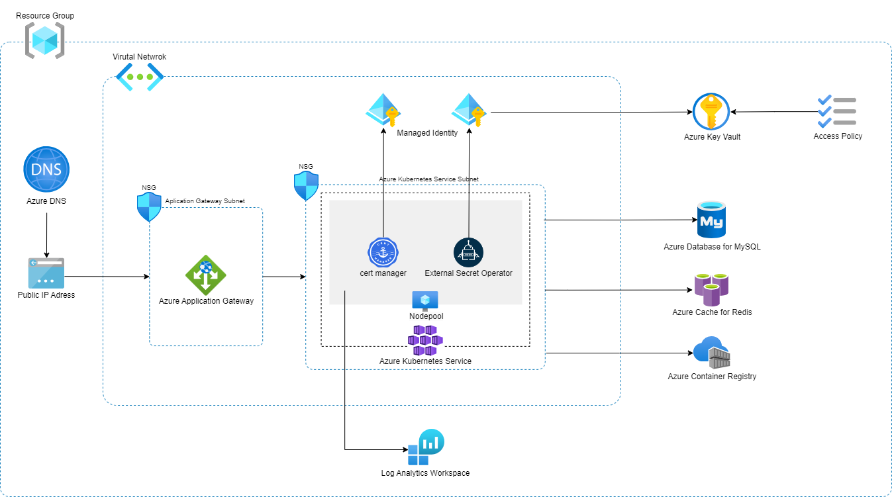

# Shared Infrastructure Adapter

CI/CD AdapterとInfrastructure Adapterを組み合わせて、HTTPSで外部公開できるアプリケーションをAzure上にデプロイするために、必要なAzureリソース群をデプロイするCloud Native Adapterです。

以下のリソースを作成します。

* Azure Resource Group
    * 下記のリソースが所属するリソースグループを作成します。
* Azure Application Gateway
    * Application Gateway イングレス コントローラーとして作成します。
* Azure Cache for Redis
    * Azureで固有のリソース名とする必要があるため、サフィックスとしてランダムな8文字を付与します。
    * 作成時に併せて、アクセスキーがKey Vaultに`redisaccesskey`という名前で格納されます。
* Azure Container Registry
    * Azureで固有のリソース名とする必要があるため、サフィックスとしてランダムな8文字を付与します。
* Azure Database for MySQL
    * Azureで固有のリソース名とする必要があるため、サフィックスとしてランダムな8文字を付与します。
    * 作成時に併せて、Adminユーザ:`admin_user`とパスワードがそれぞれ`dbadminuser`と`dbadminpassword`というシークレット名でKey
      Vaultに格納されます。
* Azure Key Vault
    * MySQLのパスワードやRedisのアクセスキー、踏み台サーバーの秘密鍵を格納します。
    * アクセスポリシーを使用して、Qmonus Value Streamに登録されたサービスプリンシパル、および任意のユーザからのシークレットへのアクセスを許可します。
    * 論理削除が有効であるため、同名のシークレットを再作成するには物理削除をAzure Portal等から行う必要があります。
* Azure Kubernetes Service
    * Custom Resource Definition
        * cert-manager
        * External Secrets Operator
    * Custom Resource
        * ClusterIssuer
            * `qvs-cluster-issuer`という名前で作成されます。
        * ClusterSecretStore
            * `qvs-global-azure-store`という名前で作成されます。
* Azure Log Analytics Workspace
    * ログを格納する Log Analytics Workspace を作成します
    * ログ機能を有効にすると AKS 上にエージェントがデプロイされ、ログをワークスペースに転送します。
* Azure Network Security Group
    * AKSクラスター用のものとApplication Gateway用のものを1つずつ作成して、それぞれのサブネットに関連付けます。
    * 受信セキュリティ規則は、以下のように設定されます。
        * AKSクラスター用NSG: Azureによってデフォルトで作成される受信セキュリティ規則のみが設定されます。
        * Application Gateway用NSG: Application Gatewayの利用に必要な受信セキュリティ規則に加え、`宛先ポート:443`・`プロトコル:TCP`のアクセスを許可します。ソースIPアドレスには、任意のIPアドレスまたはCIDR範囲を指定できます。IPアドレスの指定を省略した場合は、インターネットの全てのIPアドレスからのHTTPSアクセスを許可します。
* Azure Public IP Address
    * Application Gateway用に作成します。
* Azure Virtual Network
    * 各リソースのサブネットが所属するVirtual Networkを作成します。
* Azure Virtual Network Subnet
    * 以下のサブネットを/22のネットワークセグメントで作成します。
        * Application Gatewayが所属するサブネット
        * Azure Kubernetes Serviceが所属するサブネット



The cert-manager project logo is created by Jetstack Ltd. and licensed under
the [Creative Commons Attribution 4.0 International License](http://creativecommons.org/licenses/by/4.0/).

## Platform

Microsoft Azure, Kubernetes

## Module

* Module: `qmonus.net/adapter/official`
* Import path: `qmonus.net/adapter/official/adapters/azure/container/kubernetes/apiBackend/sharedInfrastructure`

## Level

Sample: サンプル実装

## Prerequisites / Constraints

### Prerequisites

* 事前にサービスプリンシパルを作成し、Qmonus Value Streamへ認証情報を登録する必要があります。以下の権限をサブスクリプション配下で付与してください。
    * 共同作成者
    * ユーザー アクセス管理者

* 事前にDNSゾーンを作成する必要があります。AzureにDNSゾーンを作成し、各委譲元のDNSプロバイダで委譲設定を行ってください。

    ※ DNSゾーンを作成せず、お持ちの既存のAzure DNSゾーンを利用する場合は本手順は不要です。

    - Azure portalで作成する
        - [クイック スタート:DNS ゾーンとレコードの作成](https://learn.microsoft.com/ja-jp/azure/dns/dns-getstarted-portal) およびそのほか公式ドキュメントをご参照ください。

    - Azure CLIを利用して作成する

        DNSゾーンの作成および委譲設定を行う方法例を示します。

        - 前提条件
            - 委譲元のDNSゾーンがAzureであり、かつ委譲先のDNSゾーンもAzureである。
            - Azure Cloud Shellでbashを利用している/ローカルのbash環境にAzure CLIがインストールされている。 [※参考：AzureCLIの概要](https://learn.microsoft.com/ja-jp/cli/azure/get-started-with-azure-cli)

        1. Azureテナントにサインインします。

            ※ Azure CloudShellの場合は不要です。

            [Azure CLI を使用してサインインする](https://learn.microsoft.com/ja-jp/cli/azure/authenticate-azure-cli#authentication-methods) に基づき認証を行います。詳細は公式ドキュメントをご参照ください。

            ```bash
            az login
            ```

        1. DNSゾーンを作成するために必要な情報を変数に格納します。

            任意の値に置き換えて、それぞれ格納してください。

            - `CHILD_ZONE_NAME` : 作成する子ゾーン(委譲先ゾーン)の名前
            - `CHILD_RG`: 委譲先の子ゾーンを所属させる、もしくは所属しているリソースグループ
            - `PARENT_ZONE_NAME`: 既にある親ゾーン(委譲元ゾーン)の名前
            - `PARENT_RG` : 委譲元の親ゾーンが所属しているリソースグループ

            ```bash
            CHILD_ZONE_NAME="<YOUR_CHILD_ZONE_NAME>"   # e.g. myapp.example.com
            CHILD_RG="<YOUR_CHILD_RG>"   # e.g. "my-child-rg"
            PARENT_ZONE_NAME="<YOUR_PARENT_ZONE>"   # e.g. "example.com"
            PARENT_RG="<YOUR_PARENT_RG>"   # e.g. "my-parent-rg"
            CHILD_ZONE_NAME_WITHOUT_PARENT_ZONE=${CHILD_ZONE_NAME%.$PARENT_ZONE_NAME}   # remove parent zone domain. result is "myapp" in this case.
            ```

        1. リソースグループを作成します。

            ※ すでに作成済みのリソースグループに所属させる場合はSkipで構いません。

            `--location` には任意のロケーションを指定してください。

            ```bash
            az group create --name ${CHILD_RG} --location "Japan East"
            ```

        1. 委譲先の子ゾーンを作成します。
            
            ```bash
            az network dns zone create --name ${CHILD_ZONE_NAME} --resource-group ${CHILD_RG}
            ```

        1.  子ゾーンのネームサーバーを確認します。

            ```bash
            az network dns zone show --name ${CHILD_ZONE_NAME} --resource-group ${CHILD_RG} --query 'nameServers' -o tsv
            ```

        1. 子ゾーンのネームサーバーを委譲元の親ゾーンに設定します。

            ```bash
            nsservers=$(az network dns zone show --name ${CHILD_ZONE_NAME} --resource-group ${CHILD_RG} --query 'nameServers' -o tsv)
            for nsserver in ${nsservers[@]} ; do az network dns record-set ns add-record --resource-group ${PARENT_RG} --zone-name ${PARENT_ZONE_NAME} --record-set-name ${CHILD_ZONE_NAME_WITHOUT_PARENT_ZONE} --nsdname $nsserver; done;
            ```

        1. 正常に設定できたかを確認します。

            確認のためにTXTレコードを設定します。

            ```bash
            az network dns record-set txt add-record --record-set-name hello --value "world" --resource-group ${CHILD_RG} --zone-name ${CHILD_ZONE_NAME}
            ```

            以下のコマンドを実行し、answerとして "world" が出力されていれば正しく設定されています。

            ```bash
            dig TXT +noall +ans hello.${CHILD_ZONE_NAME}
            ```

            確認後、不要なTXTレコードを削除します。

            ```bash
            az network dns record-set txt remove-record --record-set-name hello --value "world"  --resource-group ${CHILD_RG} --zone-name ${CHILD_ZONE_NAME}
            ```

### Constraints

* 作成するMySQLのAdminユーザアカウントのパスワードは、1文字以上の大小英数字記号を含む、16文字でランダムで生成されます。
* ゾーン分散などの冗長化は行いません。

## Infrastructure Parameters

| Parameter Name                 | Type   | Required | Default        | Description                                                                                                                                                                                                                                                | Example                                                                     | Auto Binding |
|--------------------------------|--------|----------|----------------|------------------------------------------------------------------------------------------------------------------------------------------------------------------------------------------------------------------------------------------------------------|-----------------------------------------------------------------------------|--------------|
| appName                        | string | yes      | -              | デプロイするアプリケーション名                                                                                                                                                                                                                                            | sample                                                                      | yes          |
| azureSubscriptionId            | string | yes      | -              | 事前に用意したAzureのサブスクリプション名                                                                                                                                                                                                                                    | xxxxxxxx-xxxx-xxxx-xxxx-xxxxxxxxxxxx                                        | yes          |
| azureTenantId                  | string | yes      | -              | 事前に用意したAzureのテナントID                                                                                                                                                                                                                                        | yyyyyyyy-yyyy-yyyy-yyyy-yyyyyyyyyyyy                                        | yes          |
| azureResourceGroupName         | string | yes      | -              | 作成するリソースグループ名                                                                                                                                                                                                                                              | sample-resourcegroup                                                        | yes          |
| azureDnsZoneResourceGroupName  | string | yes      | -              | 事前に用意したDNSゾーンが所属するリソースグループ名                                    | sample-dnszone-resourcegroup         | no           |
| keyVaultAccessAllowedObjectIds | array  | yes      | -              | Key Vaultのシークレットにアクセスを許可するオブジェクトIDのリスト <br> 以下を参考に、アクセスを許可したいユーザプリンシパルまたはADアプリケーションに対応するオブジェクトIDを指定してください。 <br> https://learn.microsoft.com/ja-jp/partner-center/marketplace/find-tenant-object-id#find-user-object-id                                     | "aaaaaaaa-aaaa-aaaa-aaaa-aaaaaaaaaaaa,bbbbbbbb-bbbb-bbbb-bbbb-bbbbbbbbbbbb" | no           |
| applicationGatewayNsgAllowedSourceIps | array | no | [] | Application Gateway用NSGへのアクセスを許可するソースIPアドレスのリスト <br> アプリケーションへのアクセスを許可したいIPアドレスまたはCIDR範囲を指定してください。複数のIPアドレスを指定する場合はカンマ区切りの文字列で指定します。指定を省略した場合は、インターネットの全てのIPアドレスからのアクセスが許可されます。 | "192.168.0.1,172.16.0.0/12" | no |
| mysqlSkuName                   | string | no       | B_Standard_B2s | MySQLのSKU名<br>以下を参考に、SKU名を指定してください。<br>https://learn.microsoft.com/ja-jp/azure/mysql/flexible-server/concepts-service-tiers-storage<br>また、指定するコンピューティング レベルに従ってプレフィックスをつける必要があります。<br>例：コンピューティング レベル`Burstable`の場合はB、`General Purpose`の場合はGPをプレフィックスとします。 | B_Standard_B2s                                                        | no           |
| mysqlVersion                   | string | no       | "8.0.21"       | MySQLのバージョン<br>`5.7`,`8.0.21`のいずれかを指定します。                                                                                                                                                                                                                  | "8.0.21"                                                                       | no           |
| dnsZoneName                    | string | yes      | -              | 事前に用意したDNSゾーン名                                                 | foo.example.com                      | no           |
| kubernetesVersion              | string | no       | ""             | Kubernetesのバージョン<br>デフォルトではデプロイ時点での最新バージョンとなります。                                                                                                                                                                                                           | ""                                                                    | no           |
| kubernetesSkuTier              | string | no       | Free           | Kubernetes コントロール プレーンのサービスレベル<br>デフォルトでは試験レベルである、`Free` となっています。<br>本番レベルでは、`Standard`と指定してください。                                                                                                                                                          | Free                                                                    | no           |
| kubernetesNodeVmSize           | string | no       | Standard_B2s   | Kubernetesのワーカーノードのサイズ<br>以下を参考に、サイズを指定してください。<br>https://learn.microsoft.com/ja-jp/azure/virtual-machines/sizes                                                                                                                                           | Standard_B2s                                                              | no           |
| kubernetesNodeCount            | string | no       | "1"            | Kubernetesのワーカーノードの数                                                                                                                                                                                                                                       | "1"                                                                         | no           |
| kubernetesOsDiskGb             | string | no       | "32"           | ワーカーノードが使用するVMのディスクサイズ(GB)                                                                                                                                                                                                                                 | "32"                                                                        | no           |
| certmanagerVersion             | string | no       | "1.11.4"       | cert-managerのバージョン                                                                                                                                                                                                                                         | "1.11.4"                                                                     | no           |
| esoVersion                     | string | no       | "0.9.0"        | External Secrets Operatorのバージョン                                                                                                                                                                                                                            | "0.9.0"                                                                     | no           |
| enableContainerLog             | string | no       | "true"           | ログ機能の有効/無効。`true`` にした場合、Log Analytics Workspace の作成と、収集エージェントがAKSにデプロイされます | "true" | no |
| retentionInDays                | string | no | "30" | `enableContainerLog` が `"true"` の場合のみ設定できます。各ログのテーブルを対話型で保持する期間を設定します。最長で 730 (2年間) まで指定することができます | "30" | no |
| location                       | string | no | Japaneast | `enableContainerLog` が `"true"` の場合のみ設定できます。Log Analytics Workspace をデプロイするロケーションを設定します | Japaneast | no |
| capacityReservationLevel       | string | no | "100" | `enableContainerLog` が `"true"` の場合のみ設定できます。sku に `CapacityReservation` を設定した際、コミットメントレベルを指定します。詳細は[公式ドキュメント]([Log Analytics ワークスペースの価格レベルを変更する](https://learn.microsoft.com/ja-jp/azure/azure-monitor/logs/change-pricing-tier?tabs=azure-portal))を確認してください | "100" | no |
| dailyQuotaGb                   | string | no | "-1"  | `enableContainerLog` が `"true"` の場合のみ設定できます。Log Analytics Workspace に対する1日当たりのログの日次上限で単位はGBです。デフォルトは無制限になっています。 | "-1" | no |
| workspaceAccessMode | string | no | resource | `enableContainerLog` が `"true"` の場合のみ設定できます。Log Analytics Workspace へのアクセスモードを指定します。`resource` の場合、ユーザはアクセス許可のあるリソースのログを確認することが可能です。ワークスペース全体へのアクセスはできません。`workspace` の場合、ユーザがログにアクセスするためには、明示的にワークスペースへアクセス許可を付与される必要があります。| resource  | no |

## CI/CD Parameters

### Adapter Options

| Parameter Name | Type   | Required | Default | Description                                                                                                      | Example |
|----------------|--------|----------|---------|------------------------------------------------------------------------------------------------------------------|---------|
| repositoryKind | string | no       | ""      | ソースコードの管理に使用しているGitリポジトリの種類を指定してください。サポートしているのは、github, gitlab, bitbucket, backlog で、何も指定されない場合はgithub用の設定になります。 | gitlab  |
| useSshKey      | bool   | no       | false   | trueを指定するとリポジトリをクローンするための認証にSSH Keyを使用するように設定できます。                                                               | true    |

### Parameters

| Parameter Name              | Type   | Required | Default | Description                                      | Example                                              | Auto Binding |
|-----------------------------|--------|----------|---------|--------------------------------------------------|------------------------------------------------------|--------------|
| gitCloneUrl                 | string | yes      | -       | GitリポジトリサービスのURL                                 | https://github.com/${organization}/<br>${repository} | yes          |
| gitRevision                 | string | yes      | -       | Gitのリビジョン                                        | commit-hash, branch-name or tag-name | no           |
| gitRepositoryDeleteExisting | bool   | no       | true    | trueの場合、Git Checkoutする時に指定先のディレクトリが存在している場合に削除する |true | no           |
| gitCheckoutSubDirectory     | string | no       | ""      | GitのCheckout作業をするパス名                             |"" | no           |
| gitTokenSecretName          | string | yes      | -       | Gitのアクセストークンを保管しているk8s Secret名                   |gitsecret-xxxxxxxxxxxxxxxxxxxx | yes          |
| pathToSource                | string | no       | ""      | ソースディレクトリからの相対パス                                 |"" | no           |
| qvsConfigPath               | string | yes      | -       | QVS Config(旧称：Application Config)のパス             | .valuestream/qvs.yaml                                | yes          |
| appName                     | string | yes      | -       | QVSにおけるApplication名                              | nginx                                                | yes          |
| qvsDeploymentName           | string | yes      | -       | QVSにおけるDeployment名                               | staging                                              | yes          |
| deployStateName             | string | no       | app    | pulumi-stack名のSuffixとして使用される                     |app | no           |
| azureApplicationId          | string | yes      | -       | AzureのApplicationID                              |xxxxxxxx-xxxx-xxxx-xxxx-xxxxxxxxxxxx | yes          |
| azureSubscriptionId         | string | yes      | -       | AzureのSubscriptionID                             |yyyyyyyy-yyyy-yyyy-yyyy-yyyyyyyyyyyy | yes          |
| azureTenantId               | string | yes      | -       | AzureのTenantID                                   |zzzzzzzz-zzzz-zzzz-zzzz-zzzzzzzzzzzz | yes          |
| azureClientSecretName       | string | yes      | -       | AzureのClientSecretを保管しているSecret名                 |	azure-default-xxxxxxxxxxxxxxxxxxxx | yes          |
| appK8sNamespaces | string | no | "" | アプリケーションのデプロイ先のKubernetesのNamespace名、複数のNamespaceを指定する場合はカンマ区切りの文字列で指定します。<br><br>指定されたNamespaceの作成とNamespace単位のadmin権限をもつkubeconfigが自動生成されます。 | "backend-app-1,backend-app-2" | no |

## Application Resources

### Azure Resources

| Resource ID                                                  | Provider | Resource Name                | Description                                                                                                              |
|--------------------------------------------------------------|----------|------------------------------|--------------------------------------------------------------------------------------------------------------------------|
| mysql                                                        | Azure    | Azure Database for MySQL     | MySQLのフレキシブルサーバーを作成します。                                                                                                  |
| mysqlNameSuffix                                              | Random   | RandomString                 | Mysql Nameの末尾に追加するランダム文字列（8文字）を生成します。Global Uniqueの制約のために追加しています。                                                        |
| mysqlAdminPassword                                           | Random   | RandomPassword               | 新規作成するMySQL Adminパスワードを16文字の英大数字で生成します。                                                                                  |
| mysqlAdminUserSecret                                         | Azure    | Azure Key Vault              | Key VaultにMySQL Adminユーザ名を格納したシークレットを作成します。                                                                              |
| mysqlAdminPasswordSecret                                     | Azure    | Azure Key Vault              | Key VaultにMySQL Adminパスワードを格納したシークレットを作成します。                                                                             |
| mysqlFirewallRule                                            | Azure    | Azure Database for MySQL     | MySQL用のファイアウォールを設定します。                                                                                                   |
| redis                                                        | Azure    | Azure Cache for Redis        | redisインスタンスを作成します。                                                                                                       |
| redisFirewallRule                                            | Azure    | Azure Cache for Redis        | redis用のファイアウォールを設定します。                                                                                                   |
| redisNameSuffix                                              | Random   | RandomString                 | Redis Nameの末尾に追加するランダム文字列（8文字）を生成します。Global Uniqueの制約のために追加しています。                                                        |
| redisPrimaryKeySecret                                        | Azure    | Azure Key Vault              | Key VaultにMySQL Adminパスワードを格納したシークレットを作成します。                                                                             |
| virtualNetwork                                               | Azure    | Azure Virtual Network        | 仮想ネットワークを作成します。                                                                                                          |
| virtualNetworkAksSubnet                                      | Azure    | Azure Virtual Network        | 仮想ネットワークにAKS用のサブネットを作成します。                                                                                               |
| virtualNetworkApplicationGatewaySubnet                       | Azure    | Azure Virtual Network        | 仮想ネットワークにアプリケーションゲートウェイ用のサブネットを作成します。                                                                                    |
| networkSecurityGroupAKS                                      | Azure    | Azure Network Security Group | AKS用のサブネットに適用するネットワークセキュリティグループを作成します。                                                                                   |
| networkSecurityGroupApplicationGateway                       | Azure    | Azure Network Security Group | アプリケーションゲートウェイ用のサブネットに適用するネットワークセキュリティグループを作成します。                                                                        |
| applicationGateway                                           | Azure    | Azure Application Gateway    | Application Gateway イングレス コントローラーとして作成します。                                                                               |
| registryNameSuffix                                           | Random   | RandomString                 | Registry Nameの末尾に追加するランダム文字列（8文字）を生成します。Global Uniqueの制約のために追加しています。                                                     |
| containerRegistry                                            | Azure    | Azure Container Registry     | Container Registryを作成します。                                                                                                |
| vaultNameSuffix                                              | Random   | RandomString                 | Vault Nameの末尾に追加するランダム文字列（8文字）を生成します。Global Uniqueの制約のために追加しています。                                                        |
| keyVault                                                     | Azure    | Azure Key Vault              | Key Vaultを作成します。                                                                                                         |
| kubernetesCluster                                            | Azure    | Azure kubernetes Service     | AKSクラスターを作成します。                                                                                                          |
| kubeconfigSecret                                             | Azure    | Azure Key Vault              | 作成したAKSクラスターのKubeconfigをKeyVaultのシークレットとして格納します。                                                                         |
| agicResourceGroupReaderRoleAssignment                        | Azure    | Managed ID                   | resourceGroupに対するReaderロールをイングレス コントローラーに割り当てます。                                                                         |
| agicApplicationGatewayContributorRoleAssignment              | Azure    | Managed ID                   | applicationGatewayに対するContributorロールをイングレス コントローラーに割り当てます。                                                               |
| agicApplicationGatewaySubnetNetworkContributorRoleAssignment | Azure    | Managed ID                   | applicationGatewayのサブネットに対するNetworkContributorロールをイングレス コントローラーに割り当てます。                                                  |
| acrPullRoleAssignment                                        | Azure    | Managed ID                   | kubernetesClusterのマネージドIDに、containerRegistryに対するAcr Pullロールを割り当てます。 |
| applicationGatewayPublicIpAddress                            | Azure    | Azure Public IP Address      | Application Gateway用のPublic IPアドレスを作成します。                                                                                |
| resourceGroup                                                | Azure    | Azure Resource Manager       | リソースグループを作成します。                                                                                                          |
| certmanagerUserAssignedIdentity                              | Azure    | Managed ID                   | cert-manager用のユーザ割り当てマネージドIDを作成します。このマネージドIDを利用して、DNSリソースを制御します。                                                         |
| certmanagerRoleAssignment                                    | Azure    | Managed ID                   | certmanagerUserAssignedIdentityリソースに対して、ロールを割り当てます。cert-managerのClusterIssuerリソースが必要とするDNS Zone Contributorロールが割り当てられます。 |
| certmanagerFederatedIdentityCredentials                      | Azure    | Managed ID                   | リソースがDNSリソースを制御するために必要な資格情報をk8s serviceaccountに連携します。                                                                     |
| esoUserAssignedIdentity                                      | Azure    | Managed ID                   | external-secrets用のユーザ割り当てマネージドIDを作成します。このマネージドIDを利用して、keyvaultリソースを制御します。                                                |
| esFederatedIdentityCredentials                               | Azure    | Managed ID                   | リソースがKeyvaultを制御するために必要な資格情報をk8s serviceaccountに連携します。                                                                    |
| keyVaultAccessPolicyForEso                                   | Azure    | Azure Key Vault              | esoUserAssignedIdentityがKeyvaultに対して値の読み取りを行うために必要なアクセスポリシーを生成します。                                                       |
| keyVaultAccessPolicyForQvs                                   | Azure    | Azure Key Vault              | Qmonus Value Streamに登録したサービスプリンシパルがKeyvaultに対して値の読み取り・書き込みを行うために必要なアクセスポリシーを生成します。                                       |
| keyVaultAccessPolicyForUser                                  | Azure    | Azure Key Vault              | 任意のオブジェクトIDがKeyvaultに対して値の読み取り・書き込みを行うために必要なアクセスポリシーを生成します。                                                              |
| logAnalyticsWorkspace                                        | Azure    | Log Analytics Workspace      | ログを格納するワークスペースを作成します。 |

### Kubernetes Resources

| Resource ID          | Provider   | API version                 | Kind               | Description                                                                                            |
|----------------------|------------|-----------------------------|--------------------|--------------------------------------------------------------------------------------------------------|
| certmanagerNamespace | kubernetes | v1                          | Namespace          | cert-managerをデプロイするnamespaceリソースを作成します。                                                                |
| certmanager          | helm       | v3                          | -                  | helmを利用してcert-managerリソースをインストールします。インストール時、Custom Resource Definitionについても同時にインストールされます。              |
| clusterIssuer        | kubernetes | cert-manager.io/v1          | ClusterIssuer      | cert-manager Custom ResourceのClusterIssuerリソースを作成します。                                                  |
| esoNamespace         | kubernetes | v1                          | Namespace          | External Secrets Operatorをデプロイするnamespaceリソースを作成します。                                                   |
| eso                  | helm       | v3                          | -                  | helmを利用してExternal Secrets Operatorリソースをインストールします。インストール時、Custom Resource Definitionについても同時にインストールされます。 |
| clusterSecretStore   | kubernetes | external-secrets.io/v1beta1 | ClusterSecretStore | external secrets operator Custom ResourceのClusterSecretStoreリソースを作成します。                                |

## Pipeline Resources

以下の Tekton Pipeline/Task リソースを含むマニフェストが作成されます。

### Pipeline

| Resource ID | Description                                                                                                            |
|-------------|------------------------------------------------------------------------------------------------------------------------|
| deploy      | git-checkout(-ssh), compile-adapter-into-pulumi-yaml(-ssh), deploy-by-pulumi-yaml のTaskを順番に実行し、アプリケーションを指定の環境にデプロイします。 |

### Task

| Resource ID                          | Pipeline | runAfter                                                                 | Description                                                                                                                                                       |
|--------------------------------------|----------|--------------------------------------------------------------------------|-------------------------------------------------------------------------------------------------------------------------------------------------------------------|
| git-checkout                         | deploy   | -                                                                        | 指定のGitリポジトリをクローンし、対象のリビジョン・ブランチにチェックアウトします。クローンする際の認証にはGit Tokenを使用します。AdapterOptionsのuseSshKeyがFalseかつrepositoryKindがgithub, gitlabの場合に作成されます。                   |
| git-checkout-ssh                     | deploy   | -                                                                        | 指定のGitリポジトリをクローンし、対象のリビジョン・ブランチにチェックアウトします。クローンする際の認証にはSSH Keyを使用します。AdapterOptionsのuseSshKeyがTrueまたはrepositoryKindがbitbucket, backlogの場合に作成されます。                 |
| compile-adapter-into-pulumi-yaml     | deploy   | git-checkout                                                             | リポジトリ内の QVS Config に記載されている Cloud Native Adapter をコンパイルし、PulumiYamlのプロジェクトファイルを生成します。AdapterOptionsのuseSshKeyがFalseかつrepositoryKindがgithub, gitlabの場合に作成されます。     |
| compile-adapter-into-pulumi-yaml-ssh | deploy   | git-checkout-ssh                                                         | リポジトリ内の QVS Config に記載されている Cloud Native Adapter をコンパイルし、PulumiYamlのプロジェクトファイルを生成します。AdapterOptionsのuseSshKeyがTrueまたはrepositoryKindがbitbucket, backlogの場合に作成されます。 |
| deploy-by-pulumi-yaml                | deploy   | compile-adapter-into-pulumi-yaml or compile-adapter-into-pulumi-yaml-ssh | コンパイルされたPulumiYamlのプロジェクトファイルを指定の環境にデプロイします。                                                                                                                      |
| generate-kubeconfig | deploy | deploy-by-pulumi-yaml | AKSクラスターにNamespaceを作成し、アプリケーションのデプロイに使用するKubeconfigをAzure Key VaultのSecretに保存します。 |

## Usage

```yaml
designPatterns:
  - pattern: qmonus.net/adapter/official/adapters/azure/container/kubernetes/apiBackend/sharedInfrastructure
    params:
      appName: $(params.appName)
      azureResourceGroupName: $(params.azureResourceGroupName)
      azureTenantId: $(params.azureTenantId)
      azureSubscriptionId: $(params.azureSubscriptionId)
      azureDnsZoneResourceGroupName: $(params.azureDnsZoneResourceGroupName)
      dnsZoneName: $(params.dnsZoneName)
      keyVaultAccessAllowedObjectIds: [ "$(params.keyVaultAccessAllowedObjectIds[*])" ]
      applicationGatewayNsgAllowedSourceIps: ["$(params.applicationGatewayNsgAllowedSourceIps[*])"]
      enableContainerLog: $(paramas.enableContainerLog)
```

## Code

[sharedInfrastructure](main.cue)

## Appendix

* 本Adapterを用いて払い出されたkubeconfigは、下記の手順でAzure Key Vaultから取得できます。

    - Azure portalを使用して取得する

        1. [Azure portal](https://portal.azure.com/) で、事前に本Adapterを用いて作成したリソースグループ内の「qvs-key-vault-******** (*はランダムなsuffix)」キーコンテナーに移動します。

        1. 「シークレット」を選択し、以下の名前で保存されている目的のSecretの名前をクリックします。
             - `kubeconfig` : cluster-admin権限のkubeconfigを保持しているSecret、本Adapter利用時にデフォルトでSecretが生成されます
             - `kubeconfig-<namespace>` : namespace単位のadmin権限をもつkubeconfigを保持するSecret、本Adapter利用時に`appK8sNamepaces` パラメータで指定したnamespace毎にSecretが生成されます

        1. 「現在のバージョン」を選択し、「シークレット値」の右側の「クリップボードにコピー」をクリックします。

    - Azure CLI を使用して取得する

        1. Azureテナントにサインインします。

            ※ Azure Cloud Shellの場合は不要です。

            [Azure CLI を使用してサインインする](https://learn.microsoft.com/ja-jp/cli/azure/authenticate-azure-cli#authentication-methods) に基づき認証を行います。詳細は公式ドキュメントをご参照ください。

            ```bash
            az login
            ```

        1. kubeconfigを取得するために必要な情報を変数に格納します。

            任意の値に置き換えて、それぞれ格納してください。

            - `NAME` : 以下の名前で保存されている目的のSecretの名前
                - `kubeconfig` : cluster-admin権限のkubeconfigを保持しているSecret、本Adapter利用時にデフォルトでSecretが生成されます
                - `kubeconfig-<namespace>` : namespace単位のadmin権限をもつkubeconfigを保持するSecret、本Adapter利用時に`appK8sNamespaces` パラメータで指定したnamespace毎にSecretが生成されます
            - `VAULT_NAME`: 作成されたキー コンテナの名前「qvs-key-vault-******** (*はランダムなsuffix)」

            ```bash
            NAME="<YOUR_SECRET_NAME>"   # e.g. kubeconfig-<namespace>(cluster-admin権限を持ったkubeconfigを使いたい場合は、kubeconfig)
            VAULT_NAME="<YOUR_VAULT_NAME>"   # e.g. qvs-key-vault-********
            ```

        1. キー コンテナーからkubeconfigを取得します。

            ```bash
            az keyvault secret show --name ${NAME} --vault-name ${VAULT_NAME} --query value -o tsv
            ```

* 本Adapterを用いて払い出されたkubeconfigの認証情報を再作成したい場合は、下記の手順を実行してください。

    - Namespaceを制限したkubeconfigの場合

        1. Azure CLIを使用してAzureテナントにサインインします。

            ※ Azure Cloud Shellの場合は不要です。

            [Azure CLI を使用してサインインする](https://learn.microsoft.com/ja-jp/cli/azure/authenticate-azure-cli#authentication-methods) に基づき認証を行います。詳細は公式ドキュメントをご参照ください。

            ```bash
            az login
            ```

        1. kubeconfigを取得するために必要な情報を変数に格納します。

            任意の値に置き換えて、それぞれ格納してください。

            - `VAULT_NAME`: 作成されたキー コンテナの名前「qvs-key-vault-******** (*はランダムなsuffix)」

            ```bash
            VAULT_NAME="<YOUR_VAULT_NAME>"   # e.g. qvs-key-vault-********
            ```

        1. キー コンテナーからkubeconfigを取得します。

            ```bash
            az keyvault secret show --name kubeconfig --vault-name ${VAULT_NAME} --query value -o tsv > ~/.kube/config
            ```

        1. kubectlをインストールします。

            ```bash
            az aks install-cli
            ```

        1. KubernetesのSecretからService Account Tokenを削除します。

            ```bash
            kubectl delete secret qmonus-kubeconfig-token
            ```

        1. 本Adapterを利用するAssemblyLineを再実行します。
