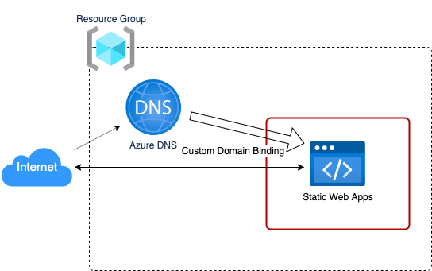

# Frontend Adapter

静的WebアプリケーションをデプロイするCloud Native Adapterです。

以下のリソースと静的WebアプリケーションをデプロイするPipeline Manifestを作成します。

* Azure Static Web Apps
    * Webアプリケーションを外部公開するサービス
* Azure DNS
    * レコードセット (CNAMEレコード)

また、アプリケーションのビルドには `Node.js v16` までをサポートしています。
`package.json` の `scripts` フィールドに記載している `build` に、具体的なビルド時のオプションを指定できます。



AssemblyLineで以下のようにResultsを指定することで、GUI上でアプリケーションの公開用URLをAssemblyLine
Resultsとして確認することができます。

```yaml
apiVersion: vs.axis-dev.io/v1
kind: AssemblyLine
metadata:
  name: sample
spec:
  …
  results:
      - name: publicUrl
        value: $(stages.publish-site.results.publicUrl)
```

## Platform

Microsoft Azure

## Module

* Module: `qmonus.net/adapter/official`
* Import path: `qmonus.net/adapter/official/adapters/azure/serverless/staticSite/frontend`

## Level

Sample: サンプル実装

## Prerequisites / Constraints

### Prerequisites

* 事前に以下のリソースを作成してください。
    * Azure DNS Zone
* 事前にサービスプリンシパルを作成し、Qmonus Value
  Streamへ認証情報を登録する必要があります。サービスプリンシパルにはサブスクリプションレベルで、共同作成者ロールか、以下のアクセス許可を含むカスタムロールを割り当ててください。
    * microsoft.web/locations/operations/read
    * microsoft.web/locations/operationResults/read
    * Microsoft.Web/staticSites/Read
    * Microsoft.Web/staticSites/Write
    * Microsoft.Web/staticSites/Delete
    * Microsoft.Web/staticSites/customdomains/Write
    * Microsoft.Web/staticSites/customdomains/Read
    * Microsoft.Web/staticSites/customdomains/Delete
    * Microsoft.Web/staticSites/listsecrets/action
    * Microsoft.Network/dnszones/CNAME/read
    * Microsoft.Network/dnszones/CNAME/write
    * Microsoft.Network/dnszones/CNAME/delete

### Constraints

* デプロイするファイルはnpmでパッケージ管理されている必要があります。
* デプロイ対象のフロントエンドプロジェクトがルートディレクトリに存在しない場合は、buildTargetDir　及び、deployTargetDirのパラメータで適切なパスを指定してください。
* 環境変数を追加する場合はQVS ConfigにenvironmentVariablesパラメータを設定してください。

## Infrastructure Parameters

| Parameter Name | Type | Required | Default | Description | Example | Auto Binding |
| --- | --- | --- | --- | --- | --- | --- |
| appName | string | yes | - | デプロイするアプリケーション名 | myapp | yes |
| azureSubscriptionId | string | yes | - | 事前に用意したAzureのリソースが含まれるサブスクリプション名 | xxxxxxxx-xxxx-xxxx-xxxx-xxxxxxxxxxxx | yes |
| azureResourceGroupName | string | yes | - | 事前に用意したAzureのリソースが含まれるリソースグループ名 | myapp-resourcegroup | yes |
| azureDnsZoneResourceGroupName | string | yes | - | 事前に用意したAzure DNS Zoneのリソースが含まれるリソースグループ名 | mydns-resourcegroup | yes |
| azureStaticSiteLocation | string | no | East Asia | Static Web Appsをデプロイするロケーション<br>以下のいずれかを指定してください。 <br> Central US, East US 2, East Asia, West Europe, West US 2| East Asia | no |
| azureDnsZoneName | string | yes | - | 事前に用意したDNSゾーン名 | foo.example.com | no |
| relativeRecordSetName | string | no | www | 公開するURLのドメイン名となるDNSレコード。`azureDnsZoneName` と 合わせて `<relativeRecordSetName>.<azureDnsZoneName>` の形式でパブリック公開されます | www | no |
| azureCnameRecordTtl | string | no | "3600" | 新たに作成するCレコードに設定するTTLの値 | "3600" | no |
| environmentVariables | object | no | - | アプリケーションに渡される環境変数名と値のペア | ENV: prod | no |

## CI/CD Parameters

### Adapter Options

| Parameter Name | Type   | Required | Default | Description                                                                                                      | Example |
|----------------|--------|----------|---------|------------------------------------------------------------------------------------------------------------------|---------|
| repositoryKind | string | no       | ""      | ソースコードの管理に使用しているGitリポジトリの種類を指定してください。サポートしているのは、github, gitlab, bitbucket, backlog で、何も指定されない場合はgithub用の設定になります。 | gitlab  |
| useSshKey      | bool   | no       | false   | trueを指定するとリポジトリをクローンするための認証にSSH Keyを使用するように設定できます。                                                               | true    |

### Parameters

| Parameter Name              | Type   | Required | Default | Description                                      | Example                                              | Auto Binding |
|-----------------------------|--------|----------|---------|--------------------------------------------------|------------------------------------------------------|--------------|
| gitCloneUrl                 | string | yes      | -       | GitリポジトリサービスのURL                                 | https://github.com/${organization}/<br>${repository} | yes          |
| gitRevision                 | string | yes      | -       | Gitのリビジョン                                        |                                                      | no           |
| gitRepositoryDeleteExisting | bool   | no       | true    | trueの場合、Git Checkoutする時に指定先のディレクトリが存在している場合に削除する |                                                      | no           |
| gitCheckoutSubDirectory     | string | no       | ""      | GitのCheckout作業をするパス名                             |                                                      | no           |
| gitTokenSecretName          | string | yes      | -       | Gitのアクセストークンを保管しているSecret名                       |                                                      | yes          |
| pathToSource                | string | no       | ""      | ソースディレクトリからの相対パス                                 |                                                      | no           |
| qvsConfigPath               | string | yes      | -       | QVS Config(旧称：Application Config)のパス             | .valuestream/qvs.yaml                                | yes          |
| appName                     | string | yes      | -       | QVSにおけるApplication名                              | nginx                                                | yes          |
| qvsDeploymentName           | string | yes      | -       | QVSにおけるDeployment名                               | staging                                              | yes          |
| deployStateName             | string | no       | app     | pulumi-stack名のSuffixとして使用される                     |                                                      | no           |
| azureApplicationId          | string | yes      | -       | AzureのApplicationID                              |                                                      | yes          |
| azureTenantId               | string | yes      | -       | AzureのTenantID                                   |                                                      | yes          |
| azureSubscriptionId         | string | yes      | -       | AzureのSubscriptionID                             |                                                      | yes          |
| azureClientSecretName       | string | yes      | -       | AzureのClientSecretを保管しているSecret名                 |                                                      | yes          |
| buildTargetDir              | string | no       | .       | ビルド対象のフロントエンドアプリケーションディレクトリへのパス                  | apps/frontend                                        | no           |
| deployTargetDir             | string | no       | dist    | ビルド結果のフロントエンドファイルが格納されているディレクトリへのパス              | apps/frontend/dist                                   | no           |

## Application Resources

| Resource ID            | Provider | Resource Name         | Description                                  |
|------------------------|----------|-----------------------|----------------------------------------------|
| staticSite             | Azure    | Azure Static Web Apps | Webアプリケーションをデプロイします                          |
| cnameRecord            | Azure    | Azure DNS             | レコードセットに新たにCNAMEレコードを追加します                   |
| staticSiteCustomDomain | Azure    | Azure Static Web Apps | 作成したCNAMEレコードを利用してWebアプリケーションにカスタムドメインを設定します |

## Pipeline Resources

以下の Tekton Pipeline/Task リソースを含むマニフェストが作成されます。

### Pipeline

| Resource ID  | Description                                                                                                                               |
|--------------|-------------------------------------------------------------------------------------------------------------------------------------------|
| deploy       | git-checkout(-ssh), compile-adapter-into-pulumi-yaml(-ssh), deploy-by-pulumi-yaml のTaskを順番に実行し、アプリケーションを指定の環境にデプロイします。                    |
| publish-site | git-checkout(-ssh), build-azure-static-web-apps, deploy-azure-static-web-apps, get-url-azure-static-web-apps のTaskを順番に実行し、静的ファイルをデプロイします。 |

### Task

| Resource ID                          | Pipeline             | runAfter                                                                 | Description                                                                                                                                                       |
|--------------------------------------|----------------------|--------------------------------------------------------------------------|-------------------------------------------------------------------------------------------------------------------------------------------------------------------|
| git-checkout                         | deploy, publish-site | -                                                                        | 指定のGitリポジトリをクローンし、対象のリビジョン・ブランチにチェックアウトします。クローンする際の認証にはGit Tokenを使用します。AdapterOptionsのuseSshKeyがFalseかつrepositoryKindがgithub, gitlabの場合に作成されます。                   |
| git-checkout-ssh                     | deploy, publish-site | -                                                                        | 指定のGitリポジトリをクローンし、対象のリビジョン・ブランチにチェックアウトします。クローンする際の認証にはSSH Keyを使用します。AdapterOptionsのuseSshKeyがTrueまたはrepositoryKindがbitbucket, backlogの場合に作成されます。                 |
| compile-adapter-into-pulumi-yaml     | deploy               | git-checkout                                                             | リポジトリ内の QVS Config に記載されている Cloud Native Adapter をコンパイルし、PulumiYamlのプロジェクトファイルを生成します。AdapterOptionsのuseSshKeyがFalseかつrepositoryKindがgithub, gitlabの場合に作成されます。     |
| compile-adapter-into-pulumi-yaml-ssh | deploy               | git-checkout-ssh                                                         | リポジトリ内の QVS Config に記載されている Cloud Native Adapter をコンパイルし、PulumiYamlのプロジェクトファイルを生成します。AdapterOptionsのuseSshKeyがTrueまたはrepositoryKindがbitbucket, backlogの場合に作成されます。 |
| deploy-by-pulumi-yaml                | deploy               | compile-adapter-into-pulumi-yaml or compile-adapter-into-pulumi-yaml-ssh | コンパイルされたPulumiYamlのプロジェクトファイルを指定の環境にデプロイします。                                                                                                                      |
| generate-environment-variables-file  | publish-site         | git-checkout or git-checkout-ssh                                         | 環境変数をexportするスクリプトを作成します。                                                                                                                          |
| build-azure-static-web-apps          | publish-site         | generate-environment-variables-file                                      | リポジトリ内のnpmプロジェクトをビルドし、静的ファイルを生成します。                                                                                                                               |
| deploy-azure-static-web-apps         | publish-site         | build-azure-static-web-apps                                              | ビルドされた静的ファイルをデプロイします。                                                                                                                                             |
| get-url-azure-static-web-apps        | publish-site         | deploy-azure-static-web-apps                                             | デプロイされたアプリケーションの公開URLを取得します。                                                                                                                                      |

## Usage

```yaml
designPatterns:
  - pattern: qmonus.net/adapter/official/adapters/azure/serverless/staticSite/frontend
    params:
      appName: $(params.appName)
      azureStaticSiteLocation: $(params.azureStaticSiteLocation)
      azureSubscriptionId: $(params.azureSubscriptionId)
      azureResourceGroupName: $(params.azureResourceGroupName)
      azureDnsZoneName: $(params.azureDnsZoneName)
      azureDnsZoneResourceGroupName: $(params.azureDnsZoneResourceGroupName)
      environmentVariables:
        ENV1: $(params.env1)
        ENV2: $(params.env2)
```

## Code

[azureFrontendApplicationAdapter](./main.cue)
