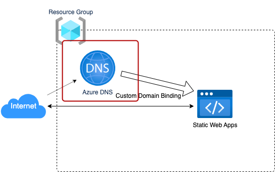

# Shared Infrastructure Adapter

静的WebアプリケーションをAzure上にデプロイするために、必要なAzureリソース群をデプロイするCloud Native Adapterです。

以下のリソースを作成します。

* Azure Resource Group
    * 下記のリソースが所属するリソースグループを作成します。



## Platform

Microsoft Azure

## Module

* Module: `qmonus.net/adapter/official`
* Import path `qmonus.net/adapter/official/adapters/azure/serverless/staticSite/frontend/sharedInfrastructure`

## Level

Sample: サンプル実装

## Prerequisites / Constraints

### Prerequisites

* 事前にサービスプリンシパルを作成し、Qmonus Value Streamへ認証情報を登録する必要があります。以下の権限をサブスクリプション配下で付与してください。
    * 共同作成者
    * ユーザー アクセス管理者
* 事前にDNS ゾーンを作成する必要があります。Azure に DNSゾーンを作成し、各委譲元のDNSプロバイダで委譲設定を行ってください。
    
    ※DNS ゾーンを作成せず、お持ちの既存のAzure DNSゾーンを利用する場合は本手順は不要です。
    
    - Azure Portal で作成する
        - [クイック スタート:DNS ゾーンとレコードの作成](https://learn.microsoft.com/ja-jp/azure/dns/dns-getstarted-portal) およびそのほか公式ドキュメントをご参照ください。
    - Azure CLI を利用して作成する  
        DNSゾーンの作成および委譲設定を行う方法例を示します。
        
        - 前提条件
            - 委譲元のDNSゾーンがAzureであり、かつ委譲先のDNSゾーンもAzureである
            - Azure Cloud Shell でbashを利用している/ローカルのbash環境に Azure CLI がインストールされている [※参考：AzureCLIの概要](https://learn.microsoft.com/ja-jp/cli/azure/get-started-with-azure-cli)
        
        1. Azureテナントにサインインします  

            ※Azure Cloudshell の場合は不要です。  
            [Azure CLI を使用してサインインする](https://learn.microsoft.com/ja-jp/cli/azure/authenticate-azure-cli#authentication-methods) に基づき認証を行います。詳細は公式ドキュメントをご参照ください。

            ```bash
            az login
            ```            
        
        1. DNSゾーンを作成するために必要な情報を変数に格納します
        任意の値に置き換えて、それぞれ格納してください
            - `CHILD_ZONE_NAME` : 作成する子ゾーン(委譲先ゾーン)の名前
            - `CHILD_RG`: 委譲先の子ゾーンを所属させる、もしくは所属しているリソースグループ
            - `PARENT_ZONE_NAME`: 既にある親ゾーン(委譲元ゾーン)の名前
            - `PARENT_RG` : 委譲元の親ゾーンが所属しているリソースグループ
            
            ```bash
            CHILD_ZONE_NAME="<YOUR_CHILD_ZONE_NAME>"   # e.g. myapp.example.com
            CHILD_RG="<YOUR_CHILD_RG>"   # e.g. "my-child-rg"
            PARENT_ZONE_NAME="<YOUR_PARENT_ZONE>"   # e.g. "example.com"
            PARENT_RG="<YOUR_PARENT_RG>"   # e.g. "my-parent-rg"
            CHILD_ZONE_NAME_WITHOUT_PARENT_ZONE=${CHILD_ZONE_NAME%.$PARENT_ZONE_NAME}   # remove parent zone domain. result is "myapp" in this case.
            ```
            
        1. リソースグループを作成します。
        ※すでに作成済みのリソースグループに所属させる場合はSkipで構いません。
        location には任意のロケーションを指定してください。
            
            ```bash
            az group create --name ${CHILD_RG} --location "Japan East"
            ```
            
        
        1. 委譲先の子ゾーンを作成する
            
            ```bash
            az network dns zone create --name ${CHILD_ZONE_NAME} --resource-group ${CHILD_RG}
            ```
            
        1.  子ゾーンのネームサーバーを確認します
            
            ```bash
            az network dns zone show --name ${CHILD_ZONE_NAME} --resource-group ${CHILD_RG} --query 'nameServers' -o tsv
            ```
            
        1. 子ゾーンのネームサーバーを委譲元の親ゾーンに設定します。
            
            ```bash
            nsservers=$(az network dns zone show --name ${CHILD_ZONE_NAME} --resource-group ${CHILD_RG} --query 'nameServers' -o tsv)
            for nsserver in ${nsservers[@]} ; do az network dns record-set ns add-record --resource-group ${PARENT_RG} --zone-name ${PARENT_ZONE_NAME} --record-set-name ${CHILD_ZONE_NAME_WITHOUT_PARENT_ZONE} --nsdname $nsserver; done;
            ```
            
        1. 正常に設定できたかを確認します。
            
            確認のためにTXTレコードを設定します。
            
            ```bash
            az network dns record-set txt add-record --record-set-name hello --value "world" --resource-group ${CHILD_RG} --zone-name ${CHILD_ZONE_NAME}
            ```
            
            以下のコマンドを実行し、answerとして ”world” が出力されていれば正しく設定されています。
            
            ```bash
            dig TXT +noall +ans hello.${CHILD_ZONE_NAME}
            ```
            
            確認後、不要なTXTレコードを削除します。
            
            ```bash
            az network dns record-set txt remove-record --record-set-name hello --value "world"  --resource-group ${CHILD_RG} --zone-name ${CHILD_ZONE_NAME}
            ```            

## Infrastructure Parameters

| Parameter Name                 | Type   | Required | Default        | Description                                                                                                                                                                                                                                                | Example                                                                     | Auto Binding |
|--------------------------------|--------|----------|----------------|------------------------------------------------------------------------------------------------------------------------------------------------------------------------------------------------------------------------------------------------------------|-----------------------------------------------------------------------------|--------------|
| appName                        | string | yes      | -              | デプロイするアプリケーション名                                                                                                                                                                                                                                            | sample                                                                      | yes          |
| azureSubscriptionId            | string | yes      | -              | 事前に用意したAzureのサブスクリプション名                                                                                                                                                                                                                                    | xxxxxxxx-xxxx-xxxx-xxxx-xxxxxxxxxxxx                                        | yes          |
| azureTenantId                  | string | yes      | -              | 事前に用意したAzureのテナントID                                                                                                                                                                                                                                        | yyyyyyyy-yyyy-yyyy-yyyy-yyyyyyyyyyyy                                        | yes          |
| azureResourceGroupName         | string | yes      | -              | 作成するリソースグループ名                                                                                                                                                                                                                                              | sample-resourcegroup                                                        | yes          |


## CI/CD Parameters

### Adapter Options

| Parameter Name | Type   | Required | Default | Description                                                                                                      | Example |
|----------------|--------|----------|---------|------------------------------------------------------------------------------------------------------------------|---------|
| repositoryKind | string | no       | ""      | ソースコードの管理に使用しているGitリポジトリの種類を指定してください。サポートしているのは、github, gitlab, bitbucket, backlog で、何も指定されない場合はgithub用の設定になります。 | gitlab  |
| useSshKey      | bool   | no       | false   | trueを指定するとリポジトリをクローンするための認証にSSH Keyを使用するように設定できます。                                                               | true    |

### Parameters

| Parameter Name              | Type   | Required | Default | Description                                      | Example                                              | Auto Binding |
|-----------------------------|--------|----------|---------|--------------------------------------------------|------------------------------------------------------|--------------|
| gitCloneUrl                 | string | yes      | -       | GitリポジトリサービスのURL                                 | https://github.com/${organization}/${repository} | yes          |
| gitRevision                 | string | yes      | -       | Gitのリビジョン                                        |                                                      | no           |
| gitRepositoryDeleteExisting | bool   | no       | true    | trueの場合、Git Checkoutする時に指定先のディレクトリが存在している場合に削除する |                                                      | no           |
| gitCheckoutSubDirectory     | string | no       | ""      | GitのCheckout作業をするパス名                             |                                                      | no           |
| gitTokenSecretName          | string | yes      | -       | Gitのアクセストークンを保管しているk8s Secret名                   |                                                      | yes          |
| pathToSource                | string | no       | ""      | ソースディレクトリからの相対パス                                 |                                                      | no           |
| qvsConfigPath               | string | yes      | -       | QVS Config(旧称：Application Config)のパス             | .valuestream/qvs.yaml                                | yes          |
| appName                     | string | yes      | -       | QVSにおけるApplication名                              | nginx                                                | yes          |
| qvsDeploymentName           | string | yes      | -       | QVSにおけるDeployment名                               | staging                                              | yes          |
| deployStateName             | string | no       | main    | pulumi-stack名のSuffixとして使用される                     |                                                      | no           |
| azureApplicationId          | string | yes      | -       | AzureのApplicationID                              |                                                      | yes          |
| azureTenantId               | string | yes      | -       | AzureのTenantID                                   |                                                      | yes          |
| azureSubscriptionId         | string | yes      | -       | AzureのSubscriptionID                             |                                                      | yes          |
| azureClientSecretName       | string | yes      | -       | AzureのClientSecretを保管しているSecret名                 |                                                      | yes          |

## Application Resources

| Resource ID                            | Provider | Resource Name                | Description                                                                        |
|----------------------------------------|----------|------------------------------|------------------------------------------------------------------------------------|
| resourceGroup                          | Azure    | Azure Resource Manager       | リソースグループを作成します。                                                                    |

## Pipeline Resources

以下の Tekton Pipeline/Task リソースを含むマニフェストが作成されます。

### Pipeline

| Resource ID | Description                                                                                                            |
|-------------|------------------------------------------------------------------------------------------------------------------------|
| deploy      | git-checkout(-ssh), compile-adapter-into-pulumi-yaml(-ssh), deploy-by-pulumi-yaml のTaskを順番に実行し、アプリケーションを指定の環境にデプロイします。 |

### Task

| Resource ID                          | Pipeline | runAfter                                                                 | Description                                                                                                                                                       |
|--------------------------------------|----------|--------------------------------------------------------------------------|-------------------------------------------------------------------------------------------------------------------------------------------------------------------|
| git-checkout                         | deploy   | -                                                                        | 指定のGitリポジトリをクローンし、対象のリビジョン・ブランチにチェックアウトします。クローンする際の認証にはGit Tokenを使用します。AdapterOptionsのuseSshKeyがFalseかつrepositoryKindがgithub, gitlabの場合に作成されます。                   |
| git-checkout-ssh                     | deploy   | -                                                                        | 指定のGitリポジトリをクローンし、対象のリビジョン・ブランチにチェックアウトします。クローンする際の認証にはSSH Keyを使用します。AdapterOptionsのuseSshKeyがTrueまたはrepositoryKindがbitbucket, backlogの場合に作成されます。                 |
| compile-adapter-into-pulumi-yaml     | deploy   | git-checkout                                                             | リポジトリ内の QVS Config に記載されている Cloud Native Adapter をコンパイルし、PulumiYamlのプロジェクトファイルを生成します。AdapterOptionsのuseSshKeyがFalseかつrepositoryKindがgithub, gitlabの場合に作成されます。     |
| compile-adapter-into-pulumi-yaml-ssh | deploy   | git-checkout-ssh                                                         | リポジトリ内の QVS Config に記載されている Cloud Native Adapter をコンパイルし、PulumiYamlのプロジェクトファイルを生成します。AdapterOptionsのuseSshKeyがTrueまたはrepositoryKindがbitbucket, backlogの場合に作成されます。 |
| deploy-by-pulumi-yaml                | deploy   | compile-adapter-into-pulumi-yaml or compile-adapter-into-pulumi-yaml-ssh | コンパイルされたPulumiYamlのプロジェクトファイルを指定の環境にデプロイします。                                                                                                                      |

## Usage

```yaml
designPatterns:
  - pattern: qmonus.net/adapter/official/adapters/azure/serverless/staticSite/frontend/sharedInfrastructure
    params:
      appName: $(params.appName)
      azureResourceGroupName: $(params.azureResourceGroupName)
      azureTenantId: $(params.azureTenantId)
      azureSubscriptionId: $(params.azureSubscriptionId)
```

## Code

[sharedInfrastructure](./main.cue)
