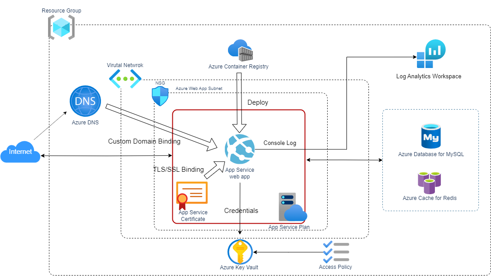

# API Backend Adapter

HTTPSで外部公開できるアプリケーションを Azure App Service 上にデプロイするCloud Native Adapterです。

以下のリソースを作成します。

* Azure DNS
    * レコードセット (CNAME レコード)
    * レコードセット (TXT レコード)
* Azure App Service Plan
* Azure App Service
    * Web Apps for Containers
    * App Service Managed Certificate
        * CNAMEレコードとして払い出したドメインを指定し、HTTPS接続を可能にするための証明書を発行します。
    * Diagnostics Settings
        * ログ機能をONにした場合、アプリケーションの `stdout`および`stderr` を収集してワークスペースに格納する設定を診断設定に追加します。



## Platform

Microsoft Azure

## Module

* Module: `qmonus.net/adapter/official`
* Import path: `qmonus.net/adapter/official/adapters/azure/serverless/webApp/apiBackend`

## Level

Sample: サンプル実装

## Prerequisites / Constraints

### Prerequisites

* 事前に以下のリソースを作成してください。
    * Azure DNS Zone
    * Azure Container Registry
    * Azure Cache for Redis
    * Azure Database for MySQL
    * Azure Key Vault
        * MySQL, Redisの接続に使用するパスワードを格納したKey Vaultシークレット
    * Log Analytics Workspace
        * ログ機能をONにする場合のみ、コンソール出力されたログを格納するワークスペースが必要です。

### Constraints

このAdapterでアプリケーションに渡す環境変数は以下になります。

| Environment Variable            | Description                          |
|---------------------------------|--------------------------------------|
| DB_HOST                         | 接続するデータベースのホスト名                      |
| DB_USER                         | データベースに接続するユーザ名                      |
| DB_PASS                         | データベースに接続するユーザーパスワード                 |
| REDIS_HOST                      | Redisのホスト名                           |
| REDIS_PASS                      | Redisの接続に使用するパスワード                   |
| REDIS_PORT                      | Redisのポート番号                          |
| DOCKER_REGISTRY_SERVER_URL      | Azure Container RegistryのサーバーURL     |
| DOCKER_REGISTRY_SERVER_USERNAME | Azure Container RegistryのAdmin ユーザー名 |
| DOCKER_REGISTRY_SERVER_PASSWORD | Azure Container RegistryのAdmin パスワード |

* 環境変数を追加する場合はQVS ConfigにenvironmentVariablesパラメータを設定してください。
* 環境変数に機密情報を含む値を設定する場合はQVS Configにsecretsパラメータを設定し、Deployment Secretと併用して利用ください。
* アプリケーションに引数を渡す場合はQVS Configにargsパラメータを設定し、Deployment Configでカンマ区切りの文字列で指定してください。

## Infrastructure Parameters

| Parameter Name                | Type   | Required | Default | Description                                                                  | Example                                                                                                                                                     | Auto Binding |
|-------------------------------|--------|----------|---------|------------------------------------------------------------------------------|-------------------------------------------------------------------------------------------------------------------------------------------------------------|--------------|
| appName                       | string | yes      | -       | デプロイするアプリケーション名                                                              | sample                                                                                                                                                      | yes          |
| azureSubscriptionId           | string | yes      | -       | 事前に用意したAzureのリソースが含まれるサブスクリプション名                                             | xxxxxxxx-xxxx-xxxx-xxxx-xxxxxxxxxxxx                                                                                                                        | yes          |
| azureResourceGroupName        | string | yes      | -       | 事前に用意したAzureのリソースが含まれるリソースグループ名                                              | sample-rg                                                                                                                                                   | yes          |
| azureDnsZoneResourceGroupName | string | yes      | -       | 事前に用意したDNSゾーンが所属するリソースグループ名                                                  | sample-dnszone-resourcegroup                                                                                                                                | no           |
| azureKeyVaultName             | string | yes      | -       | 事前に用意したAzure Key Vault名                                                      | SampleKeyVault                                                                                                                                              | no           |
| containerRegistryName         | string | yes      | -       | 事前に用意したContainer Registry名                                                   | SampleRegistry                                                                                                                                              | no           |
| subnetId                      | string | no       | ""      | Web Appsのデプロイ先のSubnet ID (指定しない場合はSubnet外にデプロイされます)                          | /subscriptions/xxxxxxxx-xxxx-xxxx-xxxx-xxxxxxxxxxxx /resourceGroups/sample-rg/providers/Microsoft.Network/virtualNetworks/sample-vnet/sample-web-app-subnet | no           |
| dnsZoneName                   | string | yes      | -       | 事前に用意したDNSゾーン名                                                               | example.com                                                                                                                                                 | no           |
| subDomainName                 | string | no       | api     | アプリケーションに紐づけるサブドメイン名                                                         | api                                                                                                                                                         | no           |
| dbHost                        | string | yes      | -       | Azure Database for MySQLのホスト名                                                | sample-db.mysql.database.azure.com                                                                                                                          | no           |
| redisHost                     | string | yes      | -       | Azure Cache for Redisのホスト名                                                   | sample-redis.redis.cache.windows.net                                                                                                                        | no           |
| imageFullNameTag              | string | yes      | -       | イメージ名のフルパスにタグ名を加えたもの                                                         | sample-registry.azurecr.io/sample-app:latest                                                                                                                | yes          |
| secrets                       | object | no       | -       | アプリケーションに渡される環境変数名とDeployment Secret名のペア。Key Vaultのシークレットを参照する形で環境変数に設定されます。 | PASSWORD: password                                                                                                                                          | no           |
| environmentVariables          | object | no       | -       | アプリケーションに渡される環境変数名と値のペア                                                      | ENV: prod                                                                                                                                                   | no           |
| args                          | array  | no       | -       | アプリケーションに渡される引数。カンマ区切りの文字列がコンテナのargsに配列として渡されます。                             | "--debug,--profile"                                                                                                                                         | no           |
| appServiceAllowedSourceIps | array | no | [] | App Serviceへのアクセスを許可するソースIPアドレスのリスト <br> アプリケーションへのアクセスを許可したいIPアドレスを、CIDR表記で指定してください。複数のIPアドレスを指定する場合はカンマ区切りの文字列で指定します。指定を省略した場合は、インターネットの全てのIPアドレスからのアクセスが許可されます。 | "192.168.0.1/32,172.16.0.0/12" | no |
| enableContainerLog             | string | no       | "true"           | ログ機能の有効/無効。`true` にした場合、診断設定に`App Service Console Logs` を取得する設定が追加されます。 "true" の場合、`logAnalyticsWorkspaceId` の指定が必要です。 | "true" | no |
| logAnalyticsWorkspaceId             | string | -       | /subscriptions/xxxxxxx-xxxxx-xxxx-xxxx-xxxxxxxxx/resourceGroups/sample-rg/providers/Microsoft.OperationalInsights/workspaces/qvs-sample-log-ws           |  `enableContainerLog` が `"true"` の場合のみ設定できます。事前に作成しているワークスペースIDを指定することで、アプリケーションが出力したコンソールログを指定したワークスペースに送信します。|  | no |

## CI/CD Parameters

### Adapter Options

| Parameter Name | Type   | Required | Default | Description                                                                                                      | Example |
|----------------|--------|----------|---------|------------------------------------------------------------------------------------------------------------------|---------|
| repositoryKind | string | no       | ""      | ソースコードの管理に使用しているGitリポジトリの種類を指定してください。サポートしているのは、github, gitlab, bitbucket, backlog で、何も指定されない場合はgithub用の設定になります。 | gitlab  |
| useSshKey      | bool   | no       | false   | trueを指定するとリポジトリをクローンするための認証にSSH Keyを使用するように設定できます。                                                               | true    |

### Parameters

| Parameter Name              | Type   | Required | Default    | Description                                        | Example                                          | Auto Binding |
|-----------------------------|--------|----------|------------|----------------------------------------------------|--------------------------------------------------|--------------|
| gitCloneUrl                 | string | yes      | -          | GitリポジトリサービスのURL                                   | https://github.com/${organization}/${repository} | yes          |
| gitRevision                 | string | yes      | -          | Gitのリビジョン                                          |                                                  | no           |
| gitRepositoryDeleteExisting | bool   | no       | true       | trueの場合、Git Checkoutする時に指定先のディレクトリが存在している場合に削除する   |                                                  | no           |
| gitCheckoutSubDirectory     | string | no       | ""         | GitのCheckout作業をするパス名                               |                                                  | no           |
| gitTokenSecretName          | string | yes      | -          | Gitのアクセストークンを保管しているk8s Secret名                     |                                                  | yes          |
| gitSshKeySecretName         | string | yes      | -          | GitのSSH Keyを保管しているk8s Secret名                      |                                                  | yes          |
| azureApplicationId          | string | yes      | -          | AzureのApplicationID                                |                                                  | yes          |
| azureClientSecretName       | string | yes      | -          | AzureのClientSecretを保管しているSecret名                   |                                                  | yes          |
| dockerfile                  | string | yes      | Dockerfile | ビルドするdockerfileのファイル名                              |                                                  | no           |
| imageRegistryPath           | string | no       | -          | ビルドしたイメージをプッシュするコンテナレジストリのイメージ名を含まないパス             | ${acr_name}.azurecr.io/sample                    | no           |
| imageShortName              | string | yes      | -          | ビルドするコンテナイメージの省略名。ACRのリポジトリ名を指定する。                 | nginx                                            | no           |
| imageTag                    | string | yes      | -          | コンテナイメージのタグ名。buildcacheというタグ名は予約されているため指定できません。    | v1.0.0                                           | no           |
| pathToContext               | string | yes      | .          | ソースディレクトリからの相対パス                                   |                                                  | no           |
| extraArgs                   | string | yes      | ""         | Buildkitでイメージをビルドする際に追加で設定するオプション                  |                                                  | no           |
| pathToSource                | string | no       | ""         | ソースディレクトリからの相対パス                                   |                                                  | no           |
| qvsConfigPath               | string | yes      | -          | QVS Config(旧称：Application Config)のパス               | .valuestream/qvs.yaml                            | yes          |
| appName                     | string | yes      | -          | QVSにおけるApplication名                                | nginx                                            | yes          |
| qvsDeploymentName           | string | yes      | -          | QVSにおけるDeployment名                                 | staging                                          | yes          |
| deployStateName             | string | no       | app        | pulumi-stack名のSuffixとして使用される                       |                                                  | no           |
| kubeconfigSecretName        | string | no       | -          | QVSにおけるDeploymentの作成時に指定したkubeconfigを保管しているSecret名 |                                                  | yes          |
| azureTenantId               | string | no       | -          | AzureのTenantID                                     |                                                  | yes          |
| azureSubscriptionId         | string | no       | -          | AzureのSubscriptionID                               |                                                  | yes          |

## Application Resources

| Resource ID                   | Provider | PaaS              | API version | Kind | Description                                                |
|-------------------------------|----------|-------------------|-------------|------|------------------------------------------------------------|
| cnameRecord                   | Azure    | Azure DNS         |             |      | レコードセットに新たにCNAMEレコードを追加します。                                |
| txtRecord                     | Azure    | Azure DNS         |             |      | レコードセットに新たにTXTレコードを追加します。（カスタムドメインの紐付けの際の検証に使用します）         |
| appServicePlan                | Azure    | Azure App Service |             |      | Web App Service をホスティングするための  App Service Plan を作成します。     |
| webAppForContainer            | Azure    | Azure App Service |             |      | コンテナ化されたアプリケーションをデプロイするための Web App Service を作成します。         |
| webAppHostNameBinding         | Azure    | Azure App Service |             |      | デプロイした Web App Service にカスタムドメインをバインドします。                  |
| managedCertificate            | Azure    | Azure App Service |             |      | 無料の App Service マネージド証明書を作成します。                            |
| certBinding                   | Azure    | Azure App Service |             |      | カスタムドメインに マネージド証明書をバインドします。                                |
| keyVaultAccessPolicyForWebApp | Azure    | Azure Key Vault   |             |      | Web App Service が Key vault のシークレットを参照するためのアクセスポリシーを追加します。 |
| AzureDiagnosticSetting        | Azure    | Azure App Service |             |      | Web App Service が 出力したコンソールログをログワークスペースに送信する設定を追加します。 |

## Pipeline Resources

以下の Tekton Pipeline/Task リソースを含むマニフェストが作成されます。

### Pipeline

| Resource ID | Description                                                                                                            |
|-------------|------------------------------------------------------------------------------------------------------------------------|
| build       | git-checkout(-ssh), docker-login-azure, buildkit のTaskを順番に実行し、Dockerfileからイメージのビルドとプッシュを行います。                          |
| deploy      | git-checkout(-ssh), compile-adapter-into-pulumi-yaml(-ssh), deploy-by-pulumi-yaml のTaskを順番に実行し、アプリケーションを指定の環境にデプロイします。 |
| get-url-after-deploy | get-url-azure-app-service のTaskを実行し、デプロイした Azure App Service の接続用URLをResultsに出力します。 |

### Task

| Resource ID                          | Pipeline      | runAfter                                                                 | Description                                                                                                                                                       |
|--------------------------------------|---------------|--------------------------------------------------------------------------|-------------------------------------------------------------------------------------------------------------------------------------------------------------------|
| git-checkout                         | build, deploy | -                                                                        | 指定のGitリポジトリをクローンし、対象のリビジョン・ブランチにチェックアウトします。クローンする際の認証にはGit Tokenを使用します。AdapterOptionsのuseSshKeyがFalseかつrepositoryKindがgithub, gitlabの場合に作成されます。                   |
| git-checkout-ssh                     | build, deploy | -                                                                        | 指定のGitリポジトリをクローンし、対象のリビジョン・ブランチにチェックアウトします。クローンする際の認証にはSSH Keyを使用します。AdapterOptionsのuseSshKeyがTrueまたはrepositoryKindがbitbucket, backlogの場合に作成されます。                 |
| docker-login-azure                   | build         | git-checkout or git-checkout-ssh                                         | 指定したAzure Container Registryへの認証を行います。                                                                                                                            |
| buildkit                             | build         | docker-login-azure                                                       | Dockerfileからイメージをビルドし、コンテナレジストリへプッシュします。                                                                                                                          |
| compile-adapter-into-pulumi-yaml     | deploy        | git-checkout                                                             | リポジトリ内の QVS Config に記載されている Cloud Native Adapter をコンパイルし、PulumiYamlのプロジェクトファイルを生成します。AdapterOptionsのuseSshKeyがFalseかつrepositoryKindがgithub, gitlabの場合に作成されます。     |
| compile-adapter-into-pulumi-yaml-ssh | deploy        | git-checkout-ssh                                                         | リポジトリ内の QVS Config に記載されている Cloud Native Adapter をコンパイルし、PulumiYamlのプロジェクトファイルを生成します。AdapterOptionsのuseSshKeyがTrueまたはrepositoryKindがbitbucket, backlogの場合に作成されます。 |
| deploy-by-pulumi-yaml                | deploy        | compile-adapter-into-pulumi-yaml or compile-adapter-into-pulumi-yaml-ssh | コンパイルされたPulumiYamlのプロジェクトファイルを指定の環境にデプロイします。                                                                                                                      |
| get-url-azure-app-service            | get-url-after-deploy | deploy-by-pulumi-yaml                                             | デプロイした Azure App Service の接続用URLをResultsに出力します。 |

## Usage

```yaml
designPatterns:
  - pattern: qmonus.net/adapter/official/adapters/azure/serverless/webApp/apiBackend
    params:
      appName: $(params.appName)
      azureSubscriptionId: $(params.azureSubscriptionId)
      azureResourceGroupName: $(params.azureResourceGroupName)
      azureDnsZoneResourceGroupName: $(params.azureDnsZoneResourceGroupName)
      containerRegistryName: $(params.containerRegistryName)
      dnsZoneName: $(params.dnsZoneName)
      subnetId: $(params.subnetId)
      subDomainName: $(params.subDomainName)
      dbHost: $(params.dbHost)
      redisHost: $(params.redisHost)
      azureKeyVaultName: $(params.azureKeyVaultName)
      imageFullNameTag: $(params.imageFullNameTag)
      secrets:
        SECRET1: $(params.secret1)
        SECRET2: $(params.secret2)
      environmentVariables:
        ENV1: $(params.env1)
        ENV2: $(params.env2)
      args: [ "$(params.args[*])" ]
      appServiceAllowedSourceIps: ["$(params.appServiceAllowedSourceIps[*])"]
      enableContainerLog: $(params.enableContainerLog)
      logAnalyticsWorkspaceId: $(params.logAnalyticsWorkspaceId)
```

## Code

[apiBackend](./main.cue)
