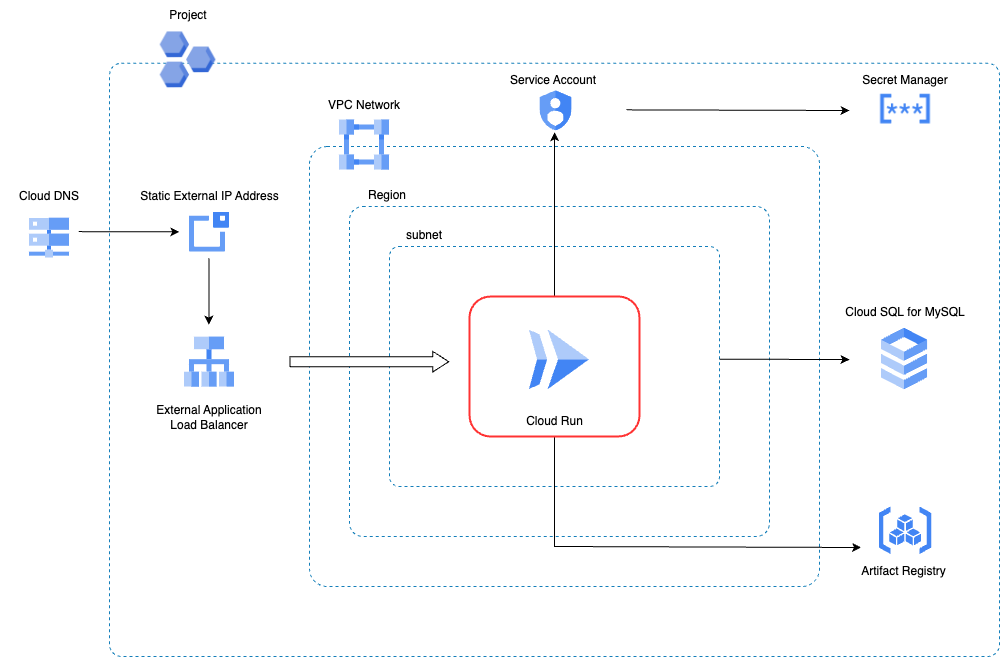

# Full Stack Adapter

フルスタックなWebアプリケーションのコンテナイメージを、Google Cloudのサーバーレス環境にデプロイするCloud Native Adapterです。
ここでのフルスタックなWebアプリケーションとは、フロントエンドとバックエンドの両方を単一のコードベースに含むソフトウェアアプリケーションのことを指します。

以下に作成する主要なリソースを記載します。

* Cloud Run Service
* Cloud SQL for MySQL
* Secret Managerシークレット
* Cloud DNS Aレコード
* Cloud Load Balancer



## Platform

Google Cloud

## Module

* Module: `qmonus.net/adapter/official`
* Import path: `qmonus.net/adapter/official/adapters/gcp/container/cloudrun/fullStack`

## Level

Sample: サンプル実装

## Prerequisites / Constraints

### Prerequisites

* 事前にGoogle Cloudサービスアカウントを作成し、Qmonus Value Streamへ認証情報を登録する必要があります。以下のロールまたは同じ権限を持つカスタムロールをサービスアカウントに付与してください。

    * Artifact Registry 書き込み ( roles/artifactregistry.writer )
    * Compute 管理者 ( roles/compute.admin )
    * Cloud Run管理者 ( roles/run.admin )
    * Cloud SQL 管理者 （ roles/cloudsql.admin ）
    * Compute パブリック IP 管理者 （ roles/compute.publicIpAdmin ）
    * DNS 管理者 （ roles/dns.admin ）
        * 本AdapterによってCloud DNSのAレコードを作成するにあたり、別のGoogle Cloudプロジェクトに属するCloud DNSゾーンを利用したい場合は、対象となるGoogle CloudプロジェクトまたはCloud DNSゾーンに対するDNS 管理者ロールを付与してください。
    * Secret Manager 管理者 （ roles/secretmanager.admin ）
    * Project IAM 管理者 （ roles/resourcemanager.projectIamAdmin ）
    * サービス アカウント ユーザー （ roles/iam.serviceAccountUser ）
    * サービス アカウント管理者 （ roles/iam.serviceAccountAdmin ）
    * サービス ネットワーキング管理者 ( roles/servicenetworking.networksAdmin )
    
* 本Adapterは、1つのGoogle Cloudプロジェクトに対して1つのみ使用することを想定しています。本Adapterを利用する複数のAssemblyLineを作成して複数のリソース群をデプロイしたい場合は、デプロイ先となるGoogle CloudプロジェクトをAssemblyLineごとにそれぞれ用意してください。

* 事前にArtifact Registryにコンテナイメージ用のrepositoryを作成する必要があります。
    * repositoryはアプリケーションをデプロイするProjectと同一Projectに作成する必要があります。

* サービスアカウント
    * 各サービスアカウントには、以下のロールを付与します。
        * CloudRun用のサービスアカウント
            * Secret Manager のシークレット アクセサー ( roles/secretmanager.secretAccessor ) 
            * Cloud SQL クライアント( roles/cloudsql.client )


* 事前にDNSゾーンを作成する必要があります。Google CloudにCloud DNSゾーンを作成し、各委譲元のDNSプロバイダで委譲設定を行ってください。

    ※ DNSゾーンを作成せず、お持ちの既存のCloud DNSゾーンを利用する場合は本手順は不要です。

    * Google Cloudコンソールで作成する

        * 詳細については [公式ドキュメント](https://cloud.google.com/dns/docs/zones?hl=ja#create-pub-zone) をご参照ください。

    * gcloud CLIを利用して作成する

        * 前提条件
            * 委譲元のDNSゾーンがCloud DNSであり、かつ委譲先のDNSゾーンもCloud DNSである。
            * Cloud Shellを利用している/ローカルのbash環境に [gcloud CLI](https://cloud.google.com/sdk/gcloud?hl=ja) がインストールされている。

        1. Google Cloudにサインインします。

            ※ Cloud Shellの場合は不要です。

            詳細については [公式ドキュメント](https://cloud.google.com/sdk/docs/authorizing?hl=ja#user-account) をご参照ください。

            ```bash
            gcloud auth login
            ```

        1. DNSゾーンを作成するために必要な情報を変数に格納します。

            任意の値に置き換えて、それぞれ格納してください。

            * `PARENT_ZONE_PROJECT_ID` : 委譲元の親ゾーンが所属しているGoogle CloudプロジェクトID
            * `CHILD_ZONE_PROJECT_ID` : 作成する子ゾーン（委譲先ゾーン）を所属させるGoogle CloudプロジェクトID（親ゾーンと同じプロジェクトに所属させる場合は `PARENT_ZONE_PROJECT_ID` と同じ値になります）
            * `PARENT_ZONE_NAME` : 既にある親ゾーンの名前
            * `CHILD_ZONE_NAME` : 作成する子ゾーンの名前
            * `CHILD_DNS_NAME` : 作成する子ゾーンのDNS名

            ```bash
            PARENT_ZONE_PROJECT_ID="<YOUR_PARENT_ZONE_PROJECT_ID>"  # e.g. "my-parent-zone-project"
            CHILD_ZONE_PROJECT_ID="<YOUR_CHILD_ZONE_PROJECT_ID>"    # e.g. "my-child-zone-project"
            PARENT_ZONE_NAME="<YOUR_PARENT_ZONE_NAME>"              # e.g. "my-parent-zone"
            CHILD_ZONE_NAME="<YOUR_CHILD_ZONE_NAME>"                # e.g. "my-child-zone"
            CHILD_DNS_NAME="<YOUR_CHILD_DNS_NAME>"                  # e.g. "myapp.example.com."
            ```

        1. 委譲先の子ゾーンを所属させるGoogle Cloudプロジェクトを作成します。

            ※ すでに作成済みのGoogle Cloudプロジェクトに所属させる場合は、この手順はSkipしてください。

            ```bash
            gcloud projects create ${CHILD_ZONE_PROJECT_ID}
            ```

        1. 子ゾーンを作成します。

            ```bash
            gcloud config set project ${CHILD_ZONE_PROJECT_ID}
            gcloud dns managed-zones create ${CHILD_ZONE_NAME} --description="" --dns-name=${CHILD_DNS_NAME} --visibility="public" --dnssec-state="off"
            ```

        1.  子ゾーンのネームサーバーを確認します。

            ```bash
            gcloud dns managed-zones describe ${CHILD_ZONE_NAME}
            ```

        1. 子ゾーンのネームサーバーを委譲元の親ゾーンに設定します。

            ```bash
            nsservers=$(gcloud dns managed-zones describe ${CHILD_ZONE_NAME} --format="value(nameServers)[delimiter=',']")
            gcloud config set project ${PARENT_ZONE_PROJECT_ID}
            gcloud dns record-sets create ${CHILD_DNS_NAME} --rrdatas=${nsservers} --type=NS --ttl=3600 --zone=${PARENT_ZONE_NAME}
            ```

        1. 正常に設定できたかを確認します。

            確認のためにTXTレコードを設定します。

            ```bash
            gcloud config set project ${CHILD_ZONE_PROJECT_ID}
            gcloud dns record-sets create hello.${CHILD_DNS_NAME} --rrdatas=world --type=TXT --zone=${CHILD_ZONE_NAME}
            ```

            以下のコマンドを実行し、answerとして "world" が出力されていれば正しく設定されています。

            ```bash
            dig TXT +noall +ans hello.${CHILD_DNS_NAME}
            ```

            確認後、不要なTXTレコードを削除します。

            ```bash
            gcloud dns record-sets delete hello.${CHILD_DNS_NAME} --type=TXT --zone=${CHILD_ZONE_NAME}
            ```

### Constraints

* 本Adapterを利用するAssemblyLineの実行が完了しても、実際にアプリケーションにアクセスできるようになるには、GoogleマネージドSSL証明書のプロビジョニングが完了する必要があります。この処理には時間がかかる場合があります。詳細については [公式ドキュメント](https://cloud.google.com/load-balancing/docs/ssl-certificates/troubleshooting?hl=ja#certificate-managed-status) をご参照ください。

* Cloud DNS
    * レコードセット（Aレコード）
        * TTL値は3600秒として作成します。
* Cloud SQL for MySQL
    * データベース
        * 文字セットには `utf8mb4` を使用します。
        * 照合順序は指定しません。このため、MySQLのバージョンに応じた `utf8mb4` の照合順序のデフォルト値が使用されます。
    * ユーザアカウント
        * `${mysqlUserName}'@'%` として作成します。
        * パスワードは、1文字以上の大小英数字記号を含む16文字でランダムで生成されます。
        * ユーザアカウントに付与される権限については [公式ドキュメント](https://cloud.google.com/sql/docs/mysql/users?hl=ja#other_mysql_user_accounts) をご参照ください。
* Secret Managerシークレット
    * 各シークレットは、以下の名前で作成します。
        * Cloud SQL for MySQLのユーザ用パスワード: `qvs-${appName}-mysql-user-password`
        * CloudRunアプリケーション用シークレットキー: `qvs-${appName}-secret-key`
* Cloud Run
    * Cloud Run Serviceで実行されるアプリケーションには次の環境変数が渡されます。
        * DB_HOST: Cloud SQL for MySQL インスタンスのIPアドレス
        * DB_NAME: Cloud SQL for MySQLに作成したデータベース名
        * DB_USER: Cloud SQL for MySQLに設定したユーザ名
        * DB_PASSWORD: Cloud SQL for MySQLに設定したユーザのパスワード
        * SERVICE_URL: DNS Aレコードに設定したFQDN

## Infrastructure Parameters

| Parameter Name | Type | Required | Default | Description | Example | Auto Binding |
| --- | --- | --- | --- | --- | --- | --- |
| appName | string | yes | - | QVSにおけるApplication名 | sample | yes |
| gcpProjectId | string | yes | - | 事前に用意したGoogle CloudプロジェクトID | sample-gcp-project | yes |
| region | string | no | asia-northeast1 | アプリケーションがデプロイされるregion名 | asia-northeast1 |
| dnsZoneProjectId | string | yes | - | 事前に用意したCloud DNSゾーンが所属するGoogle CloudプロジェクトID | sample-dns-zone-project | no |
| dnsZoneName | string | yes | - | 事前に用意したCloud DNSゾーン名 | sample-dns-zone | no |
| dnsARecordSubdomain | string | yes | - | 新たに作成するAレコードに設定するサブドメインのFQDN。末尾のルート（ `.` ）まで含めて指定してください。 | www.example.com. | no |
| mysqlDatabaseName | string | yes | - | 新たに作成するCloud SQL for MySQLのデータベース名 | sampledb | no |
| mysqlUserName | string | yes | - | 新たに作成するCloud SQL for MySQLのユーザ名 | dbuser | no |
| mysqlCpuCount | string | no | "2" | Cloud SQL InstanceのCPU数 | "2" |
| mysqlMemorySizeMb | string | no | "4096" | Cloud SQL Instanceのmemory容量 | "4096" |
| mysqlDatabaseVersion | string | no | "MYSQL_8_0" | Cloud SQL for MySQLのバージョン | MYSQL_8_0 |
| mysqlAvailabilityType | string | no | "ZONAL" | Cloud SQL for MySQLのAvailability Type. ZONAL or REGIONAL | "REGIONAL" |
| imageUrl | string | yes | - | デプロイするDocker ImageのURL | asia-northeast1-docker.pkg.dev/sample-gcp-project/sample-app/sample-app |  no |
| cloudrunMaxInstanceCount | string | no | "100" | CloudRun Instanceの最大数 | "1" |
| port | string | yes | - | アプリケーションが利用するポート番号 | "3000" | no |
| secrets | object | no | - | アプリケーションPodに渡される環境変数名とDeployment Secret名のペア | PASSWORD: password | no |
| environmentVariables | object | no | - | アプリケーションPodに渡される環境変数名と値のペア | ENV: prod | no |
| privateServiceAccessCidr | string | no | "172.20.16.0/22" | 構成するプライベートサービスアクセスのIPアドレスレンジ | "172.20.16.0/22" |
| cloudrunDirectEgressCidr | string | no | "172.20.20.0/22" | CloudRun Direct EgressのIPアドレスレンジ | "172.20.20.0/22" |


## CI/CD Parameters

### Adapter Options

| Parameter Name | Type | Required | Default | Description | Example |
| --- | --- | --- | --- | --- | --- |
| repositoryKind | string | no | "" | ソースコードの管理に使用しているGitリポジトリの種類を指定してください。サポートしているのは、github, gitlab, bitbucket, backlog で、何も指定されない場合はgithub用の設定になります。 | gitlab |
| useSshKey | bool | no | false | trueを指定するとリポジトリをクローンするための認証にSSH Keyを使用するように設定できます。 | true |

### Parameters

| Parameter Name | Type | Required | Default | Description | Example | Auto Binding |
| --- | --- | --- | --- | --- | --- | --- |
| gitCloneUrl | string | yes | - | GitリポジトリサービスのURL | https://github.com/${organization}/${repository} | yes |
| gitRevision  | string | yes | - | Gitのリビジョン | main | no |
| gitRepositoryDeleteExisting  | bool | no | true | trueの場合、Git Checkoutする時に指定先のディレクトリが存在している場合に削除する | true | no |
| gitCheckoutSubDirectory | string | no | "" | GitのCheckout作業をするパス名 | "" | no |
| gitTokenSecretName | string | yes | - | Gitのアクセストークンを保管しているk8s Secret名 | gitsecret-xxxxxxxxxxxxxxxxxxxx | yes |
| gitSshKeySecretName | string | yes | - | GitのSSH Keyを保管しているk8s Secret名 | gitsecret-xxxxxxxxxxxxxxxxxxxx | yes |
| gcpServiceAccountSecretName | string | yes | - | QVSにおけるDeploymentの作成時に指定したGoogle CloudサービスアカウントのJSONキーを保管しているSecret名 | gcp-default-xxxxxxxxxxxxxxxxxxxx | yes |
| gcpProjectId | string | yes | - | 事前に用意したGoogle CloudプロジェクトID | sample-gcp-project | yes |
| dockerfile | string | no | Dockerfile | ビルドするdockerfileのファイル名 | Dockerfile | no |
| imageRegistryPath | string | yes | - | ビルドしたイメージをプッシュするコンテナレジストリのイメージ名を含まないパス | asia-northeast1-docker.pkg.dev/${project_id}/sample | no |
| imageShortName | string | yes | - | ビルドするコンテナイメージの省略名 | nginx | no |
| imageTag | string | yes | - | コンテナイメージのタグ名。buildcacheというタグ名は予約されているため指定できません。 | v1.0.0 | no |
| pathToContext | string | no | . | ソースディレクトリからの相対パス | . | no |
| extraArgs | string | no | "" | Buildkitでイメージをビルドする際に追加で設定するオプション | "" | no |
| pathToSource | string | no | "" | ソースディレクトリからの相対パス | "" | no |
| qvsConfigPath | string | yes | - | QVS Config(旧称：Application Config)のパス | .valuestream/qvs.yaml | yes |
| appName | string | yes | - | QVSにおけるApplication名 | nginx | yes |
| qvsDeploymentName | string | yes | - | QVSにおけるDeployment名 | staging | yes |
| deployStateName | string | no | app | pulumi-stack名のSuffixとして使用される | app | no |

## Application Resources

### Google Cloud Resources

| Resource ID | Provider | Resource Name | Description |
|-------------|----------|---------------|-------------|
| backendService | gcp | Compute Backend Service | Cloud Runサービスをバックエンドとするバックエンドサービスを作成します。 |
| cloudrun | gcp | Cloud Run Service | フルスタックアプリケーション用のCloud Runサービスを作成します。 |
| directEgressSubnet | gcp | Compute Subnetwork | VPCネットワーク用のサブネットを作成します。 |
| dnsARecord | gcp | DNS Record Set | アプリケーションのドメイン用のAレコードを作成します。 |
| forwardingRule | gcp | Global Forwarding Rule | ロードバランサー用の転送ルールを作成します。 |
| globalIp | gcp | Global Address | アプリケーション用のグローバルIPアドレスを作成します。 |
| lb | gcp | Target HTTPS Proxy | HTTPSロードバランサーを作成します。 |
| lbNeg | gcp | Region Network Endpoint Group | Cloud Run用のネットワークエンドポイントグループを作成します。 |
| noauth | gcp | Cloud Run Service IAM Member | Cloud Runサービスに対する公開アクセスを許可します。 |
| privateIpAddress | gcp | Global Address | VPCピアリング用のプライベートIPアドレスを作成します。 |
| privateVpcConnection | gcp | Service Networking Connection | VPCネットワークとサービスネットワーキングの接続を設定します。 |
| secretAccessor | gcp | IAM Member | サービスアカウントにSecret Managerのアクセス権を付与します。 |
| serviceaccount | gcp | Service Account | アプリケーション用のサービスアカウントを作成します。 |
| mysqlDatabase | gcp | Cloud SQL Database | Cloud SQLデータベースを作成します。 |
| mysqlInstance | gcp | Cloud SQL Instance | Cloud SQLインスタンスを作成します。 |
| mysqlPassword | random | Random Password | データベース用のパスワードを生成します。 |
| mysqlPasswordSecret | gcp | Secret Manager Secret | データベースパスワード用のSecret Managerシークレットを作成します。 |
| mysqlPasswordSecretVersion | gcp | Secret Manager Secret Version | データベースパスワードのバージョンを作成します。 |
| mysqlUser | gcp | Cloud SQL User | データベースユーザーを作成します。 |
| sqlAccessPermission | gcp | IAM Member | Cloud RunサービスにCloud SQL clientロールを付与します。 |
| sslCert | gcp | Managed SSL Certificate | アプリケーション用のマネージドSSL証明書を作成します。 |
| urlMap | gcp | URL Map | ロードバランサー用のURLマップを作成します。 |
| vpcNetwork | gcp | Compute Network | アプリケーション用のVPCネットワークを作成します。 |

## Pipeline Resources

以下のTekton Pipeline/Taskリソースを含むマニフェストが作成されます。

### Pipeline

| Resource ID | Description |
| --- | --- |
| build | git-checkout(-ssh), docker-login-gcp, buildkit のTaskを順番に実行し、Dockerfileからイメージのビルドとプッシュを行います。 |
| deploy | git-checkout(-ssh), compile-adapter-into-pulumi-yaml(-ssh), deploy-by-pulumi-yaml のTaskを順番に実行し、アプリケーションを指定の環境にデプロイします。 |

### Task

| Resource ID | Pipeline | runAfter | Description |
| --- | --- | --- | --- |
| git-checkout | build, deploy | - | 指定のGitリポジトリをクローンし、対象のリビジョン・ブランチにチェックアウトします。クローンする際の認証にはGit Tokenを使用します。AdapterOptionsのuseSshKeyがFalseかつrepositoryKindがgithub, gitlabの場合に作成されます。 |
| git-checkout-ssh | build, deploy | - | 指定のGitリポジトリをクローンし、対象のリビジョン・ブランチにチェックアウトします。クローンする際の認証にはSSH Keyを使用します。AdapterOptionsのuseSshKeyがTrueまたはrepositoryKindがbitbucket, backlogの場合に作成されます。 |
| docker-login-gcp | build | git-checkout or git-checkout-ssh | 指定したArtifact Registryへの認証を行います。 |
| buildkit | build | docker-login-azure | Dockerfileからイメージをビルドし、コンテナレジストリへプッシュします。|
| compile-adapter-into-pulumi-yaml | deploy | git-checkout | リポジトリ内の QVS Config に記載されている Cloud Native Adapter をコンパイルし、PulumiYamlのプロジェクトファイルを生成します。AdapterOptionsのuseSshKeyがFalseかつrepositoryKindがgithub, gitlabの場合に作成されます。 |
| compile-adapter-into-pulumi-yaml-ssh | deploy | git-checkout-ssh | リポジトリ内の QVS Config に記載されている Cloud Native Adapter をコンパイルし、PulumiYamlのプロジェクトファイルを生成します。AdapterOptionsのuseSshKeyがTrueまたはrepositoryKindがbitbucket, backlogの場合に作成されます。 |
| deploy-by-pulumi-yaml | deploy | compile-adapter-into-pulumi-yaml or compile-adapter-into-pulumi-yaml-ssh | コンパイルされたPulumiYamlのプロジェクトファイルを指定の環境にデプロイします。 |

## Usage

```yaml
designPatterns:
  - pattern: qmonus.net/adapter/official/adapters/gcp/container/cloudrun/fullStack
    params:
      appName: $(params.appName)
      gcpProjectId: $(params.gcpProjectId)
      region: $(params.region)
      imageUrl: $(params.imageUrl)
      port: $(params.port)
      cloudrunMaxInstanceCount: $(params.cloudrunMaxInstanceCount)
      mysqlDatabaseName: $(params.mysqlDatabaseName)
      mysqlUserName: $(params.mysqlUserName)
      mysqlCpuCount: $(params.mysqlCpuCount)
      mysqlMemorySizeMb: $(params.mysqlMemorySizeMb)
      mysqlDatabaseVersion: $(params.mysqlDatabaseVersion)
      mysqlAvailabilityType: $(params.mysqlAvailabilityType)
      dnsZoneProjectId: $(params.dnsZoneProjectId)
      dnsZoneName: $(params.dnsZoneName)
      dnsARecordSubdomain: $(params.dnsARecordSubdomain)
      privateServiceAccessCidr: $(params.privateServiceAccessCidr)
      cloudrunDirectEgressCidr: $(params.cloudrunDirectEgressCidr)
      environmentVariables:
        ENVIRONMENT: prod
      secrets:
        ADMIN_PASSWORD: $(params.adminPassword)
        SECRET_KEY: $(params.secretKey)
```

## Code

[fullStack](main.cue)
