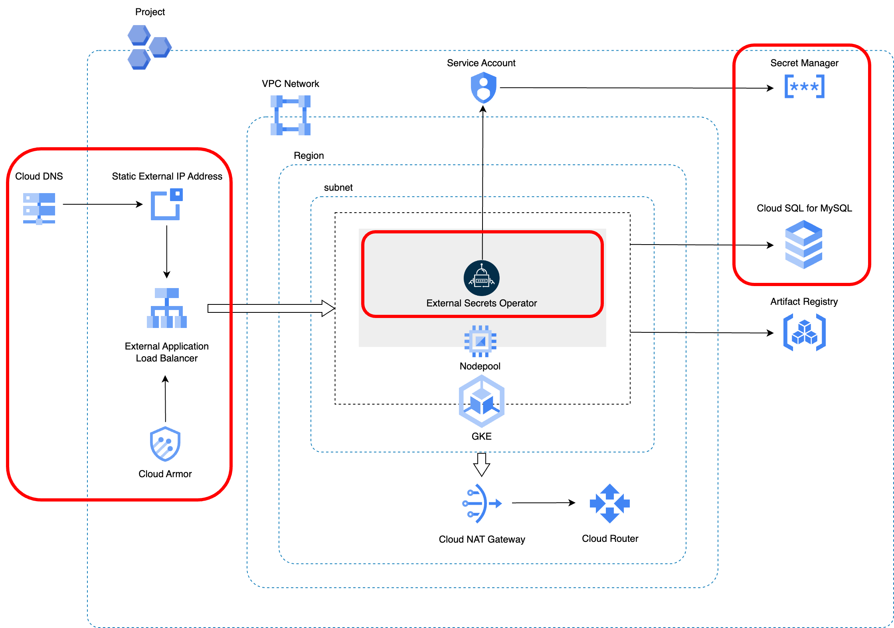

# API Backend Adapter

HTTPSで外部公開できるコンテナアプリケーションをビルドし、Google Cloud環境にデプロイするCloud Native Adapterです。

以下のリソースを作成します。

* Cloud DNS
    * レコードセット（Aレコード）
        * 外部公開するアプリケーション用のFQDNを、アプリケーション用に構成される外部アプリケーションロードバランサのIPアドレスに対応づけるために作成します。
* Cloud SQL for MySQL
    * データベース
    * ユーザアカウント
* Secret Managerシークレット
    * Cloud SQL for MySQLのユーザ名
    * Cloud SQL for MySQLのユーザ用パスワード
* 外部静的IPアドレス
    * GKE Ingressコントローラが作成する外部アプリケーションロードバランサ用のIPアドレスとして使用します。
* Cloud Armorポリシー
    * GKE Ingressコントローラが作成する外部アプリケーションロードバランサに適用するために作成します。
* Kubernetesリソース
    * Deployment
    * Service
    * Ingress
    * Custom Resource
        * ManagedCertificate
            * Aレコードに設定したドメイン名を指定し、HTTPS接続を可能にするためのGoogleマネージドSSL証明書を作成します。
        * BackendConfig
            * アプリケーション用に構成される外部アプリケーションロードバランサに、Cloud Armorポリシーを設定するために作成します。
        * ExternalSecret
            * Secret Managerにアクセスし、アプリケーションに必要なシークレットを取得します。



## Platform

Google Cloud, Kubernetes

## Module

* Module: `qmonus.net/adapter/official`
* Import path `qmonus.net/adapter/official/adapters/gcp/container/kubernetes/apiBackend`

## Level

Sample: サンプル実装

## Prerequisites / Constraints

### Prerequisites

* 事前に [Shared Infrastructure Adapter](./sharedInfrastructure/README.md) を用いて各種クラウドリソースを作成してください。

* 事前にGoogle Cloudサービスアカウントを作成し、Qmonus Value Streamへ認証情報を登録する必要があります。以下のロールまたは同じ権限を持つカスタムロールをサービスアカウントに付与してください。
    * Artifact Registry 書き込み （ `roles/artifactregistry.writer` ）
    * Cloud SQL 管理者 （ `roles/cloudsql.admin` ）
    * Compute セキュリティ管理者 （ `roles/compute.securityAdmin` ）
    * Compute パブリック IP 管理者 （ `roles/compute.publicIpAdmin` ）
    * DNS 管理者 （ `roles/dns.admin` ）
        * 本AdapterによってCloud DNSのAレコードを作成するにあたり、別のGoogle Cloudプロジェクトに属するCloud DNSゾーンを利用したい場合は、対象となるGoogle CloudプロジェクトまたはCloud DNSゾーンに対するDNS 管理者ロールを付与してください。
    * Kubernetes Engine 開発者 （ `roles/container.developer` ）
    * Secret Manager 管理者 （ `roles/secretmanager.admin` ）

* 事前に、GKEクラスタにアプリケーションをデプロイするために利用するkubeconfigをQmonus Value Streamへ登録する必要があります。kubeconfigは [Shared Infrastructure Adapter](./sharedInfrastructure/README.md) を用いて作成されます。kubeconfigの取得方法については [ドキュメント](./sharedInfrastructure/README.md#appendix) をご参照ください。

* 事前に、アプリケーションをデプロイする対象のNamespaceをGKEクラスタに作成する必要があります。このNamespaceの名前は本Adapterのパラメータ `k8sNamespace` として使用します。

* 事前にDNSゾーンを作成する必要があります。Google CloudにCloud DNSゾーンを作成し、各委譲元のDNSプロバイダで委譲設定を行ってください。

    ※ DNSゾーンを作成せず、お持ちの既存のCloud DNSゾーンを利用する場合は本手順は不要です。

    * Google Cloudコンソールで作成する

        * 詳細については [公式ドキュメント](https://cloud.google.com/dns/docs/zones?hl=ja#create-pub-zone) をご参照ください。

    * gcloud CLIを利用して作成する

        * 前提条件
            * 委譲元のDNSゾーンがCloud DNSであり、かつ委譲先のDNSゾーンもCloud DNSである。
            * Cloud Shellを利用している/ローカルのbash環境に [gcloud CLI](https://cloud.google.com/sdk/gcloud?hl=ja) がインストールされている。

        1. Google Cloudにサインインします。

            ※ Cloud Shellの場合は不要です。

            詳細については [公式ドキュメント](https://cloud.google.com/sdk/docs/authorizing?hl=ja#user-account) をご参照ください。

            ```bash
            gcloud auth login
            ```

        1. DNSゾーンを作成するために必要な情報を変数に格納します。

            任意の値に置き換えて、それぞれ格納してください。

            * `PARENT_ZONE_PROJECT_ID` : 委譲元の親ゾーンが所属しているGoogle CloudプロジェクトID
            * `CHILD_ZONE_PROJECT_ID` : 作成する子ゾーン（委譲先ゾーン）を所属させるGoogle CloudプロジェクトID（親ゾーンと同じプロジェクトに所属させる場合は `PARENT_ZONE_PROJECT_ID` と同じ値になります）
            * `PARENT_ZONE_NAME` : 既にある親ゾーンの名前
            * `CHILD_ZONE_NAME` : 作成する子ゾーンの名前
            * `CHILD_DNS_NAME` : 作成する子ゾーンのDNS名

            ```bash
            PARENT_ZONE_PROJECT_ID="<YOUR_PARENT_ZONE_PROJECT_ID>"  # e.g. "my-parent-zone-project"
            CHILD_ZONE_PROJECT_ID="<YOUR_CHILD_ZONE_PROJECT_ID>"    # e.g. "my-child-zone-project"
            PARENT_ZONE_NAME="<YOUR_PARENT_ZONE_NAME>"              # e.g. "my-parent-zone"
            CHILD_ZONE_NAME="<YOUR_CHILD_ZONE_NAME>"                # e.g. "my-child-zone"
            CHILD_DNS_NAME="<YOUR_CHILD_DNS_NAME>"                  # e.g. "myapp.example.com."
            ```

        1. 委譲先の子ゾーンを所属させるGoogle Cloudプロジェクトを作成します。

            ※ すでに作成済みのGoogle Cloudプロジェクトに所属させる場合は、この手順はSkipしてください。

            ```bash
            gcloud projects create ${CHILD_ZONE_PROJECT_ID}
            ```

        1. 子ゾーンを作成します。

            ```bash
            gcloud config set project ${CHILD_ZONE_PROJECT_ID}
            gcloud dns managed-zones create ${CHILD_ZONE_NAME} --description="" --dns-name=${CHILD_DNS_NAME} --visibility="public" --dnssec-state="off"
            ```

        1.  子ゾーンのネームサーバーを確認します。

            ```bash
            gcloud dns managed-zones describe ${CHILD_ZONE_NAME}
            ```

        1. 子ゾーンのネームサーバーを委譲元の親ゾーンに設定します。

            ```bash
            nsservers=$(gcloud dns managed-zones describe ${CHILD_ZONE_NAME} --format="value(nameServers)[delimiter=',']")
            gcloud config set project ${PARENT_ZONE_PROJECT_ID}
            gcloud dns record-sets create ${CHILD_DNS_NAME} --rrdatas=${nsservers} --type=NS --ttl=3600 --zone=${PARENT_ZONE_NAME}
            ```

        1. 正常に設定できたかを確認します。

            確認のためにTXTレコードを設定します。

            ```bash
            gcloud config set project ${CHILD_ZONE_PROJECT_ID}
            gcloud dns record-sets create hello.${CHILD_DNS_NAME} --rrdatas=world --type=TXT --zone=${CHILD_ZONE_NAME}
            ```

            以下のコマンドを実行し、answerとして "world" が出力されていれば正しく設定されています。

            ```bash
            dig TXT +noall +ans hello.${CHILD_DNS_NAME}
            ```

            確認後、不要なTXTレコードを削除します。

            ```bash
            gcloud dns record-sets delete hello.${CHILD_DNS_NAME} --type=TXT --zone=${CHILD_ZONE_NAME}
            ```

### Constraints

* 本Adapterを利用するAssemblyLineの実行が完了しても、実際にアプリケーションにアクセスできるようになるには、GoogleマネージドSSL証明書のプロビジョニングが完了する必要があります。この処理には時間がかかる場合があります。詳細については [公式ドキュメント](https://cloud.google.com/load-balancing/docs/ssl-certificates/troubleshooting?hl=ja#certificate-managed-status) をご参照ください。

* 以下のリソースでは、リソース名にサフィックスとしてランダムな3文字を付与します。
    * Secret Managerシークレット
    * 外部静的IPアドレス
    * Cloud Armorポリシー
* Cloud DNS
    * レコードセット（Aレコード）
        * TTL値は3600秒として作成します。
* Cloud SQL for MySQL
    * データベース
        * 文字セットには `utf8mb4` を使用します。
        * 照合順序は指定しません。このため、MySQLのバージョンに応じた `utf8mb4` の照合順序のデフォルト値が使用されます。
    * ユーザアカウント
        * `${mysqlUserName}'@'%` として作成します。
        * パスワードは、1文字以上の大小英数字記号を含む16文字でランダムで生成されます。
        * ユーザアカウントに付与される権限については [公式ドキュメント](https://cloud.google.com/sql/docs/mysql/users?hl=ja#other_mysql_user_accounts) をご参照ください。
* Secret Managerシークレット
    * 各シークレットは、以下の名前で作成します。
        * Cloud SQL for MySQLのユーザ名: `qvs-${appName}-mysql-user-name-<SUFFIX>`
        * Cloud SQL for MySQLのユーザ用パスワード: `qvs-${appName}-mysql-user-password-<SUFFIX>`
* Cloud Armorポリシー
    * パラメータ `cloudArmorAllowedSourceIps` でIPアドレスを指定することで、アプリケーションにアクセスできるソースIPアドレスを制限できます。
        * 指定した場合は、指定したIPアドレス以外からのアクセスに対して、HTTP `404` のレスポンスを返します。
        * 指定を省略した場合は、インターネットの全てのIPアドレスからのアクセスが許可されます。
* Kubernetesリソース
    * Ingress
        * `kubernetes.io/ingress.allow-http: "false"` アノテーションを設定します。このため、アプリケーション用に構成される外部アプリケーションロードバランサとの通信においてHTTPが無効化され、HTTPSのみが使用されます。
    * Deployment
        * 以下の値を環境変数としてアプリケーションに渡します。
            * アプリケーションが利用するポート番号
            * Cloud SQL for MySQLインスタンスのIPアドレス
            * パラメータ `environmentVariables` を設定することで、任意の環境変数も追加できます。
        * ExternalSecretによって生成された以下のSecretをマウントして、環境変数としてアプリケーションに渡します。
            * Cloud SQL for MySQLのユーザ名
            * Cloud SQL for MySQLのユーザ用パスワード
            * パラメータ `secrets` を設定することで、任意のシークレットも追加できます。

## Infrastructure Parameters

| Parameter Name | Type | Required | Default | Description | Example | Auto Binding |
| --- | --- | --- | --- | --- | --- | --- |
| appName | string | yes | - | QVSにおけるApplication名 | sample | yes |
| gcpProjectId | string | yes | - | 事前に用意したGoogle CloudプロジェクトID | sample-gcp-project | yes |
| dnsZoneProjectId | string | yes | - | 事前に用意したCloud DNSゾーンが所属するGoogle CloudプロジェクトID | sample-dns-zone-project | no |
| dnsZoneName | string | yes | - | 事前に用意したCloud DNSゾーン名 | sample-dns-zone | no |
| dnsARecordSubdomain | string | yes | - | 新たに作成するAレコードに設定するサブドメインのFQDN。末尾のルート（ `.` ）まで含めて指定してください。 | www.example.com. | no |
| mysqlInstanceId | string | no | - | 事前に用意したCloud SQL for MySQLインスタンスのインスタンスID | sample-instance | no |
| mysqlDatabaseName | string | no | - | 新たに作成するCloud SQL for MySQLのデータベース名 | sampledb | no |
| mysqlUserName | string | no | - | 新たに作成するCloud SQL for MySQLのユーザ名 | dbuser | no |
| cloudArmorAllowedSourceIps | array | no | [] | アプリケーション用に構成される外部アプリケーションロードバランサへのアクセスを許可するソースIPアドレスのリスト <br> アプリケーションへのアクセスを許可したいIPアドレスまたはCIDR範囲を指定してください。複数のIPアドレスを指定する場合はカンマ区切りの文字列で指定します。指定を省略した場合は、インターネットの全てのIPアドレスからのアクセスが許可されます。 | ["192.168.0.1","172.16.0.0/12"] | no |
| k8sNamespace | string | yes | - | アプリケーションをデプロイする対象のNamespace | qvs-sample | yes |
| imageName | string | yes | - | デプロイするDocker Image | nginx:latest | no |
| replicas | string | no | "1" | 作成するPodのレプリカ数 | "1" | no |
| portEnvironmentVariableName | string | no | PORT | アプリケーションが利用するポート番号としてアプリケーションPodに渡される環境変数名 | PORT | no |
| port | string | yes | - | アプリケーションが利用するポート番号 | "3000" | no |
| mysqlInstanceIpAddressEnvironmentVariableName | string | no | DB_HOST | Cloud SQL for MySQLインスタンスのIPアドレスとしてアプリケーションPodに渡される環境変数名 | DB_HOST | no |
| mysqlInstanceIpAddress | string | no | - | Cloud SQL for MySQLインスタンスのIPアドレス。指定しない場合、MySQL関連のリソースは作成されません。 | 192.168.0.1 | no |
| mysqlUserNameEnvironmentVariableName | string | no | DB_USER | Cloud SQL for MySQLに接続するユーザ名としてアプリケーションPodに渡される環境変数名 | DB_USER | no |
| mysqlUserPasswordEnvironmentVariableName | string | no | DB_PASS | Cloud SQL for MySQLに接続するユーザのパスワードとしてアプリケーションPodに渡される環境変数名 | DB_PASS | no |
| secrets | object | no | - | アプリケーションPodに渡される環境変数名とDeployment Secret名のペア | PASSWORD: password | no |
| environmentVariables | object | no | - | アプリケーションPodに渡される環境変数名と値のペア | ENV: prod | no |
| args | array  | no | - | アプリケーションPodに渡される引数。カンマ区切りの文字列がコンテナのargsに配列として渡されます。 | ["--debug","--profile"] | no |

## CI/CD Parameters

### Adapter Options

| Parameter Name | Type | Required | Default | Description | Example |
| --- | --- | --- | --- | --- | --- |
| repositoryKind | string | no | "" | ソースコードの管理に使用しているGitリポジトリの種類を指定してください。サポートしているのは、github, gitlab, bitbucket, backlog で、何も指定されない場合はgithub用の設定になります。 | gitlab |
| useSshKey | bool | no | false | trueを指定するとリポジトリをクローンするための認証にSSH Keyを使用するように設定できます。 | true |

### Parameters

| Parameter Name | Type | Required | Default | Description | Example | Auto Binding |
| --- | --- | --- | --- | --- | --- | --- |
| gitCloneUrl | string | yes | - | GitリポジトリサービスのURL | https://github.com/${organization}/${repository} | yes |
| gitRevision  | string | yes | - | Gitのリビジョン | main | no |
| gitRepositoryDeleteExisting  | bool | no | true | trueの場合、Git Checkoutする時に指定先のディレクトリが存在している場合に削除する | true | no |
| gitCheckoutSubDirectory | string | no | "" | GitのCheckout作業をするパス名 | "" | no |
| gitTokenSecretName | string | yes | - | Gitのアクセストークンを保管しているk8s Secret名 | gitsecret-xxxxxxxxxxxxxxxxxxxx | yes |
| gitSshKeySecretName | string | yes | - | GitのSSH Keyを保管しているk8s Secret名 | gitsecret-xxxxxxxxxxxxxxxxxxxx | yes |
| gcpServiceAccountSecretName | string | yes | - | QVSにおけるDeploymentの作成時に指定したGoogle CloudサービスアカウントのJSONキーを保管しているSecret名 | gcp-default-xxxxxxxxxxxxxxxxxxxx | yes |
| gcpProjectId | string | yes | - | 事前に用意したGoogle CloudプロジェクトID | sample-gcp-project | yes |
| dockerfile | string | no | Dockerfile | ビルドするdockerfileのファイル名 | Dockerfile | no |
| imageRegistryPath | string | yes | - | ビルドしたイメージをプッシュするコンテナレジストリのイメージ名を含まないパス | asia-northeast1-docker.pkg.dev/${project_id}/sample | no |
| imageShortName | string | yes | - | ビルドするコンテナイメージの省略名 | nginx | no |
| imageTag | string | yes | - | コンテナイメージのタグ名。buildcacheというタグ名は予約されているため指定できません。 | v1.0.0 | no |
| pathToContext | string | no | . | ソースディレクトリからの相対パス | . | no |
| extraArgs | string | no | "" | Buildkitでイメージをビルドする際に追加で設定するオプション | "" | no |
| pathToSource | string | no | "" | ソースディレクトリからの相対パス | "" | no |
| qvsConfigPath | string | yes | - | QVS Config(旧称：Application Config)のパス | .valuestream/qvs.yaml | yes |
| appName | string | yes | - | QVSにおけるApplication名 | nginx | yes |
| qvsDeploymentName | string | yes | - | QVSにおけるDeployment名 | staging | yes |
| deployStateName | string | no | app | pulumi-stack名のSuffixとして使用される | app | no |
| kubeconfigSecretName | string | yes | - | QVSにおけるDeploymentの作成時に指定したkubeconfigを保管しているSecret名 | kubernetes-default-xxxxxxxxxxxxxxxxxxxx | yes |

## Application Resources

### Google Cloud Resources

| Resource ID | Provider | Resource Name | Description |
| --- | --- | --- | --- |
| resourceSuffix | random | RandomString | 一部のリソース名の末尾に追加するランダム文字列（3文字）を生成します。 |
| externalApplicationLoadBalancerIp | gcp | 外部静的IPアドレス | 外部アプリケーションロードバランサ用のIPアドレスとして使用する外部静的IPアドレスを作成します。 |
| aRecord | gcp | Cloud DNSレコードセット | Aレコードを作成します。 |
| mysqlDatabase | gcp | Cloud SQL for MySQLデータベース | Cloud SQL for MySQLのデータベースを作成します。 |
| mysqlUser | gcp | Cloud SQL for MySQLユーザ | Cloud SQL for MySQLのユーザアカウントを作成します。 |
| mysqlUserPassword | random | RandomPassword | Cloud SQL for MySQLのユーザ用パスワードを、1文字以上の大小英数字記号を含む16文字で生成します。 |
| mysqlUserNameSecret | gcp | Secret Managerシークレット | Cloud SQL for MySQLのユーザ名用のシークレットを作成します。シークレットの値自体は、シークレットではなくシークレットバージョンとして作成されます。 |
| mysqlUserNameSecretVersion | gcp | Secret Managerシークレットバージョン | Cloud SQL for MySQLのユーザ名が格納されたシークレットバージョンを作成します。 |
| mysqlUserPasswordSecret | gcp | Secret Managerシークレット | Cloud SQL for MySQLのユーザ用パスワード用のシークレットを作成します。シークレットの値自体は、シークレットではなくシークレットバージョンとして作成されます。 |
| mysqlUserPasswordSecretVersion | gcp | Secret Managerシークレットバージョン | Cloud SQL for MySQLのユーザ用パスワードが格納されたシークレットバージョンを作成します。 |
| cloudArmorPolicy | gcp | Cloud Armorポリシー | Cloud Armorポリシーを作成します。 |

### Kubernetes Resources

| Resource ID | Provider | API version | Kind | Description |
| --- | --- | --- | --- | --- |
| managedCertificate | kubernetes | networking.gke.io/v1 | ManagedCertificate | GoogleマネージドSSL証明書を作成するManagedCertificateリソースを作成します。 |
| backendConfig | kubernetes | cloud.google.com/v1 | BackendConfig | 外部アプリケーションロードバランサにCloud Armorポリシーを設定するBackendConfigリソースを作成します。 |
| externalSecret | kubernetes | external-secrets.io/v1beta1 | ExternalSecret | Secret Managerにアクセスしてシークレットを取得するExternalSecretリソースを作成します。 |
| deployment | kubernetes | apps/v1 | Deployment | デプロイするPodリソース（アプリケーション）を定義します。 |
| service | kubernetes | v1 | Service | 各Node上で、静的なポートでServiceを公開します。 |
| ingress | kubernetes | v1 | Ingress | Serviceに対する外部からのアクセスを管理します。 |

## Pipeline Resources

以下のTekton Pipeline/Taskリソースを含むマニフェストが作成されます。

### Pipeline

| Resource ID | Description |
| --- | --- |
| build | git-checkout(-ssh), docker-login-gcp, buildkit のTaskを順番に実行し、Dockerfileからイメージのビルドとプッシュを行います。 |
| deploy | git-checkout(-ssh), compile-adapter-into-pulumi-yaml(-ssh), deploy-by-pulumi-yaml のTaskを順番に実行し、アプリケーションを指定の環境にデプロイします。 |

### Task

| Resource ID | Pipeline | runAfter | Description |
| --- | --- | --- | --- |
| git-checkout | build, deploy | - | 指定のGitリポジトリをクローンし、対象のリビジョン・ブランチにチェックアウトします。クローンする際の認証にはGit Tokenを使用します。AdapterOptionsのuseSshKeyがFalseかつrepositoryKindがgithub, gitlabの場合に作成されます。 |
| git-checkout-ssh | build, deploy | - | 指定のGitリポジトリをクローンし、対象のリビジョン・ブランチにチェックアウトします。クローンする際の認証にはSSH Keyを使用します。AdapterOptionsのuseSshKeyがTrueまたはrepositoryKindがbitbucket, backlogの場合に作成されます。 |
| docker-login-gcp | build | git-checkout or git-checkout-ssh | 指定したArtifact Registryへの認証を行います。 |
| buildkit | build | docker-login-azure | Dockerfileからイメージをビルドし、コンテナレジストリへプッシュします。|
| compile-adapter-into-pulumi-yaml | deploy | git-checkout | リポジトリ内の QVS Config に記載されている Cloud Native Adapter をコンパイルし、PulumiYamlのプロジェクトファイルを生成します。AdapterOptionsのuseSshKeyがFalseかつrepositoryKindがgithub, gitlabの場合に作成されます。 |
| compile-adapter-into-pulumi-yaml-ssh | deploy | git-checkout-ssh | リポジトリ内の QVS Config に記載されている Cloud Native Adapter をコンパイルし、PulumiYamlのプロジェクトファイルを生成します。AdapterOptionsのuseSshKeyがTrueまたはrepositoryKindがbitbucket, backlogの場合に作成されます。 |
| deploy-by-pulumi-yaml | deploy | compile-adapter-into-pulumi-yaml or compile-adapter-into-pulumi-yaml-ssh | コンパイルされたPulumiYamlのプロジェクトファイルを指定の環境にデプロイします。 |

## Usage

```yaml
designPatterns:
  - pattern: qmonus.net/adapter/official/adapters/gcp/container/kubernetes/apiBackend
    params:
      appName: $(params.appName)
      gcpProjectId: $(params.gcpProjectId)
      dnsZoneProjectId: $(params.dnsZoneProjectId)
      dnsZoneName: $(params.dnsZoneName)
      dnsARecordSubdomain: $(params.dnsARecordSubdomain)
      mysqlInstanceId: $(params.mysqlInstanceId)
      mysqlDatabaseName: $(params.mysqlDatabaseName)
      mysqlUserName: $(params.mysqlUserName)
      k8sNamespace: $(params.k8sNamespace)
      imageName: $(params.imageName)
      port: $(params.port)
      mysqlInstanceIpAddress: $(params.mysqlInstanceIpAddress)
```

## Code

[apiBackend](main.cue)
