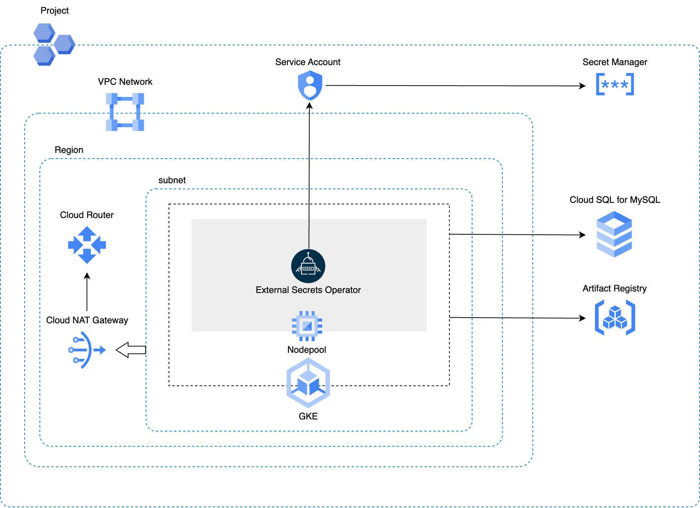

# Shared Infrastructure Adapter

HTTPSで外部公開できるアプリケーションをGoogle Cloud上にデプロイするために必要なGoogle Cloudリソース群をデプロイするCloud Native Adapterです。

以下のリソースを作成します。

* VPCネットワーク
* サブネット
* Google Kubernetes Engine（GKE）
    * クラスタ
    * ノードプール
* Secret Managerシークレット
    * GKEクラスタのkubeconfig
    * Cloud SQL for MySQLのrootユーザ用パスワード
* Cloud NATゲートウェイ
    * GKEクラスタからインターネットへのアウトバウンドアクセスを許可するために作成します。
* Cloud Router
    * GKEクラスタからインターネットへのアウトバウンドアクセスを許可するために作成します。
* 外部静的IPアドレス
    * Cloud NAT IPアドレスとして使用します。
* Artifact Registry
* Cloud SQL for MySQL
    * インスタンス
    * rootユーザアカウント
* サービスアカウント
    * GKEノードプール用のサービスアカウント
    * External Secrets Operator（ESO）が使用するWorkload Identity用サービスアカウント
* Kubernetesリソース
    * Namespace
        * ESO関連リソースを管理するために作成します。
    * ServiceAccount
        * ESO用ServiceAccountを作成します。
            * このServiceAccountは、Secret ManagerシークレットにアクセスするためにWorkload Identityを使用します。
    * Custom Resource Definition
        * External Secrets Operator
    * Custom Resource
        * ClusterSecretStore



## Platform

Google Cloud, Kubernetes

## Module

* Module: `qmonus.net/adapter/official`
* Import path: `qmonus.net/adapter/official/adapters/gcp/container/kubernetes/apiBackend/sharedInfrastructure`

## Level

Sample: サンプル実装

## Prerequisites / Constraints

### Prerequisites

* 事前にGoogle Cloudサービスアカウントを作成し、Qmonus Value Streamへ認証情報を登録する必要があります。以下のロールまたは同じ権限を持つカスタムロールをサービスアカウントに付与してください。
    * Artifact Registry 管理者 （ `roles/artifactregistry.admin` ）
    * Cloud SQL 管理者 （ `roles/cloudsql.admin` ）
    * Compute ネットワーク管理者 （ `roles/compute.networkAdmin` ）
    * Kubernetes Engine 管理者 （ `roles/container.admin` ）
    * Project IAM 管理者 （ `roles/resourcemanager.projectIamAdmin` ）
    * Secret Manager 管理者 （ `roles/secretmanager.admin` ）
    * サービス アカウント ユーザー （ `roles/iam.serviceAccountUser` ）
    * サービス アカウント管理者 （ `roles/iam.serviceAccountAdmin` ）

* 本Adapterは、1つのGoogle Cloudプロジェクトに対して1つのみ使用することを想定しています。本Adapterを利用する複数のAssemblyLineを作成して複数のリソース群をデプロイしたい場合は、デプロイ先となるGoogle CloudプロジェクトをAssemblyLineごとにそれぞれ用意してください。

### Constraints

* サブネット
    * `asia-northeast1` リージョンに作成します。
    * 以下のIPv4アドレス範囲が設定されます。
        * プライマリIPv4範囲
            * 10.0.0.0/22
        * セカンダリIPv4範囲
            * 10.4.0.0/14
                * GKEクラスタのクラスタPodのIPv4範囲として使用します。
            * 10.0.24.0/22
                * GKEクラスタのServiceのIPv4範囲として使用します。
* GKE
    * クラスタ
        * シングルゾーンクラスタとして `asia-northeast1-a` ゾーンに作成します。
        * 限定公開クラスタとして作成します。
        * コントロールプレーンアドレスの範囲は172.16.0.0/28として作成します。
        * インターネット上の全てのIPアドレス、もしくは指定したCIDR範囲からのみコントロールプレーンにアクセスできます。
        * 垂直Pod自動スケーリングは無効になります。
    * ノードプール
        * ノードイメージには `cos_containerd` イメージを使用します。
        * ブートディスクにはバランス永続ディスクを使用します。
* Secret Managerシークレット
    * 各シークレットは、以下の名前で作成します。
        * GKEクラスタのkubeconfig: `qvs-${appName}-cluster-kubeconfig`
        * Cloud SQL for MySQLのrootユーザ用パスワード: `qvs-${appName}-mysql-root-password`
* Cloud NATゲートウェイ
    * `asia-northeast1` リージョンに作成します。
    * Cloud NAT IPアドレスの割り当て方法として、手動割り当てを使用します。
        * Cloud NAT IPアドレスとして使用される外部静的IPアドレスは1個です。
* Artifact Registry
    * DOCKER形式として作成します。
    * `asia-northeast1` リージョンに作成します。
* Cloud SQL for MySQL
    * インスタンス
        * `asia-northeast1` リージョンに作成します。
        * パブリックIPアドレスを使用するようにインスタンスを構成します。
        * 承認済みネットワークに0.0.0.0/0が設定されます。このため、インターネット上の全てのIPアドレスからインスタンスにアクセスできます。
        * クライアントからの接続は、SSL接続のみ許可します。
    * rootユーザアカウント
        * Cloud SQL for MySQLインスタンス作成時に存在する [デフォルトのユーザアカウント](https://cloud.google.com/sql/docs/mysql/users?hl=ja) を削除した上で、新しいユーザアカウントとして作成します。
        * `root'@'%` として作成します。
        * パスワードは、1文字以上の大小英数字記号を含む16文字でランダムで生成されます。
        * ユーザアカウントに付与される権限については [公式ドキュメント](https://cloud.google.com/sql/docs/mysql/users?hl=ja#other_mysql_user_accounts) をご参照ください。
* サービスアカウント
    * 各サービスアカウントには、以下のロールを付与します。
        * GKEノードプール用のサービスアカウント
            * Artifact Registry 読み取り （ `roles/artifactregistry.reader` ）
            * ログ書き込み （ `roles/logging.logWriter` ）
            * モニタリング指標の書き込み （ `roles/monitoring.metricWriter` ）
        * ESOが使用するWorkload Identity用サービスアカウント
            * Secret Manager のシークレット アクセサー （ `roles/secretmanager.secretAccessor` ）
* Kubernetesリソース
    * 各リソースは、以下の名前で作成します。
        * Namespace: `external-secrets`
        * ServiceAccount: `qvs-eso-sa`
        * ClusterSecretStore: `qvs-global-gcp-store`

## Infrastructure Parameters

| Parameter Name | Type | Required | Default | Description | Example | Auto Binding |
| --- | --- | --- | --- | --- | --- | --- |
| appName | string | yes | - | QVSにおけるApplication名 | sample | yes |
| gcpProjectId | string | yes | - | 事前に用意したGoogle CloudプロジェクトID | sample-gcp-project | yes |
| gkeReleaseChannel | string | no | REGULAR | GKEクラスタのリリースチャンネル。`"REGULAR"`, `"RAPID"`, `"STABLE"`, `"UNSPECIFIED"` のいずれかを設定できます。以下を参考に指定してください。<br>https://cloud.google.com/kubernetes-engine/docs/concepts/release-channels?hl=ja | REGULAR | no |
| gkeNodeAutoUpgrade | string | no | "true" | GKEノードの自動アップグレードの有効/無効。`"true"`, `"false"` のいずれかを設定できます。`gkeReleaseChannel` が `"UNSPECIFIED"` の場合のみ設定できます。 | "true" | no |
| gkeNodeVersion | string | no | - | GKEノードのバージョン。省略した場合は、リリースチャンネルごとのデフォルトのバージョンが設定されます。デフォルトのバージョンおよび利用可能なバージョンは `gcloud container get-server-config` コマンドで確認できます。 | 1.27.3-gke.100 | no |
| gkeNodeDiskSizeGb | string | no | "32" | GKEノードのブートディスクのサイズ（GB） | "32" | no |
| gkeNodeMachineType | string | no | e2-medium | GKEノードのマシンタイプ。以下を参考に指定してください。<br>https://cloud.google.com/compute/docs/general-purpose-machines?hl=ja | e2-medium | no |
| gkeNodeCount | string | no | "1" | GKEノードの数 | "1" | no |
| gkeNodeLocation | string | no | "asia-northeast1" | GKEクラスタのノードをデプロイするロケーション。リージョン名またはゾーン名のいずれかを設定できます。リージョン名の場合は、GKEクラスタがリージョンクラスタとして作成されます。ゾーン名の場合は、GKEクラスタがシングルゾーンクラスタとして作成されます。 | "asia-northeast1" | no |
| gkeMasterAuthorizedNetworks | array | no | [] | GKEのコントロールプレーン承認済みネットワークとして追加するソースIPアドレスのリスト。コントロールプレーンへのアクセスを許可したいCIDR範囲を指定してください。指定を省略した場合は、インターネットの全てのIPアドレスからのアクセスが許可されます。 | ["192.0.2.0/24","198.51.100.0/24","203.0.113.0/24"] | no |
| esoVersion | string | no | "0.9.9" | External Secrets Operatorのバージョン | "0.9.9" | no |
| mysqlCpuCount | string | no | "2" | Cloud SQL for MySQLインスタンスのvCPUの数。1または2～96の間の偶数に設定して下さい。 | "2" | no |
| mysqlMemorySizeMb | string | no | "4096" | Cloud SQL for MySQLインスタンスのメモリのサイズ（MB）。vCPUあたり0.9～6.5GB、かつ256MBの倍数、かつ3840MB以上の条件を満たす値に設定して下さい。 | "4096" | no |
| mysqlDatabaseVersion | string | no | "MYSQL_8_0" | Cloud SQL for MySQLインスタンスのデータベースのバージョン。利用可能なバージョンは以下で確認できます。<br>https://cloud.google.com/sdk/gcloud/reference/sql/instances/create#--database-version | "MYSQL_8_0" | no |
| mysqlAvailabilityType | string | no | "ZONAL" | Cloud SQL for MySQLインスタンスの可用性。`"ZONAL"`, `"REGIONAL"` のいずれかを設定できます。`"ZONAL"` の場合は、インスタンスとバックアップを1つのゾーンに配置し、停止時にフェイルオーバーは発生しません。 | "ZONAL" | no |
| useMySql | string | no | "true" | falseを設定すると、Cloud SQL for MySQLインスタンスが作成されなくなります。 | "true" | no |

## CI/CD Parameters

### Adapter Options

| Parameter Name | Type | Required | Default | Description | Example |
| --- | --- | --- | --- | --- | --- |
| repositoryKind | string | no | "" | ソースコードの管理に使用しているGitリポジトリの種類を指定してください。サポートしているのは、github, gitlab, bitbucket, backlog で、何も指定されない場合はgithub用の設定になります。 | gitlab |
| useSshKey | bool | no | false | trueを指定するとリポジトリをクローンするための認証にSSH Keyを使用するように設定できます。 | true |

### Parameters

| Parameter Name | Type | Required | Default | Description | Example | Auto Binding |
| --- | --- | --- | --- | --- | --- | --- |
| gitCloneUrl | string | yes | - | GitリポジトリサービスのURL | https://github.com/${organization}/${repository} | yes |
| gitRevision | string | yes | - | Gitのリビジョン | commit-hash, branch-name or tag-name | no |
| gitRepositoryDeleteExisting | bool | no | true | trueの場合、Git Checkoutする時に指定先のディレクトリが存在している場合に削除する | true | no |
| gitCheckoutSubDirectory | string | no | "" | GitのCheckout作業をするパス名 | "" | no |
| gitTokenSecretName | string | yes | - | Gitのアクセストークンを保管しているk8s Secret名 |gitsecret-xxxxxxxxxxxxxxxxxxxx | yes |
| pathToSource | string | no | "" | ソースディレクトリからの相対パス | "" | no |
| qvsConfigPath | string | yes | - | QVS Config(旧称：Application Config)のパス | .valuestream/qvs.yaml | yes |
| appName | string | yes | - | QVSにおけるApplication名 | sample | yes |
| qvsDeploymentName | string | yes | - | QVSにおけるDeployment名 | staging | yes |
| deployStateName | string | no | app | pulumi-stack名のSuffixとして使用される | app | no |
| gcpServiceAccountSecretName | string | yes | - | QVSにおけるDeploymentの作成時に指定したGoogle CloudサービスアカウントのJSONキーを保管しているSecret名 | gcp-default-xxxxxxxxxxxxxxxxxxxx | yes |

## Application Resources

### Google Cloud Resources

| Resource ID | Provider | Resource Name | Description |
| --- | --- | --- | --- |
| vpcNetwork | gcp | VPCネットワーク | VPCネットワークを作成します。 |
| subnet | gcp | サブネット | サブネットを作成します。 |
| gkeCluster | gcp | GKEクラスタ | GKEクラスタを作成します。 |
| gkeNodepool | gcp | GKEノードプール | GKEノードプールを作成します。 |
| gkeNodepoolServiceAccount | gcp | サービスアカウント | GKEノードプール用のサービスアカウントを作成します。 |
| gkeNodepoolServiceAccountIamMemberGarReader | gcp | IAM | GKEノードプール用サービスアカウントにArtifact Registry 読み取りロールを付与します。 |
| gkeNodepoolServiceAccountIamMemberLoggingLogWriter | gcp | IAM | GKEノードプール用サービスアカウントにログ書き込みロールを付与します。 |
| gkeNodepoolServiceAccountIamMemberMonitoringMetricWriter | gcp | IAM | GKEノードプール用サービスアカウントにモニタリング指標の書き込みロールを付与します。 |
| gkeKubeconfigSecret | gcp | Secret Managerシークレット | GKEクラスタのkubeconfig用のシークレットを作成します。シークレットの値自体は、シークレットではなくシークレットバージョンとして作成されます。 |
| gkeKubeconfigSecretVersion | gcp | Secret Managerシークレットバージョン | GKEクラスタのkubeconfigが格納されたシークレットバージョンを作成します。 |
| cloudNatIpAddress | gcp | 外部静的IPアドレス | Cloud NAT IPアドレスとして使用する外部静的IPアドレスを作成します。 |
| cloudNatGateway | gcp | Cloud NATゲートウェイ | Cloud NATゲートウェイを作成します。 |
| cloudNatRouter | gcp | Cloud Router | Cloud Routerを作成します。 |
| esoGcpServiceAccount | gcp | サービスアカウント | ESOが使用するWorkload Identity用のサービスアカウントを作成します。 |
| esoGcpServiceAccountIamMemberSecretManagerSecretAccessor | gcp | IAM | ESOが使用するWorkload Identity用サービスアカウントにSecret Manager のシークレット アクセサーロールを付与します。 |
| esoGcpServiceAccountIamPolicyBindingWorkloadIdentityUser | gcp | IAM | ESOが使用するWorkload Identity用サービスアカウントに対するWorkload Identity ユーザーロールを、KubernetesのESO用ServiceAccountリソースに付与します。 |
| artifactRegistry | gcp | Artifact Registry | コンテナイメージを保存するためのArtifact Registryリポジトリを作成します。 |
| mysqlInstance | gcp | Cloud SQL for MySQLインスタンス | Cloud SQL for MySQLインスタンスを作成します。 |
| mysqlRootUser | gcp | Cloud SQL for MySQLユーザ | Cloud SQL for MySQLのrootユーザアカウントを作成します。 |
| mysqlRootPassword | random | RandomPassword | Cloud SQL for MySQLのrootユーザ用パスワードを、1文字以上の大小英数字記号を含む16文字で生成します。 |
| mysqlRootPasswordSecret | gcp | Secret Managerシークレット | Cloud SQL for MySQLのrootユーザ用パスワード用のシークレットを作成します。シークレットの値自体は、シークレットではなくシークレットバージョンとして作成されます。 |
| mysqlRootPasswordSecretVersion | gcp | Secret Managerシークレットバージョン | Cloud SQL for MySQLのrootユーザ用パスワードが格納されたシークレットバージョンを作成します。 |

### Kubernetes Resources

| Resource ID | Provider | API version | Kind | Description |
| --- | --- | --- | --- | --- |
| esoNamespace | kubernetes | v1 | Namespace | ESOをデプロイするNamespaceリソースを作成します。 |
| esoK8sServiceAccount | kubernetes | v1 | ServiceAccount | ESO用のServiceAccountリソースを作成します。 |
| eso | kubernetes | - | - | Helmを利用してESOをインストールします。インストール時、ESOのCustom Resource Definitionも同時にインストールされます。 |
| esoClusterSecretStore | kubernetes | external-secrets.io/v1beta1 | ClusterSecretStore | ESOのCustom ResourceのClusterSecretStoreリソースを作成します。 |

## Pipeline Resources

以下のTekton Pipeline/Taskリソースを含むマニフェストが作成されます。

### Pipeline

| Resource ID | Description |
| --- | --- |
| deploy | git-checkout(-ssh), compile-adapter-into-pulumi-yaml(-ssh), deploy-by-pulumi-yaml のTaskを順番に実行し、アプリケーションを指定の環境にデプロイします。 |

### Task

| Resource ID | Pipeline | runAfter | Description |
| --- | --- | --- | --- |
| git-checkout | deploy | - | 指定のGitリポジトリをクローンし、対象のリビジョン・ブランチにチェックアウトします。クローンする際の認証にはGit Tokenを使用します。AdapterOptionsのuseSshKeyがFalseかつrepositoryKindがgithub, gitlabの場合に作成されます。 |
| git-checkout-ssh | deploy | - | 指定のGitリポジトリをクローンし、対象のリビジョン・ブランチにチェックアウトします。クローンする際の認証にはSSH Keyを使用します。AdapterOptionsのuseSshKeyがTrueまたはrepositoryKindがbitbucket, backlogの場合に作成されます。 |
| compile-adapter-into-pulumi-yaml | deploy | git-checkout | リポジトリ内の QVS Config に記載されている Cloud Native Adapter をコンパイルし、PulumiYamlのプロジェクトファイルを生成します。AdapterOptionsのuseSshKeyがFalseかつrepositoryKindがgithub, gitlabの場合に作成されます。 |
| compile-adapter-into-pulumi-yaml-ssh | deploy | git-checkout-ssh | リポジトリ内の QVS Config に記載されている Cloud Native Adapter をコンパイルし、PulumiYamlのプロジェクトファイルを生成します。AdapterOptionsのuseSshKeyがTrueまたはrepositoryKindがbitbucket, backlogの場合に作成されます。 |
| deploy-by-pulumi-yaml | deploy | compile-adapter-into-pulumi-yaml or compile-adapter-into-pulumi-yaml-ssh | コンパイルされたPulumiYamlのプロジェクトファイルを指定の環境にデプロイします。 |

## Usage

```yaml
designPatterns:
  - pattern: qmonus.net/adapter/official/adapters/gcp/container/kubernetes/apiBackend/sharedInfrastructure
    params:
      appName: $(params.appName)
      gcpProjectId: $(params.gcpProjectId)
```

## Code

[sharedInfrastructure](main.cue)

## Appendix

* 本Adapterによって作成されたSecret Managerシークレットのデータの取得方法については、[公式ドキュメント](https://cloud.google.com/secret-manager/docs/access-secret-version?hl=ja) をご参照ください。
