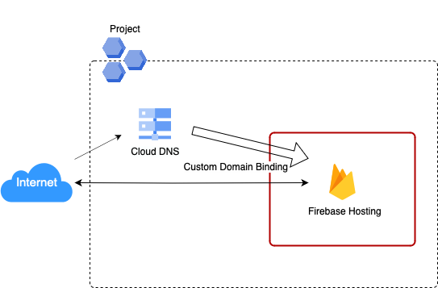

# Frontend Adapter

静的WebアプリケーションをデプロイするCloud Native Adapterです。

以下のリソースと静的WebアプリケーションをデプロイするPipeline Manifestを作成します。

* Firebase Hosting
    * Webアプリケーションを外部公開するサービス

* Cloud DNS
    * レコードセット (CNAMEレコード)

また、アプリケーションのビルドには `Node.js v18` までをサポートしています。
`package.json` の `scripts` フィールドに記載している `build` に、具体的なビルド時のオプションを指定できます。



AssemblyLineで以下のようにResultsを指定することで、GUI上でアプリケーションの公開用URLをAssemblyLine Resultsとして確認することができます。

```yaml
apiVersion: vs.axis-dev.io/v1
kind: AssemblyLine
metadata:
  name: sample
spec:
  …
  results:
    - name: defaultDomain
      value: $(stages.publish-site.results.defaultDomain)
    - name: customDomain
      value: $(stages.publish-site.results.customDomain)
```

## Platform

Firebase, Google Cloud

## Module

* Module: `qmonus.net/adapter/official`
* Import path: `qmonus.net/adapter/official/adapters/gcp/serverless/staticSite/frontend`

## Level

Sample: サンプル実装

## Prerequisites / Constraints

### Prerequisites

* 事前にGoogle Cloudサービスアカウントを作成し、Qmonus Value Streamへ認証情報を登録する必要があります。以下のロールまたは同じ権限を持つカスタムロールをサービスアカウントに付与してください。
    * Firebase Hosting 管理者 （ `roles/firebasehosting.admin` ）
    * DNS 管理者 （ `roles/dns.admin` ）
        * 本AdapterによってCloud DNSのCNAMEレコードを作成するにあたり、別のGoogle Cloudプロジェクトに属するCloud DNSゾーンを利用したい場合は、対象となるGoogle CloudプロジェクトまたはCloud DNSゾーンに対するDNS 管理者ロールを付与してください。

* 事前にDNSゾーンを作成する必要があります。Google CloudにCloud DNSゾーンを作成し、各委譲元のDNSプロバイダで委譲設定を行ってください。

    ※ DNSゾーンを作成せず、お持ちの既存のCloud DNSゾーンを利用する場合は本手順は不要です。

    * Google Cloudコンソールで作成する

        * 詳細については [公式ドキュメント](https://cloud.google.com/dns/docs/zones?hl=ja#create-pub-zone) をご参照ください。

    * gcloud CLIを利用して作成する

        * 前提条件
            * 委譲元のDNSゾーンがCloud DNSであり、かつ委譲先のDNSゾーンもCloud DNSである。
            * Cloud Shellを利用している/ローカルのbash環境に [gcloud CLI](https://cloud.google.com/sdk/gcloud?hl=ja) がインストールされている。

        1. Google Cloudにサインインします。

            ※ Cloud Shellの場合は不要です。

            詳細については [公式ドキュメント](https://cloud.google.com/sdk/docs/authorizing?hl=ja#user-account) をご参照ください。

            ```bash
            gcloud auth login
            ```

        1. DNSゾーンを作成するために必要な情報を変数に格納します。

            任意の値に置き換えて、それぞれ格納してください。

            * `PARENT_ZONE_PROJECT_ID` : 委譲元の親ゾーンが所属しているGoogle CloudプロジェクトID
            * `CHILD_ZONE_PROJECT_ID` : 作成する子ゾーン（委譲先ゾーン）を所属させるGoogle CloudプロジェクトID（親ゾーンと同じプロジェクトに所属させる場合は `PARENT_ZONE_PROJECT_ID` と同じ値になります）
            * `PARENT_ZONE_NAME` : 既にある親ゾーンの名前
            * `CHILD_ZONE_NAME` : 作成する子ゾーンの名前
            * `CHILD_DNS_NAME` : 作成する子ゾーンのDNS名

            ```bash
            PARENT_ZONE_PROJECT_ID="<YOUR_PARENT_ZONE_PROJECT_ID>"  # e.g. "my-parent-zone-project"
            CHILD_ZONE_PROJECT_ID="<YOUR_CHILD_ZONE_PROJECT_ID>"    # e.g. "my-child-zone-project"
            PARENT_ZONE_NAME="<YOUR_PARENT_ZONE_NAME>"              # e.g. "my-parent-zone"
            CHILD_ZONE_NAME="<YOUR_CHILD_ZONE_NAME>"                # e.g. "my-child-zone"
            CHILD_DNS_NAME="<YOUR_CHILD_DNS_NAME>"                  # e.g. "myapp.example.com."
            ```

        1. 委譲先の子ゾーンを所属させるGoogle Cloudプロジェクトを作成します。

            ※ すでに作成済みのGoogle Cloudプロジェクトに所属させる場合は、この手順はSkipしてください。

            ```bash
            gcloud projects create ${CHILD_ZONE_PROJECT_ID}
            ```

        1. 子ゾーンを作成します。

            ```bash
            gcloud config set project ${CHILD_ZONE_PROJECT_ID}
            gcloud dns managed-zones create ${CHILD_ZONE_NAME} --description="" --dns-name=${CHILD_DNS_NAME} --visibility="public" --dnssec-state="off"
            ```

        1.  子ゾーンのネームサーバーを確認します。

            ```bash
            gcloud dns managed-zones describe ${CHILD_ZONE_NAME}
            ```

        1. 子ゾーンのネームサーバーを委譲元の親ゾーンに設定します。

            ```bash
            nsservers=$(gcloud dns managed-zones describe ${CHILD_ZONE_NAME} --format="value(nameServers)[delimiter=',']")
            gcloud config set project ${PARENT_ZONE_PROJECT_ID}
            gcloud dns record-sets create ${CHILD_DNS_NAME} --rrdatas=${nsservers} --type=NS --ttl=3600 --zone=${PARENT_ZONE_NAME}
            ```

        1. 正常に設定できたかを確認します。

            確認のためにTXTレコードを設定します。

            ```bash
            gcloud config set project ${CHILD_ZONE_PROJECT_ID}
            gcloud dns record-sets create hello.${CHILD_DNS_NAME} --rrdatas=world --type=TXT --zone=${CHILD_ZONE_NAME}
            ```

            以下のコマンドを実行し、answerとして "world" が出力されていれば正しく設定されています。

            ```bash
            dig TXT +noall +ans hello.${CHILD_DNS_NAME}
            ```

            確認後、不要なTXTレコードを削除します。

            ```bash
            gcloud dns record-sets delete hello.${CHILD_DNS_NAME} --type=TXT --zone=${CHILD_ZONE_NAME}
            ```

### Constraints

* デプロイするファイルはnpmでパッケージ管理されている必要があります。
* デプロイ対象のフロントエンドプロジェクトがルートディレクトリに存在しない場合は、buildTargetDir　及び、deployTargetDirのパラメータで適切なパスを指定してください。
* gcpFirebaseHostingSiteIdパラメータには、24文字以内、かつ半角英数字とハイフン(-)のみを使用してデプロイする静的Webアプリケーションのデフォルトドメインに使用されるsiteIDを設定して下さい。
* Firebase HostingのsiteIDには重複回避のためサフィックスとしてランダムな5文字が付与されます。
* 環境変数を追加する場合はQVS ConfigにenvironmentVariablesパラメータを設定してください。

## Infrastructure Parameters

| Parameter Name | Type | Required | Default | Description | Example | Auto Binding |
| --- | --- | --- | --- | --- | --- | --- |
| appName | string | yes | - | デプロイするアプリケーション名 | myapp | yes |
| gcpProjectId | string | yes | - | 事前に用意したGoogle CloudプロジェクトID | sample-gcp-project | yes |
| gcpFirebaseHostingSiteId | string | yes | - | デプロイする静的Webアプリケーションのデフォルトドメインに使用されるサイトID。24文字以内、かつ半角英数字とハイフン(-)のみを使用してください。 | myapp-site-id | no |
| gcpFirebaseHostingCustomDomainName | string | yes | - | デプロイする静的WebアプリケーションのカスタムドメインのFQDN。末尾のルート（ `.` ）まで含めて指定してください。 | foo.example.com. | no |
| dnsZoneProjectId | string | yes | - | 事前に用意したCloud DNSゾーンが所属するGoogle CloudプロジェクトID | sample-dns-zone-project | no |
| dnsZoneName | string | yes | - | 事前に用意したDNSゾーン名 | sample-dns-zone | no |
| environmentVariables | object | no | - | アプリケーションに渡される環境変数名と値のペア | ENV: prod | no |

## CI/CD Parameters

### Adapter Options

| Parameter Name | Type   | Required | Default | Description                                                                                                      | Example |
|----------------|--------|----------|---------|------------------------------------------------------------------------------------------------------------------|---------|
| repositoryKind | string | no       | ""      | ソースコードの管理に使用しているGitリポジトリの種類を指定してください。サポートしているのは、github, gitlab, bitbucket, backlog で、何も指定されない場合はgithub用の設定になります。 | gitlab  |
| useSshKey      | bool   | no       | false   | trueを指定するとリポジトリをクローンするための認証にSSH Keyを使用するように設定できます。                                                               | true    |

### Parameters

| Parameter Name              | Type   | Required | Default | Description                                      | Example                                              | Auto Binding |
|-----------------------------|--------|----------|---------|--------------------------------------------------|------------------------------------------------------|--------------|
| gitCloneUrl                 | string | yes      | -       | GitリポジトリサービスのURL                                 | https://github.com/${organization}/${repository} | yes          |
| gitRevision                 | string | yes      | -       | Gitのリビジョン                                        |                                                      | no           |
| gitRepositoryDeleteExisting | bool   | no       | true    | trueの場合、Git Checkoutする時に指定先のディレクトリが存在している場合に削除する |                                                      | no           |
| gitCheckoutSubDirectory     | string | no       | ""      | GitのCheckout作業をするパス名                             |                                                      | no           |
| gitTokenSecretName          | string | yes      | -       | Gitのアクセストークンを保管しているSecret名                       |                                                      | yes          |
| pathToSource                | string | no       | ""      | ソースディレクトリからの相対パス                                 |                                                      | no           |
| qvsConfigPath               | string | yes      | -       | QVS Config(旧称：Application Config)のパス             | .valuestream/qvs.yaml                                | yes          |
| appName                     | string | yes      | -       | QVSにおけるApplication名                              | nginx                                                | yes          |
| qvsDeploymentName           | string | yes      | -       | QVSにおけるDeployment名                               | staging                                              | yes          |
| deployStateName             | string | no       | app     | pulumi-stack名のSuffixとして使用される                     |                                                      | no           |
| gcpProjectId          | string | yes      | -       | 事前に用意したGoogle CloudプロジェクトID                              |                                                      | yes          |
| gcpServiceAccountSecretName       | string | yes      | -       | QVSにおけるDeploymentの作成時に指定したGoogle CloudサービスアカウントのJSONキーを保管しているSecret名     | gcp-default-xxxxxxxxxxxxxxxxxxxx     | yes          |
| buildTargetDir              | string | no       | .       | ビルド対象のフロントエンドアプリケーションディレクトリへのパス                  | apps/frontend                                        | no           |
| deployTargetDir             | string | no       | dist    | ビルド結果のフロントエンドファイルが格納されているディレクトリへのパス              | apps/frontend/dist                                   | no           |

## Application Resources

| Resource ID            | Provider | PaaS                  | Description                                  |
|------------------------|----------|-----------------------|----------------------------------------------|
| firebaseHostingSite | gcp | Firebase Hosting | Webアプリケーションをデプロイします。 |
| siteIdSuffix | random | RandomString | Firebase HostingのsiteIDの末尾に追加するランダム文字列（5文字）を生成します。 |
| cloudDnsCnameRecord | gcp | Cloud DNS | レコードセットに新たにCNAMEレコードを追加します。 |
| firebaseHostingCustomDomain | gcp | Firebase Hosting | 作成したCNAMEレコードを利用してWebアプリケーションにカスタムドメインを設定します。 |

## Pipeline Resources

以下の Tekton Pipeline/Task リソースを含むマニフェストが作成されます。

### Pipeline

| Resource ID  | Description                                                                                                                               |
|--------------|-------------------------------------------------------------------------------------------------------------------------------------------|
| deploy       | git-checkout(-ssh), compile-adapter-into-pulumi-yaml(-ssh), deploy-by-pulumi-yaml のTaskを順番に実行し、アプリケーションを指定の環境にデプロイします。                    |
| publish-site | git-checkout(-ssh), generate-environment-variables-file, build-gcp-firebase-hosting, get-url-firebase-hosting, deploy-gcp-firebase-hosting のTaskを順番に実行し、静的ファイルをデプロイします。 |

### Task

| Resource ID                          | Pipeline             | runAfter                                                                 | Description                                                                                                                                                       |
|--------------------------------------|----------------------|--------------------------------------------------------------------------|-------------------------------------------------------------------------------------------------------------------------------------------------------------------|
| git-checkout                         | deploy, publish-site | -                                                                        | 指定のGitリポジトリをクローンし、対象のリビジョン・ブランチにチェックアウトします。クローンする際の認証にはGit Tokenを使用します。AdapterOptionsのuseSshKeyがFalseかつrepositoryKindがgithub, gitlabの場合に作成されます。                   |
| git-checkout-ssh                     | deploy, publish-site | -                                                                        | 指定のGitリポジトリをクローンし、対象のリビジョン・ブランチにチェックアウトします。クローンする際の認証にはSSH Keyを使用します。AdapterOptionsのuseSshKeyがTrueまたはrepositoryKindがbitbucket, backlogの場合に作成されます。                 |
| compile-adapter-into-pulumi-yaml     | deploy               | git-checkout                                                             | リポジトリ内の QVS Config に記載されている Cloud Native Adapter をコンパイルし、PulumiYamlのプロジェクトファイルを生成します。AdapterOptionsのuseSshKeyがFalseかつrepositoryKindがgithub, gitlabの場合に作成されます。     |
| compile-adapter-into-pulumi-yaml-ssh | deploy               | git-checkout-ssh                                                         | リポジトリ内の QVS Config に記載されている Cloud Native Adapter をコンパイルし、PulumiYamlのプロジェクトファイルを生成します。AdapterOptionsのuseSshKeyがTrueまたはrepositoryKindがbitbucket, backlogの場合に作成されます。 |
| deploy-by-pulumi-yaml                | deploy               | compile-adapter-into-pulumi-yaml or compile-adapter-into-pulumi-yaml-ssh | コンパイルされたPulumiYamlのプロジェクトファイルを指定の環境にデプロイします。                                                                                                                      |
| generate-environment-variables-file  | publish-site         | git-checkout or git-checkout-ssh                                         | 環境変数をexportするスクリプトを作成します。                                                                                                                          |
| build-gcp-firebase-hosting                                  | publish-site         | generate-environment-variables-file                                      | リポジトリ内のnpmプロジェクトをビルドし、静的ファイルを生成します。                                                                                                                                      |
| get-url-firebase-hosting                                               | publish-site         | build-gcp-firebase-hosting                                               | 静的Webアプリケーションの公開URLを取得します。                                                                                                                                      |
| deploy-gcp-firebase-hosting                                 | publish-site         | get-url-firebase-hosting                                                 | ビルドされた静的ファイルをデプロイします。                                                                                                                                             |

## Usage

```yaml
designPatterns:
  - pattern: qmonus.net/adapter/official/adapters/gcp/serverless/staticSite/frontend
    params:
      appName: $(params.appName)
      gcpProjectId: $(params.gcpProjectId)
      gcpFirebaseHostingSiteId: $(params.gcpFirebaseHostingSiteId)
      gcpFirebaseHostingCustomDomainName: $(params.gcpFirebaseHostingCustomDomainName)
      dnsZoneProjectId:  $(params.dnsZoneProjectId)
      dnsZoneName:  $(params.dnsZoneName)
      environmentVariables:
        ENV1: $(params.env1)
        ENV2: $(params.env2)
```

## Code

[gcpFrontendApplicationAdapter](./main.cue)
