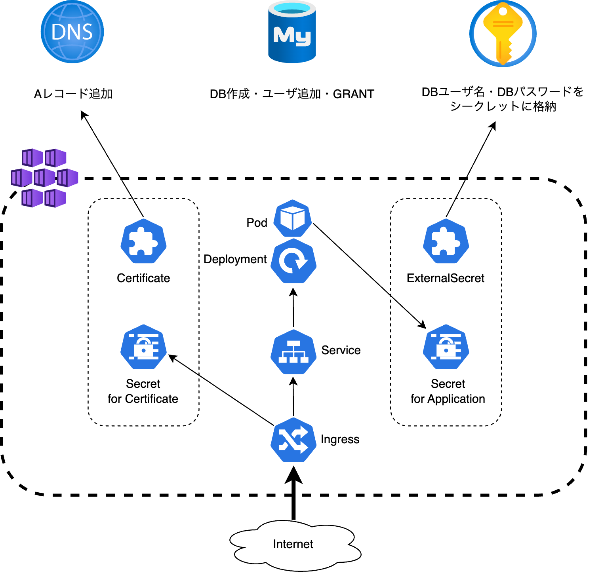

# Azure API Backend Application Adapter

以下のCloud Native Adapterを組み合わせて、HTTPSで外部公開できるアプリケーションをAzure環境にデプロイするCloud Native Adapterです。詳細は各Cloud Native Adapterのドキュメントをご覧ください。

* [Azure API Backend Application Adapter for Azure Resources](sample-azureApiBackendApplicationAdapterForAzureResources.md)
* [Azure API Backend Application Adapter for Kubernetes Resources](sample-azureApiBackendApplicationAdapterForKubernetesResources.md)
* [Azure Buildkit Adapter](../cicd/build-buildkitAzure.md)
* [Simple Deploy by Pulumi Yaml Adapter](../cicd/deploy-simpleDeployByPulumiYaml.md)

以下のリソースを作成します。

* Azure DNS
  * レコードセット (Aレコード)
* Azure Database for MySQL
  * データベース
  * 作成したデータベースへのGRANT ALL権限をもつユーザーアカウント
* Azure Key Valut
  * MySQLのユーザー名、パスワードを格納したシークレット
* Kubernetes
  * Certificate
    * Aレコードとして払い出したドメインを指定し、HTTPS接続を可能にするための証明書を発行します。
  * Ingress
    * Certificateリソースと払い出したドメインを指定し、HTTPSアクセスを公開します。
  * Service
    * IngressへのアクセスをDeploymentに振り向けます。
  * ExternalSecret
    * Key Vaultにアクセスし、アプリケーションがDB接続を行うのに必要なユーザ名とパスワード、およびRedisのパスワードを取得します。
  * Deployment
    * パラメータから、DBとRedisのホスト名とポート番号を環境変数としてアプリケーションに渡します。
    * External Secretで生成されたSecretをマウントして、DBユーザ名とそのパスワード、およびRedisのパスワードを環境変数としてアプリケーションに渡します。



## Module

* Module: `qmonus.net/adapter/official`
* Import path: `qmonus.net/adapter/official/pulumi/azure/sample:azureApiBackendApplicationAdapter`

## Level

Sample: サンプル実装

## Prerequisites / Constraints

### Prerequisites

* 事前に以下のリソースを作成してください。
  * Azure DNS
    * ゾーン
  * Azure Database for MySQL
    * サーバー
  * Azure Key Valut
    * キーコンテナ
      * デプロイ時に使用するService Principalのアクセスをキーコンテナのアクセスポリシーで許可してください。
    * Redisの接続に使用するパスワードを格納したKey Vaultシークレット
  * Azure Cache for Redis
  * Application Gateway
    * AKSのAGICを有効にしてアタッチする
  * 静的IPアドレス
    * Application Gatewayに付与
* 以下のCRDをKubernetesクラスタへApplyしてください。
  * External Secrets Operator
  * cert-manager
    * ClusterIssuerリソースも事前に作成してください。

### Constraints

* 作成するMySQLのユーザアカウントのパスワードは、それぞれ1文字以上の大小英数字を含む、16文字でランダムで生成されます。
* このAdapterでアプリケーションに渡す環境変数は以下のみとなります。
  * アプリケーションが利用するポート番号
  * 接続するデータベースのホスト名
  * データベースに接続するユーザ名
  * データベースに接続するユーザーパスワード
  * Redisのホスト名
  * Redisのポート番号
  * Redisの接続に使用するパスワード
* このAdapterでは、パラメータの設定を簡単化するため、組み合わせる個々のAdapterにおける一部のパラメータに固定値が設定されます。これらの固定値は変更できません。詳細は以下の表をご確認ください。
  * 以下のパラメータに固定値ではなく任意の値を設定したい場合は、このAdapterは使用できないため、個々のAdapterを組み合わせたQVS Configを作成してご利用ください。

| Adapter Name | Parameter Name | Predefined Value | Description |
| --- | --- | --- | --- |
| Azure API Backend Application Adapter for Azure Resources | azureProvider | AzureProvider | Pulumi yamlで使用するAzure Provider名 |
| Azure API Backend Application Adapter for Azure Resources | mysqlProvider | MysqlProvider | Pulumi yamlで使用するMySQL Provider名 |
| Azure API Backend Application Adapter for Azure Resources | azureARecordTtl | "3600" | 新たに作成するAレコードに設定するTTLの値 |
| Azure API Backend Application Adapter for Azure Resources | mysqlCreateDbCharacterSet | utf8mb3 | 新たに作成するMySQLのデータベースに設定するキャラクタセット |
| Azure API Backend Application Adapter for Azure Resources | azureKeyVaultDbAdminSecretName | dbadminuser | 事前に用意した、MySQLのAdminユーザー名が格納されているシークレット名 |
| Azure API Backend Application Adapter for Azure Resources | azureKeyVaultDbAdminPasswordSecretName | dbadminpassword | 事前に用意した、MySQLのAdminパスワードが格納されているシークレット名 |
| Azure API Backend Application Adapter for Kubernetes Resources | replicas | "1" | 作成するPodのレプリカ数 |
| Azure API Backend Application Adapter for Kubernetes Resources | portEnvironmentVariableName | PORT | アプリケーションが利用するポート番号としてアプリケーションPodに渡される環境変数名 |
| Azure API Backend Application Adapter for Kubernetes Resources | dbHostEnvironmentVariableName | DB_HOST | Azure Database for MySQLのホスト名としてアプリケーションPodに渡される環境変数名 |
| Azure API Backend Application Adapter for Kubernetes Resources | dbUserEnvironmentVariableName | DB_USER | Azure Database for MySQLに接続するユーザ名としてアプリケーションPodに渡される環境変数名 |
| Azure API Backend Application Adapter for Kubernetes Resources | dbPasswordEnvironmentVariableName | DB_PASS | Azure Database for MySQLに接続するユーザのパスワードとしてアプリケーションPodに渡される環境変数名 |
| Azure API Backend Application Adapter for Kubernetes Resources | redisHostEnvironmentVariableName | REDIS_HOST | Azure Cache for Redisのホスト名としてアプリケーションPodに渡される環境変数名 |
| Azure API Backend Application Adapter for Kubernetes Resources | redisPortEnvironmentVariableName | REDIS_PORT | Azure Cache for Redisのポート番号としてアプリケーションPodに渡される環境変数名 |
| Azure API Backend Application Adapter for Kubernetes Resources | redisPort | "6380" | Azure Cache for Redisのポート番号 |
| Azure API Backend Application Adapter for Kubernetes Resources | redisPasswordEnvironmentVariableName | REDIS_PASS | Azure Cache for Redisの接続に使用するパスワードとしてアプリケーションPodに渡される環境変数名 |
| Azure API Backend Application Adapter for Kubernetes Resources | clusterSecretStoreName | qvs-global-azure-store | 使用するClusterSecretStoreリソース名 |
| Azure API Backend Application Adapter for Kubernetes Resources | k8sProvider | K8sProvider | Pulumi yamlで使用するKubernetes Provider名 |
| Azure Buildkit Adapter | image | "" | 生成される2つのTaskのdocker-login-azure, buildkitに付与される接頭語 |
| Simple Deploy by Pulumi Yaml Adapter | useDebug | false | trueを指定すると、AssemblyLine実行時にQmonus Value Streamが適用するApplication Manifestの内容を出力します。 |
| Simple Deploy by Pulumi Yaml Adapter | deployPhase | app | Qmonus Value Streamにおけるコンパイル・デプロイ単位を示すフェーズ |
| Simple Deploy by Pulumi Yaml Adapter | resourcePriority | medium | マニフェストをコンパイルするTekton Task に割り当てるリソース量（medium → cpu:1, memory: 512MiB） |
| Simple Deploy by Pulumi Yaml Adapter | pulumiCredentialName | qmonus-pulumi-secret | Pulumi Stack上の機密情報を暗号化するためのパスフレーズを格納したCredential名 |
| Simple Deploy by Pulumi Yaml Adapter | useCred.kubernetes | true | trueを指定するとKubernetesにリソースをデプロイする際に、Value Streamで設定されたCredentialを参照できるようになります 。 |
| Simple Deploy by Pulumi Yaml Adapter | useCred.gcp | false | trueを指定するとGCPにリソースをデプロイする際に、Value Streamで設定されたCredentialを参照できるようになります。 |
| Simple Deploy by Pulumi Yaml Adapter | useCred.aws | false | trueを指定するとAWSにリソースをデプロイする際に、Value Streamで設定されたCredentialを参照できるようになります。 |
| Simple Deploy by Pulumi Yaml Adapter | useCred.azure | true | trueを指定するとAzureにリソースをデプロイする際に、Value Streamで設定されたCredentialを参照できるようになります。 |
| Simple Deploy by Pulumi Yaml Adapter | importStackName | "" | deployment-workerでのデプロイで生成されたStackをimportしたい場合に指定するStack名 |

## Platform

Kubernetes, Microsoft Azure

## Infrastructure Parameters

| Parameter Name | Type | Required | Default | Description | Auto Binding |
| --- | --- | --- | --- | --- | --- |
| appName | string | yes | - | デプロイするアプリケーション名 | yes |
| azureKeyVaultDbUserSecretName | string | no | dbuser | MySQLのユーザー名を格納するシークレット名 | no |
| azureKeyVaultDbPasswordSecretName | string | no | dbpassword | MySQLのユーザーパスワードを格納するシークレット名 | no |
| azureSubscriptionId | string | yes | - | 事前に用意したAzureのリソースが含まれるサブスクリプション名 | yes |
| azureResourceGroupName | string | yes | - | 事前に用意したAzureのリソースが含まれるリソースグループ名 | yes |
| azureDnsZoneName | string | yes | - | 事前に用意したDNSゾーン名 | no |
| azureDnsARecordName | string | yes | - | 新たに作成するAレコード名 | no |
| azureStaticIpAddress | string | yes | - | 新たに作成するAレコードで指定するIPアドレス | no |
| mysqlCreateUserName | string | no | dbuser | 新たに作成するMySQLのユーザー名 | no |
| mysqlCreateDbName | string | yes | - | 新たに作成するMySQLのデータベース名 | no |
| mysqlEndpoint | string | no | `dbHost` の値 | 接続するMySQLのエンドポイント(hostname / Unix domain socket) | no |
| azureKeyVaultKeyContainerName | string | yes | - | 事前に用意したキーコンテナ名 | no |
| clusterIssuerName | string | yes | - | 使用するClusterIssuerリソース名 | no |
| k8sNamespace | string | yes | - | アプリケーションをデプロイする対象のNamespace | no |
| imageName | string | yes | - | デプロイするDocker Image | no |
| port | string | yes | - | アプリケーションが利用するポート番号 | no |
| dbHost | string | yes | - | Azure Database for MySQLのホスト名 | no |
| redisHost | string | yes | - | Azure Cache for Redisのホスト名 | no |
| redisPasswordSecretName | string | yes | - | Azure Cache for Redisの接続に使用するパスワードが格納されているシークレット名 | no |
| host | string | yes | - | 公開するアプリケーションのホスト名 | no |

## CI/CD Parameters

### Adapter Options

| Parameter Name | Type | Required | Default | Description | Example |
| --- | --- | --- | --- | --- | --- |
| repositoryKind | string | no | "" | ソースコードの管理に使用しているGitリポジトリの種類を指定してください。サポートしているのは、github, gitlab, bitbucket, backlog で、何も指定されない場合はgithub用の設定になります。 | gitlab |
| useSshKey | bool | no | false | trueを指定するとリポジトリをクローンするための認証にSSH Keyを使用するように設定できます。 | true |

### Parameters

| Parameter Name | Type | Required | Default | Description | Example | Auto Binding |
| --- | --- | --- | --- | --- | --- | --- |
| gitCloneUrl | string | yes | - | GitリポジトリサービスのURL | https://github.com/${organization}/<br>${repository} | yes |
| gitRevision  | string | yes | - | Gitのリビジョン | | no |
| gitRepositoryDeleteExisting  | bool | no | true | trueの場合、Git Checkoutする時に指定先のディレクトリが存在している場合に削除する | | no |
| gitCheckoutSubDirectory | string | no | "" | GitのCheckout作業をするパス名 | | no |
| gitTokenSecretName | string | yes | - | Gitのアクセストークンを保管しているk8s Secret名 | | yes |
| gitSshKeySecretName | string | yes | - | GitのSSH Keyを保管しているk8s Secret名 | | yes |
| azureApplicationId | string | yes | - | AzureのApplicationID | | yes |
| azureClientSecretName | string | yes | - | AzureのClientSecretを保管しているSecret名 | | yes |
| dockerfile | string | yes | Dockerfile | ビルドするdockerfileのファイル名 | | no |
| imageRegistryPath | string | yes | - | ビルドしたイメージをプッシュするコンテナレジストリのイメージ名を含まないパス | ${acr_name}.azurecr.io/sample | no |
| imageShortName | string | yes | - | ビルドするコンテナイメージの省略名。ACRのリポジトリ名を指定する。| nginx | no |
| imageTag | string | yes | - | コンテナイメージのタグ名。buildcacheというタグ名は予約されているため指定できません。 | v1.0.0 | no |
| pathToContext | string | yes | . | ソースディレクトリからの相対パス | | no |
| extraArgs | string | yes | "" | Buildkitでイメージをビルドする際に追加で設定するオプション | | no |
| pathToSource | string | no | "" | ソースディレクトリからの相対パス | | no |
| qvsConfigPath | string | yes | - | QVS Config(旧称：Application Config)のパス | .valuestream/qvs.yaml | yes |
| appName | string | yes | - | QVSにおけるApplication名 | nginx | yes |
| qvsDeploymentName | string | yes | - | QVSにおけるDeployment名 | staging | yes |
| deployStateName | string | no | main | pulumi-stack名のSuffixとして使用される | | no |
| kubeconfigSecretName | string | no | - | QVSにおけるDeploymentの作成時に指定したkubeconfigを保管しているSecret名 | | yes |
| azureTenantId | string | no | - | AzureのTenantID | | yes |
| azureSubscriptionId | string | no | - | AzureのSubscriptionID | | yes |

## Application Resources

| Resource ID | Provider | PaaS | API version | Kind | Description |
| --- | --- | --- | --- | --- | --- |
| aRecord | Azure | Azure DNS | | | レコードセットに新たにAレコードを追加します。 |
| database | MySQL | Azure Database for MySQL | | | MySQLサーバーに新たにデータベースを作成します。 |
| dbRandomPassword | Random | | | | 新規作成するMySQLユーザーパスワードを16文字の英大数字で生成します。 |
| user | MySQL | Azure Database for MySQL | | | MySQLサーバーに新たにユーザーを作成します。 |
| grant | MySQL | Azure Database for MySQL | | | ユーザーに作成したデータベースへの権限を付与します。 |
| dbUserSecret | Azure | Azure Key Valut | | | 新規作成したMySQLユーザー名を格納したシークレットを作成します。 |
| dbPasswordSecret | Azure | Azure Key Valut | | | 新規作成したMySQLユーザーパスワードを格納したシークレットを作成します。 |
| ingress | kubernetes | | v1 | Ingress | Serviceに対する外部からのアクセスを管理します |
| service | kubernetes | | v1 | Service | 各Node上で、静的なポートでServiceを公開します |
| deployment | kubernetes | | apps/v1 | Deployment | デプロイするPodリソース（アプリケーション）を定義します |
| certificate | kubernetes | | cert-manager.io/v1  | Certificate | アプリケーションを公開するために使用するTLS証明書を定義します |
| externalSecret | kubernetes | | external-secrets.io/v1beta1 | ExternalSecret | 外部プロバイダの機密情報をSecretリソースとして使用できるようにします |

## Pipeline Resources

以下の Tekton Pipeline/Task リソースを含むマニフェストが作成されます。

### Pipeline

| Resource ID | Description |
| --- | --- |
| build | git-checkout(-ssh), docker-login-azure, buildkit のTaskを順番に実行し、Dockerfileからイメージのビルドとプッシュを行います。 |
| deploy | git-checkout(-ssh), compile-adapter-into-pulumi-yaml(-ssh), deploy-by-pulumi-yaml のTaskを順番に実行し、アプリケーションを指定の環境にデプロイします。 |

### Task

| Resource ID | Pipeline | runAfter | Description |
| --- | --- | --- | --- |
| git-checkout | build, deploy | - | 指定のGitリポジトリをクローンし、対象のリビジョン・ブランチにチェックアウトします。クローンする際の認証にはGit Tokenを使用します。AdapterOptionsのuseSshKeyがFalseかつrepositoryKindがgithub, gitlabの場合に作成されます。 |
| git-checkout-ssh | build, deploy | - | 指定のGitリポジトリをクローンし、対象のリビジョン・ブランチにチェックアウトします。クローンする際の認証にはSSH Keyを使用します。AdapterOptionsのuseSshKeyがTrueまたはrepositoryKindがbitbucket, backlogの場合に作成されます。 |
| docker-login-azure | build | git-checkout or git-checkout-ssh | 指定したAzure Container Registryへの認証を行います。|
| buildkit | build | docker-login-azure | Dockerfileからイメージをビルドし、コンテナレジストリへプッシュします。|
| compile-adapter-into-pulumi-yaml | deploy | git-checkout | リポジトリ内の QVS Config に記載されている Cloud Native Adapter をコンパイルし、PulumiYamlのプロジェクトファイルを生成します。AdapterOptionsのuseSshKeyがFalseかつrepositoryKindがgithub, gitlabの場合に作成されます。 |
| compile-adapter-into-pulumi-yaml-ssh | deploy | git-checkout-ssh | リポジトリ内の QVS Config に記載されている Cloud Native Adapter をコンパイルし、PulumiYamlのプロジェクトファイルを生成します。AdapterOptionsのuseSshKeyがTrueまたはrepositoryKindがbitbucket, backlogの場合に作成されます。 |
| deploy-by-pulumi-yaml | deploy | compile-adapter-into-pulumi-yaml or compile-adapter-into-pulumi-yaml-ssh | コンパイルされたPulumiYamlのプロジェクトファイルを指定の環境にデプロイします。 |

## Usage

```yaml
designPatterns:
  - pattern: qmonus.net/adapter/official/pulumi/azure/sample:azureApiBackendApplicationAdapter
    params:
      appName: $(params.appName)
      azureSubscriptionId: $(params.azureSubscriptionId)
      azureResourceGroupName: $(params.azureResourceGroupName)
      azureDnsZoneName: $(params.azureDnsZoneName)
      azureDnsARecordName: $(params.azureDnsARecordName)
      azureStaticIpAddress: $(params.azureStaticIpAddress)
      mysqlCreateDbName: $(params.mysqlCreateDbName)
      azureKeyVaultKeyContainerName: $(params.azureKeyVaultKeyContainerName)
      clusterIssuerName: $(params.clusterIssuerName)
      k8sNamespace: $(params.k8sNamespace)
      imageName: $(params.imageName)
      port: $(params.port)
      dbHost: $(params.dbHost)
      redisHost: $(params.redisHost)
      redisPasswordSecretName: $(params.redisPasswordSecretName)
      host: $(params.host)
```

## Code

[azureApiBackendApplicationAdapter](../../pulumi/azure/sample/azureApiBackendApplicationAdapter.cue)
