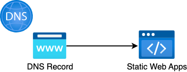

# Azure Frontend Application Adapter for Azure Resources

静的Webアプリケーションをデプロイするために、関連するAzureリソースをデプロイするCloud Native Adapterです。

Webアプリケーションを公開するためには、別途HTML, CSSなどの静的ファイルをデプロイする必要があります。静的ファイルをデプロイするためには [Deploy Static Site to Azure Static Web Apps Adapter](../cicd/deploy-staticSiteToAzureStaticWebApps.md) を合わせてご利用いただくか、本AdapterとDeploy Static Site to Azure Static Web Apps Adapterを組み合わせた [Azure Frontend Application Adapter](sample-azureFrontendApplicationAdapter.md) をご利用ください。

以下のリソースを作成します。

* Azure Static Web Apps
  * Webアプリケーションを外部公開するサービス
* Azure DNS
  * レコードセット (CNAMEレコード)



## Module

* Module: `qmonus.net/adapter/official`
* Import path: `qmonus.net/adapter/official/pulumi/azure/sample:azureFrontendApplicationAdapterForAzureResources`

## Level

Sample: サンプル実装

## Prerequisites / Constraints

### Prerequisites
* 事前に以下のリソースを作成してください。
  * Azure DNS
    * ゾーン

* 以下のProvider AdapterをQVS Configに指定してください。
  * `qmonus.net/adapter/official/pulumi/provider:azure`

## Platform

Azure Static Web Apps, Microsoft Azure

## Parameters

| Parameter Name | Type | Required | Default | Description |
| --- | --- | --- | --- | --- |
| appName | string | yes | - | デプロイするアプリケーション名 |
| azureProvider | string | no | AzureProvider | Pulumi yamlで使用するAzure Provider名 |
| azureSubscriptionId | string | yes | - | 事前に用意したAzureのリソースが含まれるサブスクリプション名 |
| azureResourceGroupName | string | yes | - | 事前に用意したAzureのリソースが含まれるリソースグループ名 |
| azureStaticSiteLocation | string | yes | - | Static Web Appsをデプロイするロケーション |
| azureDnsZoneName | string | yes | - | 事前に用意したDNSゾーン名 |
| azureCnameRecordTtl | string | no | "3600" | 新たに作成するCレコードに設定するTTLの値 |

## Resources
| Resource ID | Provider | PaaS | Description |
| --- | --- | --- | --- |
| staticSite | Azure | Azure Static Web Apps | Webアプリケーションをデプロイします |
| cnameRecord | Azure | Azure DNS | レコードセットに新たにCNAMEレコードを追加します |
| staticSiteCustomDomain | Azure | Azure Static Web Apps | 作成したCNAMEレコードを利用してWebアプリケーションにカスタムドメインを設定します |

## Usage

```yaml
designPatterns:
  - pattern: qmonus.net/adapter/official/pulumi/provider:azure
  - pattern: qmonus.net/adapter/official/pulumi/azure/sample:azureFrontendApplicationAdapterForAzureResources
    params:
      appName: $(params.appName)
      azureStaticSiteLocation: $(params.azureStaticSiteLocation)
      azureSubscriptionId: $(params.azureSubscriptionId)
      azureResourceGroupName: $(params.azureResourceGroupName)
      azureDnsZoneName: $(params.azureDnsZoneName)
```

## Code

[azureFrontendApplicationAdapterForAzureResources](../../pulumi/azure/sample/azureFrontendApplicationAdapterForAzureResources.cue)
