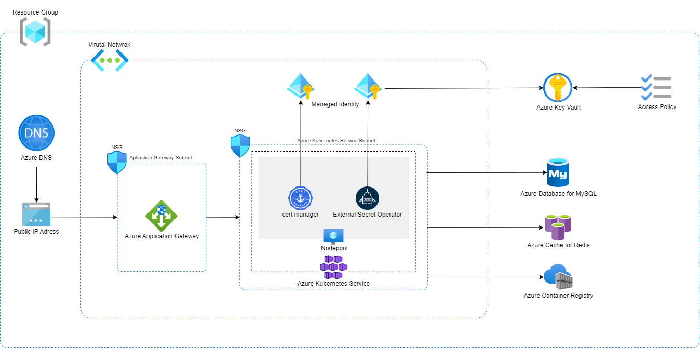

# Azure Web Platform Adapter

CI/CD AdapterとInfrastructure Adapterを組み合わせて、HTTPSで外部公開できるアプリケーションをAzure上にデプロイするために、必要なAzureリソース群をデプロイするCloud
Native Adapterです。

CI/CD Adapterの詳細については、以下をご覧ください。

* [Simple Deploy by Pulumi Yaml Adapter](../cicd/deploy-simpleDeployByPulumiYaml.md)

以下のリソースを作成します。

* Azure Resource Group
    * 下記のリソースが所属するリソースグループを作成します。
* Azure Application Gateway
    * Application Gateway イングレス コントローラーとして作成します。
* Azure Cache for Redis
    * Azureで固有のリソース名とする必要があるため、サフィックスとしてランダムな8文字を付与します。
    * 作成時に併せて、アクセスキーがKey Vaultに`redisaccesskey`という名前で格納されます。
* Azure Container Registry
    * Azureで固有のリソース名とする必要があるため、サフィックスとしてランダムな8文字を付与します。
* Azure Database for MySQL
    * Azureで固有のリソース名とする必要があるため、サフィックスとしてランダムな8文字を付与します。
    * 作成時に併せて、Adminユーザ:`admin_user`とパスワードがそれぞれ`dbadminuser`と`dbadminpassword`というシークレット名でKey
      Vaultに格納されます。
* Azure DNS
    * DNSのゾーンを作成します。
    * 機能させるには、デプロイ後にユーザが用意したドメインに移譲の設定を行う必要があります。
* Azure Key Vault
    * MySQLのパスワードやRedisのアクセスキー、踏み台サーバーの秘密鍵を格納します。
    * アクセスポリシーを使用して、Qmonus Value Streamに登録されたサービスプリンシパル、および任意のユーザからのシークレットへのアクセスを許可します。
    * 論理削除が有効であるため、同名のシークレットを再作成するには物理削除をAzure Portal等から行う必要があります。
* Azure Kubernetes Service
    * Custom Resource Definition
        * cert-manager
        * External Secrets Operator
    * Custom Resource
        * ClusterIssuer
            * `qvs-cluster-issuer`という名前で作成されます。
        * ClusterSecretStore
            * `qvs-global-azure-store`という名前で作成されます。
* Azure Network Security Group
    * 2つ作成して、サブネットに関連付けます。
    * セキュリティ規則は任意のポート・プロトコル・IPアドレスからのアクセスを許可します。
* Azure Public IP Address
    * Application Gateway用に作成します。
* Azure Virtual Network
    * 各リソースのサブネットが所属するVirtual Networkを作成します。
* Azure Virtual Network Subnet
    * 以下のサブネットを/22のネットワークセグメントで作成します。
        * Application Gatewayが所属するサブネット
        * Azure Kubernetes Serviceが所属するサブネット



The cert-manager project logo is created by Jetstack Ltd. and licensed under
the [Creative Commons Attribution 4.0 International License](http://creativecommons.org/licenses/by/4.0/).

## Module

* Module: `qmonus.net/adapter/official`
* Import path `qmonus.net/adapter/official/pulumi/azure/sample:azureWebPlatform`

## Level

Sample: サンプル実装

## Prerequisites / Constraints

### Prerequisites

* 事前にサービスプリンシパルを作成し、Qmonus Value Streamへ認証情報を登録する必要があります。以下の権限をサブスクリプション配下で付与してください。
    * 共同作成者
    * ユーザー アクセス管理者

### Constraints

* 作成するMySQLのAdminユーザアカウントのパスワードは、1文字以上の大小英数字記号を含む、16文字でランダムで生成されます。
* ゾーン分散などの冗長化は行いません。

## Platform

Microsoft Azure

## Infrastructure Parameters

| Parameter Name                 | Type   | Required | Default        | Description                                                                                                                                                                                                                                                | Example                                                                     | Auto Binding |
|--------------------------------|--------|----------|----------------|------------------------------------------------------------------------------------------------------------------------------------------------------------------------------------------------------------------------------------------------------------|-----------------------------------------------------------------------------|--------------|
| appName                        | string | yes      | -              | デプロイするアプリケーション名                                                                                                                                                                                                                                            | sample                                                                      | yes          |
| azureSubscriptionId            | string | yes      | -              | 事前に用意したAzureのサブスクリプション名                                                                                                                                                                                                                                    | xxxxxxxx-xxxx-xxxx-xxxx-xxxxxxxxxxxx                                        | yes          |
| azureTenantId                  | string | yes      | -              | 事前に用意したAzureのテナントID                                                                                                                                                                                                                                        | yyyyyyyy-yyyy-yyyy-yyyy-yyyyyyyyyyyy                                        | yes          |
| azureResourceGroupName         | string | yes      | -              | 作成するリソースグループ名                                                                                                                                                                                                                                              | sample-resourcegroup                                                        | yes          |
| dnsZoneName                    | string | yes      | -              | 作成するDNSゾーン名                                                                                                                                                                                                                                                | example.com                                                                 | no           |
| keyVaultAccessAllowedObjectIds | array  | yes      | -              | Key Vaultのシークレットにアクセスを許可するオブジェクトIDのリスト <br> 以下を参考に、アクセスを許可したいユーザプリンシパルまたはADアプリケーションに対応するオブジェクトIDを指定してください。 <br> https://learn.microsoft.com/ja-jp/partner-center/marketplace/find-tenant-object-id#find-user-object-id                                     | "aaaaaaaa-aaaa-aaaa-aaaa-aaaaaaaaaaaa,bbbbbbbb-bbbb-bbbb-bbbb-bbbbbbbbbbbb" | no           |
| mysqlSkuName                   | string | no       | B_Standard_B2s | MySQLのSKU名<br>以下を参考に、SKU名を指定してください。<br>https://learn.microsoft.com/ja-jp/azure/mysql/flexible-server/concepts-service-tiers-storage<br>また、指定するコンピューティング レベルに従ってプレフィックスをつける必要があります。<br>例：コンピューティング レベル`Burstable`の場合はB、`General Purpose`の場合はGPをプレフィックスとします。 | GP_Standard_D16ds_v4                                                        | no           |
| mysqlVersion                   | string | no       | "8.0.21"       | MySQLのバージョン<br>`5.7`,`8.0.21`のいずれかを指定します。                                                                                                                                                                                                                  | "5.7"                                                                       | no           |
| kubernetesVersion              | string | no       | ""             | Kubernetesのバージョン<br>デフォルトではデプロイ時点での最新バージョンとなります。                                                                                                                                                                                                           | "1.26.0"                                                                    | no           |
| kubernetesSkuTier              | string | no       | Free           | Kubernetes コントロール プレーンのサービスレベル<br>デフォルトでは試験レベルである、`Free` となっています。<br>本番レベルでは、`Standard`と指定してください。                                                                                                                                                          | Standard                                                                    | no           |
| kubernetesNodeVmSize           | string | no       | Standard_B2s   | Kubernetesのワーカーノードのサイズ<br>以下を参考に、サイズを指定してください。<br>https://learn.microsoft.com/ja-jp/azure/virtual-machines/sizes                                                                                                                                           | Standard_D2_v4                                                              | no           |
| kubernetesNodeCount            | string | no       | "1"            | Kubernetesのワーカーノードの数                                                                                                                                                                                                                                       | "3"                                                                         | no           |
| kubernetesOsDiskGb             | string | no       | "32"           | ワーカーノードが使用するVMのディスクサイズ(GB)                                                                                                                                                                                                                                 | "64"                                                                        | no           |
| certmanagerVersion             | string | no       | "1.11.4"       | cert-managerのバージョン                                                                                                                                                                                                                                         | "1.0.0"                                                                     | no           |
| esoVersion                     | string | no       | "0.9.0"        | External Secrets Operatorのバージョン                                                                                                                                                                                                                            | "0.5.0"                                                                     | no           |

## CI/CD Parameters

### Adapter Options

| Parameter Name | Type   | Required | Default | Description                                                                                                      | Example |
|----------------|--------|----------|---------|------------------------------------------------------------------------------------------------------------------|---------|
| repositoryKind | string | no       | ""      | ソースコードの管理に使用しているGitリポジトリの種類を指定してください。サポートしているのは、github, gitlab, bitbucket, backlog で、何も指定されない場合はgithub用の設定になります。 | gitlab  |
| useSshKey      | bool   | no       | false   | trueを指定するとリポジトリをクローンするための認証にSSH Keyを使用するように設定できます。                                                               | true    |

### Parameters

| Parameter Name              | Type   | Required | Default | Description                                      | Example                                              | Auto Binding |
|-----------------------------|--------|----------|---------|--------------------------------------------------|------------------------------------------------------|--------------|
| gitCloneUrl                 | string | yes      | -       | GitリポジトリサービスのURL                                 | https://github.com/${organization}/<br>${repository} | yes          |
| gitRevision                 | string | yes      | -       | Gitのリビジョン                                        |                                                      | no           |
| gitRepositoryDeleteExisting | bool   | no       | true    | trueの場合、Git Checkoutする時に指定先のディレクトリが存在している場合に削除する |                                                      | no           |
| gitCheckoutSubDirectory     | string | no       | ""      | GitのCheckout作業をするパス名                             |                                                      | no           |
| gitTokenSecretName          | string | yes      | -       | Gitのアクセストークンを保管しているk8s Secret名                   |                                                      | yes          |
| pathToSource                | string | no       | ""      | ソースディレクトリからの相対パス                                 |                                                      | no           |
| qvsConfigPath               | string | yes      | -       | QVS Config(旧称：Application Config)のパス             | .valuestream/qvs.yaml                                | yes          |
| appName                     | string | yes      | -       | QVSにおけるApplication名                              | nginx                                                | yes          |
| qvsDeploymentName           | string | yes      | -       | QVSにおけるDeployment名                               | staging                                              | yes          |
| deployStateName             | string | no       | main    | pulumi-stack名のSuffixとして使用される                     |                                                      | no           |
| azureApplicationId          | string | yes      | -       | AzureのApplicationID                              |                                                      | yes          |
| azureTenantId               | string | yes      | -       | AzureのTenantID                                   |                                                      | yes          |
| azureSubscriptionId         | string | yes      | -       | AzureのSubscriptionID                             |                                                      | yes          |
| azureClientSecretName       | string | yes      | -       | AzureのClientSecretを保管しているSecret名                 |                                                      | yes          |

## Resources

### Azure Resources

| Resource ID                                                  | Provider | Resource Name                | Description                                                                                                              |
|--------------------------------------------------------------|----------|------------------------------|--------------------------------------------------------------------------------------------------------------------------|
| mysql                                                        | Azure    | Azure Database for MySQL     | MySQLのフレキシブルサーバーを作成します。                                                                                                  |
| mysqlNameSuffix                                              | Random   | RandomString                 | Mysql Nameの末尾に追加するランダム文字列（8文字）を生成します。Global Uniqueの制約のために追加しています。                                                        |
| mysqlAdminPassword                                           | Random   | RandomPassword               | 新規作成するMySQL Adminパスワードを16文字の英大数字で生成します。                                                                                  |
| mysqlAdminUserSecret                                         | Azure    | Azure Key Vault              | Key VaultにMySQL Adminユーザ名を格納したシークレットを作成します。                                                                              |
| mysqlAdminPasswordSecret                                     | Azure    | Azure Key Vault              | Key VaultにMySQL Adminパスワードを格納したシークレットを作成します。                                                                             |
| mysqlFirewallRule                                            | Azure    | Azure Database for MySQL     | MySQL用のファイアウォールを設定します。                                                                                                   |
| redis                                                        | Azure    | Azure Cache for Redis        | redisインスタンスを作成します。                                                                                                       |
| redisFirewallRule                                            | Azure    | Azure Cache for Redis        | redis用のファイアウォールを設定します。                                                                                                   |
| redisNameSuffix                                              | Random   | RandomString                 | Redis Nameの末尾に追加するランダム文字列（8文字）を生成します。Global Uniqueの制約のために追加しています。                                                        |
| redisPrimaryKeySecret                                        | Azure    | Azure Key Vault              | Key VaultにMySQL Adminパスワードを格納したシークレットを作成します。                                                                             |
| virtualNetwork                                               | Azure    | Azure Virtual Network        | 仮想ネットワークを作成します。                                                                                                          |
| virtualNetworkAksSubnet                                      | Azure    | Azure Virtual Network        | 仮想ネットワークにAKS用のサブネットを作成します。                                                                                               |
| virtualNetworkApplicationGatewaySubnet                       | Azure    | Azure Virtual Network        | 仮想ネットワークにアプリケーションゲートウェイ用のサブネットを作成します。                                                                                    |
| networkSecurityGroupAKS                                      | Azure    | Azure Network Security Group | AKS用のサブネットに適用するネットワークセキュリティグループを作成します。                                                                                   |
| networkSecurityGroupApplicationGateway                       | Azure    | Azure Network Security Group | アプリケーションゲートウェイ用のサブネットに適用するネットワークセキュリティグループを作成します。                                                                        |
| applicationGateway                                           | Azure    | Azure Application Gateway    | Application Gateway イングレス コントローラーとして作成します。                                                                               |
| registryNameSuffix                                           | Random   | RandomString                 | Registry Nameの末尾に追加するランダム文字列（8文字）を生成します。Global Uniqueの制約のために追加しています。                                                     |
| containerRegistry                                            | Azure    | Azure Container Registry     | Container Registryを作成します。                                                                                                |
| dnsZone                                                      | Azure    | Azure DNS                    | DNSのゾーンを発行します。                                                                                                           |
| vaultNameSuffix                                              | Random   | RandomString                 | Vault Nameの末尾に追加するランダム文字列（8文字）を生成します。Global Uniqueの制約のために追加しています。                                                        |
| keyVault                                                     | Azure    | Azure Key Vault              | Key Vaultを作成します。                                                                                                         |
| kubernetesCluster                                            | Azure    | Azure kubernetes Service     | AKSクラスターを作成します。                                                                                                          |
| kubeconfigSecret                                             | Azure    | Azure Key Vault              | 作成したAKSクラスターのKubeconfigをKeyVaultのシークレットとして格納します。                                                                         |
| agicResourceGroupReaderRoleAssignment                        | Azure    | Managed ID                   | resourceGroupに対するReaderロールをイングレス コントローラーに割り当てます。                                                                         |
| agicApplicationGatewayContributorRoleAssignment              | Azure    | Managed ID                   | applicationGatewayに対するContributorロールをイングレス コントローラーに割り当てます。                                                               |
| agicApplicationGatewaySubnetNetworkContributorRoleAssignment | Azure    | Managed ID                   | applicationGatewayのサブネットに対するNetworkContributorロールをイングレス コントローラーに割り当てます。                                                  |
| applicationGatewayPublicIpAddress                            | Azure    | Azure Public IP Address      | Application Gateway用のPublic IPアドレスを作成します。                                                                                |
| resourceGroup                                                | Azure    | Azure Resource Manager       | リソースグループを作成します。                                                                                                          |
| certmanagerUserAssignedIdentity                              | Azure    | Managed ID                   | cert-manager用のユーザ割り当てマネージドIDを作成します。このマネージドIDを利用して、DNSリソースを制御します。                                                         |
| certmanagerRoleAssignment                                    | Azure    | Managed ID                   | certmanagerUserAssignedIdentityリソースに対して、ロールを割り当てます。cert-managerのClusterIssuerリソースが必要とするDNS Zone Contributorロールが割り当てられます。 |
| certmanagerFederatedIdentityCredentials                      | Azure    | Managed ID                   | リソースがDNSリソースを制御するために必要な資格情報をk8s serviceaccountに連携します。                                                                     |
| esoUserAssignedIdentity                                      | Azure    | Managed ID                   | external-secrets用のユーザ割り当てマネージドIDを作成します。このマネージドIDを利用して、keyvaultリソースを制御します。                                                |
| esFederatedIdentityCredentials                               | Azure    | Managed ID                   | リソースがKeyvaultを制御するために必要な資格情報をk8s serviceaccountに連携します。                                                                    |
| keyVaultAccessPolicyForEso                                   | Azure    | Azure Key Vault              | esoUserAssignedIdentityがKeyvaultに対して値の読み取りを行うために必要なアクセスポリシーを生成します。                                                       |
| keyVaultAccessPolicyForQvs                                   | Azure    | Azure Key Vault              | Qmonus Value Streamに登録したサービスプリンシパルがKeyvaultに対して値の読み取り・書き込みを行うために必要なアクセスポリシーを生成します。                                       |
| keyVaultAccessPolicyForUser                                  | Azure    | Azure Key Vault              | 任意のオブジェクトIDがKeyvaultに対して値の読み取り・書き込みを行うために必要なアクセスポリシーを生成します。                                                              |

### Kubernetes Resources

| Resource ID          | Provider   | API version                 | Kind               | Description                                                                                            |
|----------------------|------------|-----------------------------|--------------------|--------------------------------------------------------------------------------------------------------|
| certmanagerNamespace | kubernetes | v1                          | Namespace          | cert-managerをデプロイするnamespaceリソースを作成します。                                                                |
| certmanager          | helm       | v3                          | -                  | helmを利用してcert-managerリソースをインストールします。インストール時、Custom Resource Definitionについても同時にインストールされます。              |
| clusterIssuer        | kubernetes | cert-manager.io/v1          | ClusterIssuer      | cert-manager Custom ResourceのClusterIssuerリソースを作成します。                                                  |
| esoNamespace         | kubernetes | v1                          | Namespace          | External Secrets Operatorをデプロイするnamespaceリソースを作成します。                                                   |
| eso                  | helm       | v3                          | -                  | helmを利用してExternal Secrets Operatorリソースをインストールします。インストール時、Custom Resource Definitionについても同時にインストールされます。 |
| clusterSecretStore   | kubernetes | external-secrets.io/v1beta1 | ClusterSecretStore | external secrets operator Custom ResourceのClusterSecretStoreリソースを作成します。                                |

## Pipeline Resources

以下の Tekton Pipeline/Task リソースを含むマニフェストが作成されます。

### Pipeline

| Resource ID | Description                                                                                                            |
|-------------|------------------------------------------------------------------------------------------------------------------------|
| deploy      | git-checkout(-ssh), compile-adapter-into-pulumi-yaml(-ssh), deploy-by-pulumi-yaml のTaskを順番に実行し、アプリケーションを指定の環境にデプロイします。 |

### Task

| Resource ID                          | Pipeline | runAfter                                                                 | Description                                                                                                                                                       |
|--------------------------------------|----------|--------------------------------------------------------------------------|-------------------------------------------------------------------------------------------------------------------------------------------------------------------|
| git-checkout                         | deploy   | -                                                                        | 指定のGitリポジトリをクローンし、対象のリビジョン・ブランチにチェックアウトします。クローンする際の認証にはGit Tokenを使用します。AdapterOptionsのuseSshKeyがFalseかつrepositoryKindがgithub, gitlabの場合に作成されます。                   |
| git-checkout-ssh                     | deploy   | -                                                                        | 指定のGitリポジトリをクローンし、対象のリビジョン・ブランチにチェックアウトします。クローンする際の認証にはSSH Keyを使用します。AdapterOptionsのuseSshKeyがTrueまたはrepositoryKindがbitbucket, backlogの場合に作成されます。                 |
| compile-adapter-into-pulumi-yaml     | deploy   | git-checkout                                                             | リポジトリ内の QVS Config に記載されている Cloud Native Adapter をコンパイルし、PulumiYamlのプロジェクトファイルを生成します。AdapterOptionsのuseSshKeyがFalseかつrepositoryKindがgithub, gitlabの場合に作成されます。     |
| compile-adapter-into-pulumi-yaml-ssh | deploy   | git-checkout-ssh                                                         | リポジトリ内の QVS Config に記載されている Cloud Native Adapter をコンパイルし、PulumiYamlのプロジェクトファイルを生成します。AdapterOptionsのuseSshKeyがTrueまたはrepositoryKindがbitbucket, backlogの場合に作成されます。 |
| deploy-by-pulumi-yaml                | deploy   | compile-adapter-into-pulumi-yaml or compile-adapter-into-pulumi-yaml-ssh | コンパイルされたPulumiYamlのプロジェクトファイルを指定の環境にデプロイします。                                                                                                                      |

## Usage

```yaml
designPatterns:
  - pattern: qmonus.net/adapter/official/pulumi/azure/sample:azureWebPlatform
    params:
      appName: $(params.appName)
      azureResourceGroupName: $(params.azureResourceGroupName)
      azureTenantId: $(params.azureTenantId)
      azureSubscriptionId: $(params.azureSubscriptionId)
      dnsZoneName: $(params.dnsZoneName)
      keyVaultAccessAllowedObjectIds: [ "$(params.keyVaultAccessAllowedObjectIds[*])" ]
```

## Code

[azureWebPlatform](../../pulumi/azure/sample/azureWebPlatform.cue)
